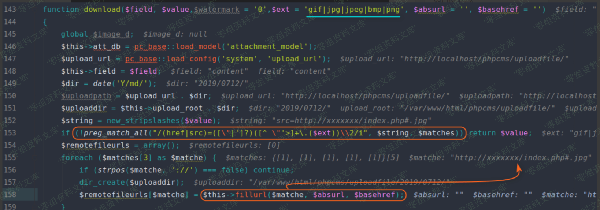

Phpcms v9.6.0 任意文件上传
==========================

一、漏洞简介
------------

二、漏洞影响
------------

Phpcms v9.6.0

三、复现过程
------------

这个漏洞存在于用户注册处。这里有一个可控变量 **\$\_POST\[\'info\'\]**
传入了 **member\_input** 类的 **get**
方法中，跟进该方法。(下图对应文件位置：phpcms/modules/member/index.php)

在 **get** 方法中，我们发现 **\$data** 变量来自 **\$\_POST\[\'info\'\]**
，并且我们可以调用 **member\_input** 类的所有方法（对应下图
**第47-48行**
代码）。(下图对应文件位置：caches/caches\_model/caches\_data/member\_input.class.php)

看了一下 **member\_input** 类的所有方法，只有一个 **editor**
方法比较好利用，而本次漏洞正是利用到这个方法。在这个方法中，调用了
**attachment** 类的 **download**
方法。(下图对应文件位置：caches/caches\_model/caches\_data/member\_input.class.php)

在 **download** 方法中，程序先使用正则对图片 **URL** 进行匹配，其中
**\$ext** 只允许为**gif\|jpg\|jpeg\|bmp\|png** ，而我们使用
[**http://xxxx/1.php?a.jpg**](http://xxxx/1.php?a.jpg) 或者
[**http://xxxx/1.php\#a.jpg**](http://xxxx/1.php#a.jpg)
即可绕过正则。(下图对应文件位置：phpcms/libs/classes/attachment.class.php)

接着又使用 **fillurl** 方法对匹配到的远程图片地址进行处理，其实就是将
**\#** 号之后的字符全部去除，例如
[**http://xxxx/1.php\#a.jpg**](http://xxxx/1.php#a.jpg) 会被处理成
[**http://xxxx/1.php**](http://xxxx/1.php)
。(下图对应文件位置：phpcms/libs/classes/attachment.class.php)

**fillurl** 方法处理后，又回到了 **download** 方法。程序直接调用
**copy** 函数将远程文件复制到本地（对应下图 **161**
行代码），远程文件名可预测，后缀名为上边处理后的 **URL** 文件名后缀，即
**php** ，最终导致 **getshell** 。其中 **webshell** 地址为
**<http://website/uploadfile/date('Y/md/')/date('Ymdhis').rand(100>,
999).\'.\'.\$fileext**
。(下图对应文件位置：phpcms/libs/classes/attachment.class.php)

最后我们再来看一下在官方发布的 **PHPCMS v9.6.1**
中是如何修复这个漏洞的，代码具体如下。可以明确看到，在官方补丁中，对
**fileext(\$file)**
获取到的文件后缀进行了黑名单校验。虽然暂时不能直接上传 **shell**
，但是还是可以上传图片马。如果 **CMS**
存在任意文件包含或任意文件名修改的漏洞，同样还是可以 **getshell**
，这里最好再对远程图片的内容进行校验下比较好。(下图对应文件位置：phpcms/libs/classes/attachment.class.php，左半图为PHPCMSv9.6.0，右半图为PHPCMSv9.6.1)

实际上，单这个补丁中的正则来说，是可以绕过的，例如： **.php%7f**
，Windows下会将非法字符替换成空，但是其实后续还有一系列的问题，导致我没绕过。本以为要挖到0day了，我傻乐了半天：)

参考链接
--------

> <https://xz.aliyun.com/t/5730>
