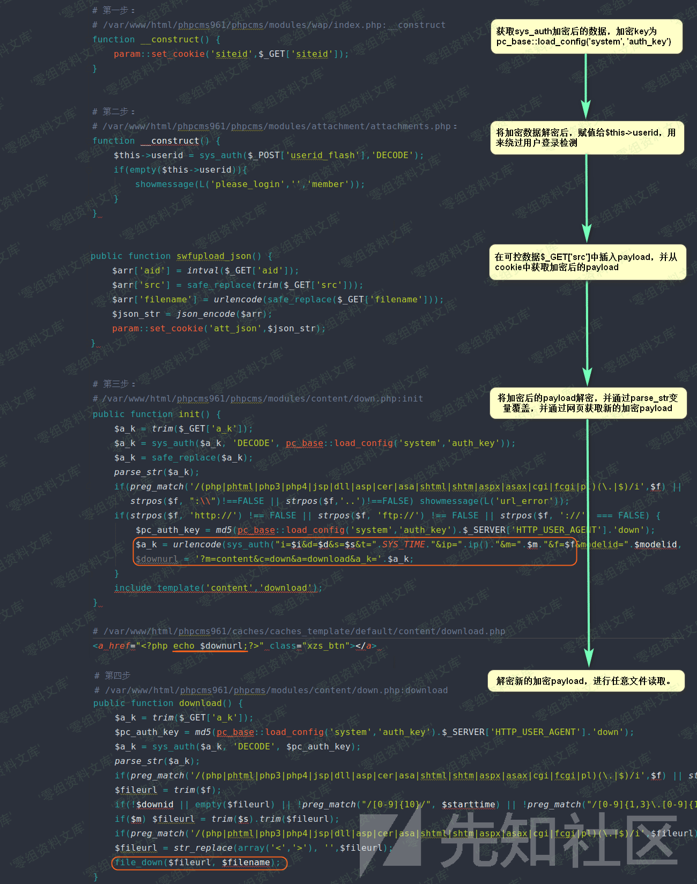

Phpcms v9.6.1 任意文件读取
==========================

一、漏洞简介
------------

二、漏洞影响
------------

Phpcms v9.6.1

三、复现过程
------------

这个版本的 **任意文件读取** 漏洞和上个版本的 **SQL注入**
漏洞原理是类似的，且出问题的文件均在 **phpcms/modules/content/down.php**
中。在该文件的 **download** 方法中最后一行调用了 **file\_down**
文件下载函数，我们可以看到其第一个参数是要读取的文件路径。

我们再来看看 **download**
方法中有哪些限制条件。可以看到其开头部分的代码，和上一个版本的
**SQL注入** 类似，唯一不同的是这里加解密的 **key** 变成了
**\$pc\_auth\_key** ，我们等下就要来找找使用 **\$pc\_auth\_key**
进行加密的可控点。继续看 **download**
方法，里面对要下载的文件后缀进行了黑名单校验，但是末尾又对 **\>\<**
字符进行替换，这就导致后缀名正则可被绕过，例如： \*\*.ph
。(下图对应文件位置：phpcms/modules/content/down.php)

现在我们就要来找找使用 **\$pc\_auth\_key** 作为加密 **key**
的可控点。通过搜索关键字，我们可以看到有三处地方。然而前两处地方是不可以利用的，因为都有登录检测。而第三个点就可以利用，我们看其中
**\$i、\$d、\$s**
作为明文字符串被加密。(下图对应文件位置：phpcms/modules/content/down.php)

有了加密字符串，我们如何能够从前台获取呢，这里其实在最后一行包含模板文件时，将加密字符串
**\$downurl** 输出了，这样也就解决了我们获取的问题。

那 **\$i、\$d、\$s**
这三个变量从哪里来？我们往前看，代码有没有相当熟悉？这里只对 **\$i**
进行了 **intval** 过滤，其他两个变量还是可以利用。而且加密字符串
**\$a\_k** 的获取，就和上个版本的 **SQL注入**
漏洞攻击链的前2步是一样的，这里不再赘述。(下图对应文件位置：phpcms/modules/content/down.php)

我们在构造 **payload** 的时候，我们要注意整个攻击过程会经过两次
**safe\_replace** 、两次 **parse\_str** 、一次
**str\_replace(array(\'\<\',\'\>\'), \'\',\$fileurl)** ，而程序对 **..**
和 **php** 字符进行了检测。所以我们要想访问 **php**
文件或进行路径穿越，后缀可以设置成 **ph\>p** ，路径符可以变成 **.\>.**
。但是 **safe\_replace** 函数会 **str\_replace(\'\>\',\'\>\',\$string)**
，所以 **\>** 字符需要编码两次，变成 **%25253e** 。

我们可以将整个漏洞的触发过程整理成下图：

最后来看一下官方发布的 **PHPCMS v9.6.2**
中是如何修复这个漏洞的，补丁如下：

可以看到补丁将后缀匹配规则放在离下载文件最近的地方，貌似能防止规则中的文件被读取，但是我们可以利用
**windows** 的特性，在 **windows** 下绕过这个正则，这也是网传的一种
**PHPCMS v9.6.2任意文件下载** 漏洞。

