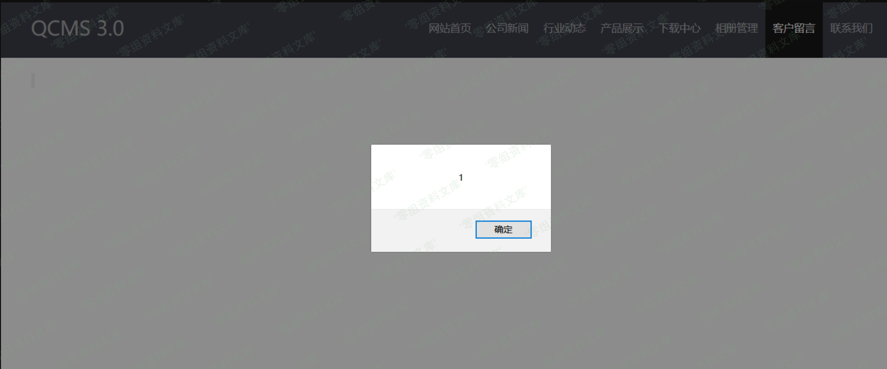
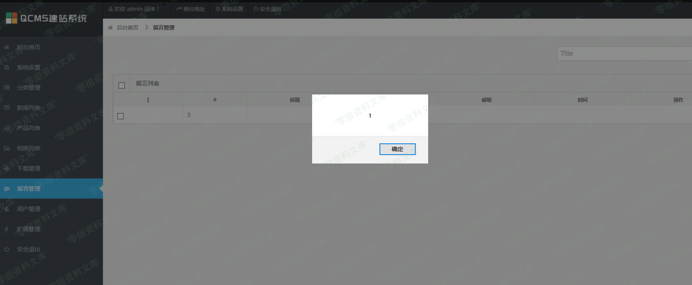

QCMS 3.0 留言板xss
==================

一、漏洞简介
------------

二、漏洞影响
------------

QCMS 3.0

三、复现过程
------------

按照如图所示构造payload

提交之后无需审核，直接先弹个窗。。

登录后台再弹一个。。

查看数据库，没有过滤直接插入

参考链接
--------

> https://xz.aliyun.com/t/7269
