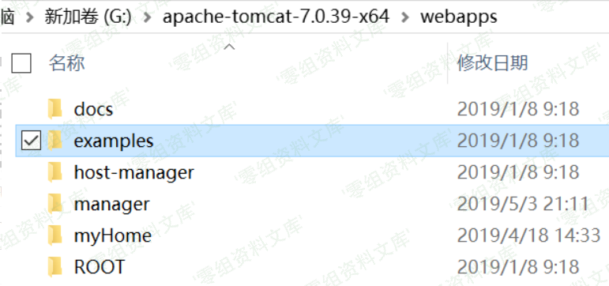
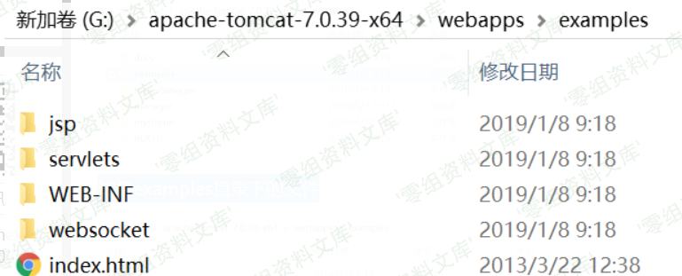
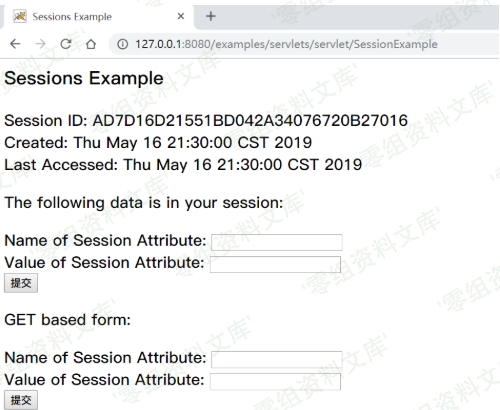
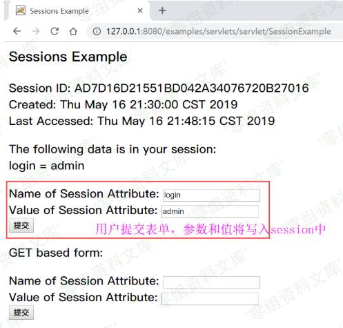
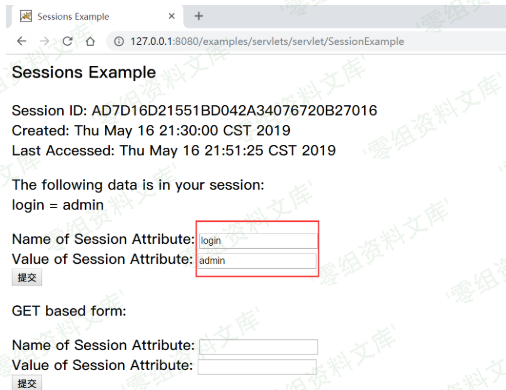
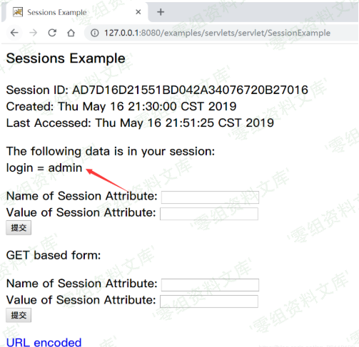
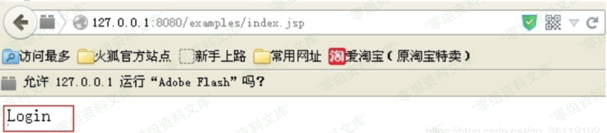

Tomcat样例目录session操纵漏洞
=============================

一、漏洞简介
------------

在Apache
tomcat中，有一个默认的example示例目录，该example目录中存着众多的样例，其中/examples/servlets/servlet/SessionExample
允许用户对Session进行操作。由于Session是存储在服务器端的用于验证用户身份的东西。所以，理论上，只要我们可以操控Session，就可以伪造任意用户身份信息。

二、漏洞影响
------------

三、复现过程
------------

如图，是Apache tomcat 网站根目录下的文件夹，默认是有一个examples目录的

这是examples目录下的文件

我们访问该SessionExample页面，该页面可以对Session进行操控，本来该页面是Apache
tomcat用来给开发者操纵Session示例的页面。但是，如果实际生产环境中不删除该页面的话，可能存在伪造任意用户身份的漏洞。

<http://127.0.0.1:8080/examples/servlets/servlet/SessionExample>

那么我们来看看SessionExample页面是如何通过接收用户输入的值，来对Session进行控制的。

表单部分代码，接收用户输入的Name和Value值。

    out.println("
");
    out.print("<form action=\"");
    out.print(response.encodeURL("SessionExample"));
    out.print("\" ");
    out.println("method=POST>");
    out.println(rb.getString("sessions.dataname"));
    out.println("<input type=text size=20 name=dataname>");
    out.println(" ");
    out.println(rb.getString("sessions.datavalue"));
    out.println("<input type=text size=20 name=datavalue>");
    out.println(" ");
    out.println("<input type=submit>");
    out.println("</form>");

核心代码，将接收的用户输入的Name和Value值写入到Session中

    HttpSession session = request.getSession(true);
    out.println(rb.getString("sessions.id") + " " +session.getId());
    out.println(" ");
    out.println(rb.getString("sessions.created") + " ");
    out.println(new Date(session.getCreationTime()) +" ");
    out.println(rb.getString("sessions.lastaccessed") + "");
    out.println(new Date(session.getLastAccessedTime()));
    String dataName = request.getParameter("dataname");//获取dataname参数的值
    String dataValue = request.getParameter("datavalue");//获取datavalue参数的值
    if (dataName != null && dataValue != null) {
        session.setAttribute(dataName, dataValue);//将dataname和datavalue写入session
    }

也就是说，用户通过表单提交Name和Value参数，然后通过request.getParameter（）函数获取这两个参数的值，再通过session.setAttribute()
函数将Name和Value的值写入Session中。

### 漏洞示例

我们先来编写 login.jsp 、login\_check.jsp 、 index.jsp
这三个页面，通过这三个页面来模拟一般网站身份验证的过程。

login.jsp

    <form action=login_check.jsp method="POST" >  
        用户名: <input type="text"name="username">  
        密码: <input type="text" name="password">  
        <inputtype="submit" value="登录">  
    <form>

login\_check.jsp

    <% 
          if(request.getParameter("username") != null && 
          request.getParameter("password")!= null) {  
          String username =request.getParameter("username"); 
          String password =request.getParameter("password"); 
          //验证身份 
          if (username.equals("admin")&& password.equals("admin")) {  
            session.setAttribute("login","admin"); 
            response.sendRedirect("index.jsp"); 
            }else { 
               response.sendRedirect("login.jsp"); 
            }  
          } 
    %>

index.jsp

     <% 
         if(session.getAttribute("login")!= null &&
         ((String)session.getAttribute("login")).equals("admin")){ 
            out.println("Login"); 
          } else{
           response.sendRedirect("login.jsp");
           }
    %>

我们直接打开网站后台，即 index.jsp

<http://127.0.0.1:8080/examples/index.jsp>

发现被重定向到login.jsp了。因为我们没有登录，所以被重定向到了登录页面

打开SessionExample

<http://127.0.0.1:8080/examples/servlets/servlet/SessionExample>

在Name of Session Attribute: 里输入 login

在Value of Session Attribute:里输入 admin

提交后显示login=admin已经写入session

再次打开index.jsp，显示成功登录

> 注：但是在现实生产环境中，我们很难知道服务器后端的Session中是通过什么参数(Name)和值(Value)来判断用户登录状态的。所以就是我们根本很难利用该页面来进行任意用户伪造，只是说理论上是可行的。
