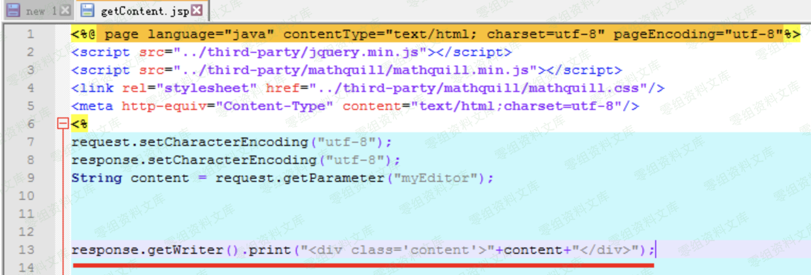
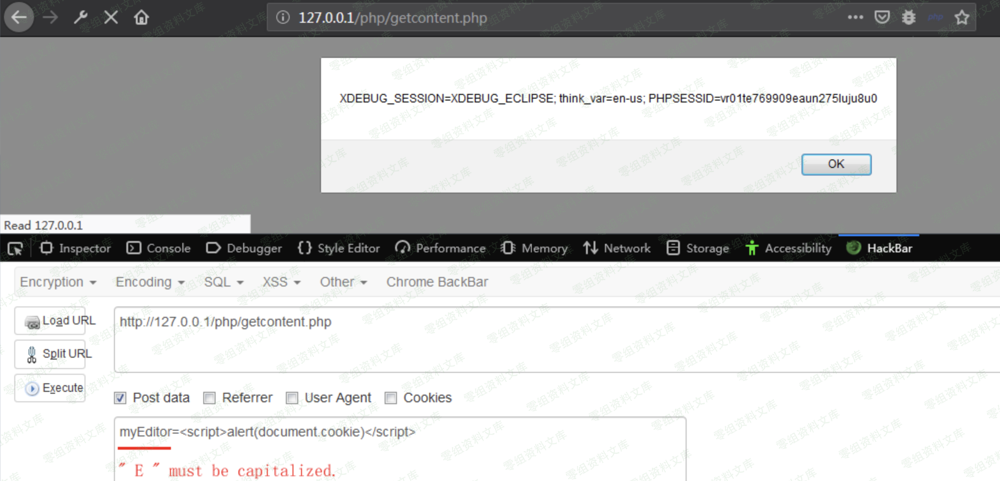

百度ueditor编辑器 xss漏洞
=========================

一、漏洞简介
------------

产品官网下载地址：

<https://ueditor.baidu.com/website/download.html#mini>

涉及版本：php , asp, jsp, net

二、漏洞影响
------------

三、复现过程
------------

### 漏洞分析

存在漏洞的文件：

    /php/getContent.php
    /asp/getContent.asp
    /jsp/getContent.jsp
    /net/getContent.ashx

#### /php/getContent.php

入进行了过滤，但是在14行输出时却使用了htmlspecialchars\_decode，造成XSS漏洞。

#### /asp/getContent.asp

获取myEditor参数无过滤，直接输出。

#### /jsp/getContent.jsp

获取myEditor参数无过滤，直接输出。

#### /net/getContent.ashx

获取myEditor参数无过滤，直接输出。

### 漏洞复现

php版本测试，其他版本一样。

url:

    http://0-sec.org/php/getcontent.php

payload:

    myEditor=
    // myEditor中的’ E ’必须大写，小写无效。

由于只是个反弹XSS，单独这个漏洞影响小。若能结合使用该编辑器的网站的其他漏洞使用，则可能产生不错的效果。

四、参考链接
------------

> <https://blog.csdn.net/yun2diao/article/details/91381846>
