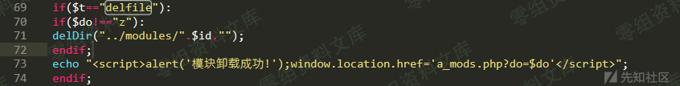

UsualToolcms 8.0 a\_modsx.php 任意文件删除
==========================================

一、漏洞简介
------------

二、漏洞影响
------------

UsualToolcms 8.0

三、复现过程
------------

漏洞位置在a\_modsx.php

id由用户传入，且有一层过滤

过滤逻辑存在问题，str\_replace只替换一次，将../替换为空格绕过：

    .../...//  --> ../

意味着可以实现跨目录删除指定目录

参考链接
--------

> https://xz.aliyun.com/t/8100
