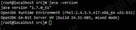
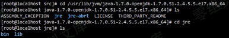
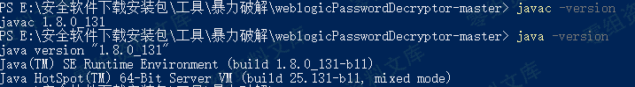

weblogic爆破
============

一、部署weblogic
----------------

现有的redhat环境7.0,jdk版本1.7。

二、weblogic下载
----------------

操作系统：RedHat7

weblogic版本：10.3.6

三、安装weblogic
----------------

### 1、weblogic安装

创建一个用户

useradd weblogic

passwd weblogic

chmod a+x wls1036\_generic.jar

su weblogic

java -jar wls1036\_generic.jar -mode=console

出现问题

提示空间内存大小不够，清理空间再下一步。

\[root\@localhostsrc\]\# cd
/usr/lib/jvm/java-1.7.0-openjdk-1.7.0.51-2.4.5.5.el7.x86\_64

修改 commEnv.sh 文件

JAVA\_HOME=\"/usr/lib/jvm/java-1.7.0-openjdk-1.7.0.9.x86\_64/ jre\"

### 2、启动weblogic

\[weblogic\@localhostroot\]\$cd
/home/weblogic/Oracle/Middleware/user\_projects/domains/base\_domain/
\[weblogic\@localhost base\_domain\]\$ ./startWebLogic.sh

在目录/usr/lib/jvm/java-1.7.0-openjdk-1.7.0.79.x86\_64中找不到JRE

编辑setDomainEnv.sh

重新启动weblogic服务

四、破解weblogic控制台密码
--------------------------

### 第一步 将用户名和密码保存到boot.properties文件中

\[root\@localhost security\]\# pwd

/home/weblogic/Oracle/Middleware/user\_projects/domains/base\_domain/servers/AdminServer/security

在adminserver目录下创建security目录，并创建文件boot.properties

Username=weblogic

Password=weblogic123

### 第二步 重新启动WebLogic服务

\[root\@localhost bin\]\# ./startWebLogic.sh&

已经加密

### 第三步 暴力破解

#### 1.java和javac的版本一致

#### 2.编译WebLogicPasswordDecryptor.java

3.破解密码

