WordPress Plugin - File Manager 任意文件上传漏洞
================================================

一、漏洞简介
------------

File
Manager是一个WordPress插件，由于函数处理不严谨，可构造恶意请求包上传任意文件。漏洞主要因为File
Manager插件中的elFinder库的调用未进行严格访问控制触发，导致可以被直接利用

二、漏洞影响
------------

免费版受影响版本：V6.0-V6.8

Pro版受影响版本：V7.6-V7.0

三、复现过程
------------

### 漏洞分析

漏洞点位于file
manager的connector.minimal.php文件，具体路径在`wordpress\wp-content\plugins\wp-file-manager\lib\php\connector.minimal.php`

首先实例化一个`elFinderConnector`对象，然后调用它的`run()`方法，跟进run();

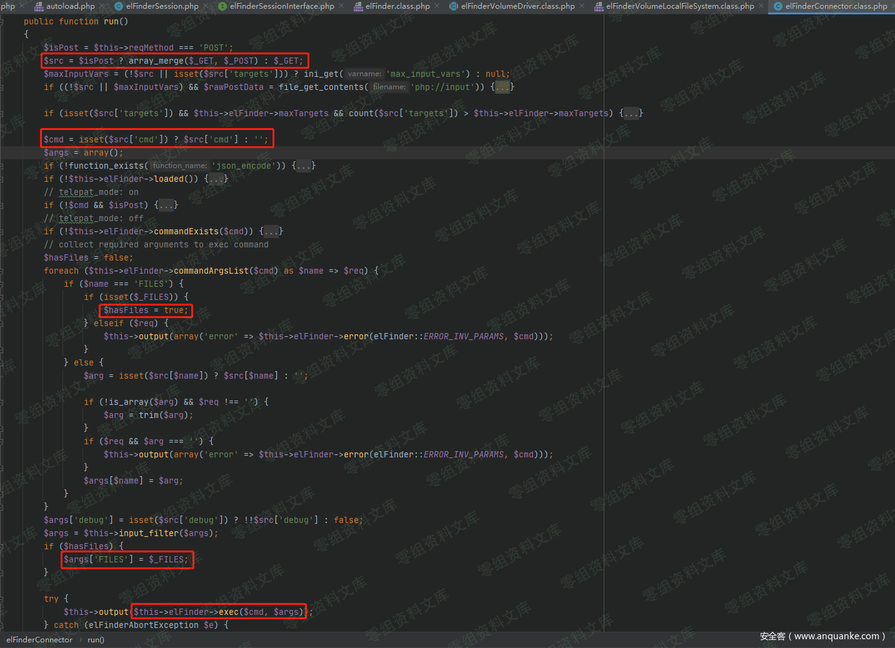

如果HTTP请求的方法是`POST`，会把`POST`和`GET`请求的数据保存到`$src`，然后判断`POST`传的参数。如果不传入`targets`，就不会进入前几个判断，之后会把`POST`请求传的`cmd`变量赋给`$cmd`，然后调用`commandExists()`检测传入的`$cmd`是否存在。

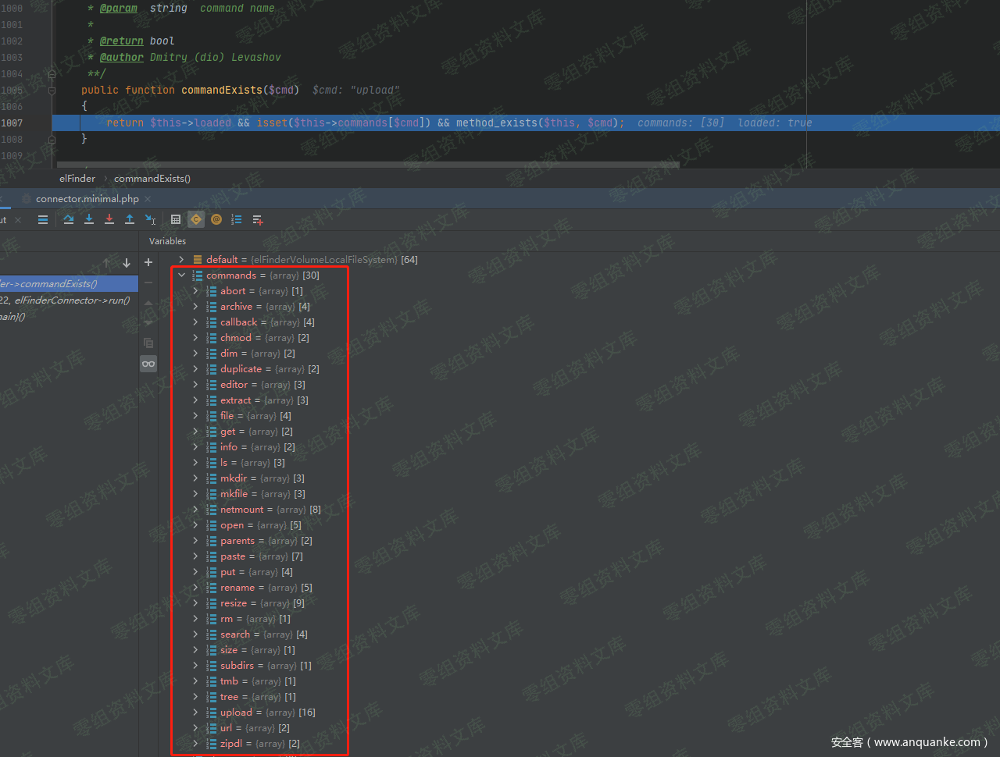

然后利用`commandArgsList()`函数获取`$cmd`对应的命令参数列表，漏洞利用需要上传文件，这里只关注`$cmd`为`upload`的情况。

    public function commandArgsList($cmd)
    {
            if ($this->commandExists($cmd)) {
                $list = $this->commands[$cmd];
                $list['reqid'] = false;
            } else {
                $list = array();
            }
            return $list;
    }
    /*upload对应的数组如下:
    'upload' => array(
        'target' => true, 'FILES' => true, 'mimes' => false, 'html' => false, 'upload' => false, 
        'name' => false, 'upload_path' => false, 'chunk' => false, 'cid' => false, 'node' => false, 
        'renames' => false, 'hashes' => false, 'suffix' => false, 'mtime' => false, 'overwrite' => false, 
        'contentSaveId' => false)
        */

循环遍历，将`POST`传入的参数保存到`$args`数组中，然后调用`input_filter()`函数对`$args`进行简单的过滤，

替换掉`%00`，并且做`stripslashes()`处理。然后将通过表单上传的文件`$_FILES`存到`$args['FILE']`中。然后调用`exec()`函数，跟进

前面会进行一些判断，最后进入到`$this->$cmd($args)`调用`upload()`函数，跟进

首先将`POST`传入的`target`赋给`$target`变量，然后调用`volume()`函数，

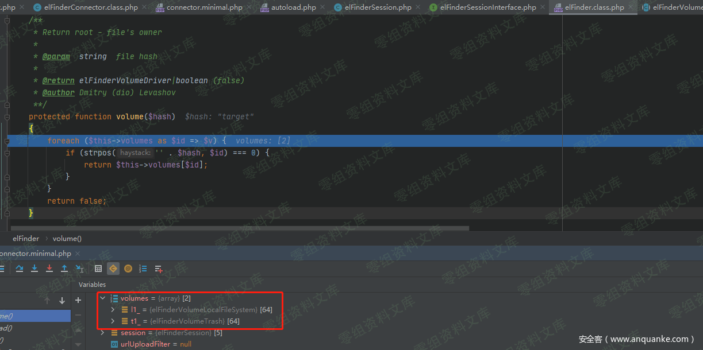

可以看到`$this->volume`数组含有两项，一项是`l1_`，一项是`t1_`，`volume()`函数定义如果传入的`$hash`以`l1_`或`t1_`开头，返回`$this->volume`数组对应的值，否则返回false。在`upload`函数中会检测`$volume`，如果其为false，程序会报错结束，所以`POST`传入的`target`必须以它们两个为前缀。继续分析upload()函数。依次取出`$args`数组中的值赋给相应的变量，这里要求`$args['FILES']['upload']`也就是`$_FILES['upload']`为数组，才能将其赋给`$files`变量，这就需要上传文件时上传一个文件数组。接下来其他的如`html、upload_path、chunk、cid、mtime`等参数可以不传。之后遍历`$files['name']`也就是`$_FILES['upload']['name']`，如果文件上传成功，将`$_FILES['upload']['name']`赋给`$tmpname`，然后调用`fopen()`打开上传的临时文件，将指针保存在`$fp`。在不传入`upload_path`时`$thash`等于`$target`，所以`$_target`为`$target`为我们`POST`传入的`target`变量。之后调用了`$volume->upload()`函数，第一个参数为之前打开文件的指针，第二个参数为`POST`传入的`target`变量，第三个参数为上传的文件名，第四个参数为空的数组。跟进`elFinderVolumeDriver`的`upload()`

    public function upload($fp, $dst, $name, $tmpname, $hashes = array())
    {
            if ($this->commandDisabled('upload')) {
                return $this->setError(elFinder::ERROR_PERM_DENIED);
            }

            if (($dir = $this->dir($dst)) == false) {
                return $this->setError(elFinder::ERROR_TRGDIR_NOT_FOUND, '#' . $dst);
            }

            if (empty($dir['write'])) {
                return $this->setError(elFinder::ERROR_PERM_DENIED);
            }

            if (!$this->nameAccepted($name, false)) {
                return $this->setError(elFinder::ERROR_INVALID_NAME);
            }

            $mimeByName = '';
            if ($this->mimeDetect === 'internal') {
                $mime = $this->mimetype($tmpname, $name);
            } else {
                $mime = $this->mimetype($tmpname, $name);
                $mimeByName = $this->mimetype($name, true);
                if ($mime === 'unknown') {
                    $mime = $mimeByName;
                }
            }

            if (!$this->allowPutMime($mime) || ($mimeByName && !$this->allowPutMime($mimeByName))) {
                return $this->setError(elFinder::ERROR_UPLOAD_FILE_MIME, '(' . $mime . ')');
            }

            $tmpsize = (int)sprintf('%u', filesize($tmpname));
            if ($this->uploadMaxSize > 0 && $tmpsize > $this->uploadMaxSize) {
                return $this->setError(elFinder::ERROR_UPLOAD_FILE_SIZE);
            }

            $dstpath = $this->decode($dst);
            if (isset($hashes[$name])) {
                $test = $this->decode($hashes[$name]);
                $file = $this->stat($test);
            } else {
                $test = $this->joinPathCE($dstpath, $name);
                $file = $this->isNameExists($test);
            }

            $this->clearcache();

            if ($file && $file['name'] === $name) { // file exists and check filename for item ID based filesystem
                if ($this->uploadOverwrite) {
                    if (!$file['write']) {
                        return $this->setError(elFinder::ERROR_PERM_DENIED);
                    } elseif ($file['mime'] == 'directory') {
                        return $this->setError(elFinder::ERROR_NOT_REPLACE, $name);
                    }
                    $this->remove($test);
                } else {
                    $name = $this->uniqueName($dstpath, $name, '-', false);
                }
            }

            $stat = array(
                'mime' => $mime,
                'width' => 0,
                'height' => 0,
                'size' => $tmpsize);

            // $w = $h = 0;
            if (strpos($mime, 'image') === 0 && ($s = getimagesize($tmpname))) {
                $stat['width'] = $s[0];
                $stat['height'] = $s[1];
            }
            // $this->clearcache();
            if (($path = $this->saveCE($fp, $dstpath, $name, $stat)) == false) {
                return false;
            }

            $stat = $this->stat($path);
            // Try get URL
            if (empty($stat['url']) && ($url = $this->getContentUrl($stat['hash']))) {
                $stat['url'] = $url;
            }

            return $stat;
    }

首先进入`commandDisabled()`函数，返回false。

然后进入`dir()`函数，参数为`$dst`即`POST`传入的`target`值。

调用了file函数，

跟进`decode()`函数

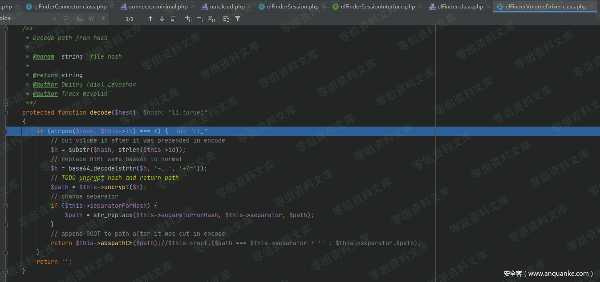

`decode()`函数首先判断是否以`$this->id`开头，然后截取出`l1_`后面的内容，之后进行base64解密，uncrypt函数如上，未作操作。然后更换分隔符，之后调用`abspathCE()`函数，从注释中可以看出，`abspathCE()`函数会先判断`$path`是否等于分隔符`\`,如果等于，返回`$this->root`，否则返回`$this->root`拼接`$path`。看下对应的`abspathCE()`函数。

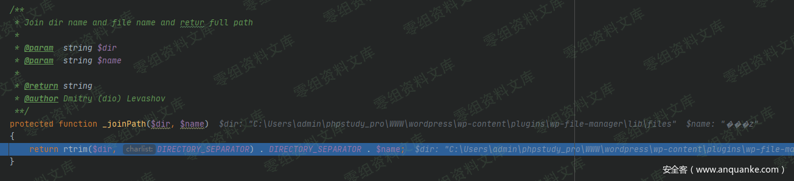

> ps：POST传入target前缀不同的区别

-   前缀为`l1_`时，`$this->root`
    为`C:\Users\admin\phpstudy_pro\WWW\wordpress\wp-content\plugins\wp-file-manager\lib\files`

> {width="5.833333333333333in"
> height="2.864215879265092in"}

-   前缀为`t1_`时，`$this->disabled[]`包含`upload`，程序会报错结束，`$this->root`
    为`C:\Users\admin\phpstudy_pro\WWW\wordpress\wp-content\plugins\wp-file-manager\lib\files\.trash`

> 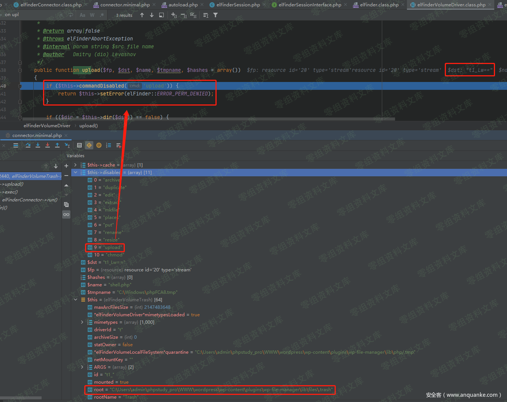{width="5.833333333333333in"
> height="4.630450568678915in"}

继续分析程序流程，`decode()`函数会返回`C:\Users\admin\phpstudy_pro\WWW\wordpress\wp-content\plugins\wp-file-manager\lib\files`,然后调用`stat()`函数。

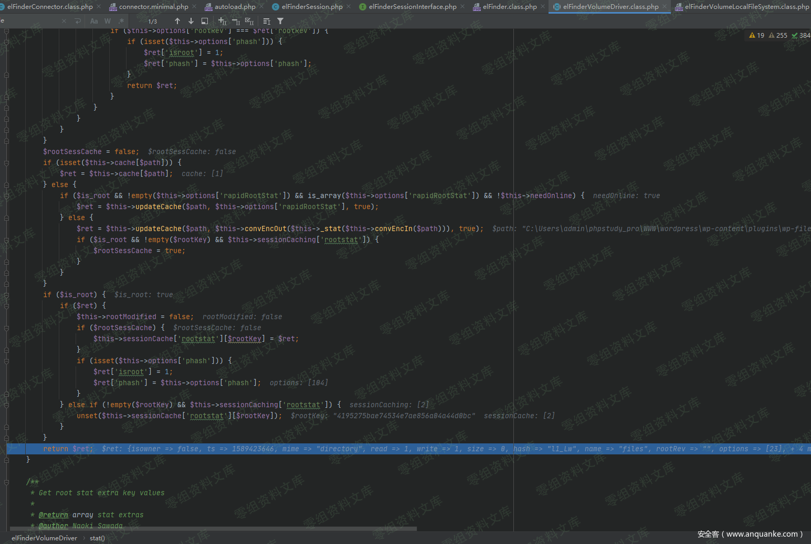

stat()函数返回的`$ret`为

    Array
    (
        [isowner] => 
        [ts] => 1589423646
        [mime] => directory
        [read] => 1
        [write] => 1
        [size] => 0
        [hash] => l1_Lw
        [name] => files
        [rootRev] => 
        [options] => Array
            (
                [path] => 
                [url] => /wordpress/wp-content/plugins/wp-file-manager/lib/php/../files/
                [tmbUrl] => /wordpress/wp-content/plugins/wp-file-manager/lib/php/../files/.tmb/
                [disabled] => Array
                    (
                        [0] => chmod
                    )

                [separator] =>                 [copyOverwrite] => 1
                [uploadOverwrite] => 1
                [uploadMaxSize] => 9223372036854775807
                [uploadMaxConn] => 3
                [uploadMime] => Array
                    (
                        [firstOrder] => deny
                        [allow] => Array
                            (
                                [0] => all
                            )

                        [deny] => Array
                            (
                                [0] => all
                            )

                    )

                [dispInlineRegex] => ^(?:(?:video|audio)|image/(?!.+\+xml)|application/(?:ogg|x-mpegURL|dash\+xml)|(?:text/plain|application/pdf)$)
                [jpgQuality] => 100
                [archivers] => Array
                    (
                        [create] => Array
                            (
                                [0] => application/x-tar
                                [1] => application/zip
                            )

                        [extract] => Array
                            (
                                [0] => application/x-tar
                                [1] => application/zip
                            )

                        [createext] => Array
                            (
                                [application/x-tar] => tar
                                [application/zip] => zip
                            )

                    )

                [uiCmdMap] => Array
                    (
                    )

                [syncChkAsTs] => 1
                [syncMinMs] => 10000
                [i18nFolderName] => 0
                [tmbCrop] => 1
                [tmbReqCustomData] => 
                [substituteImg] => 1
                [onetimeUrl] => 1
                [trashHash] => t1_Lw
                [csscls] => elfinder-navbar-root-local
            )

        [volumeid] => l1_
        [locked] => 1
        [isroot] => 1
        [phash] => 
    )

返回`dir()`函数，然后在返回到`upload()`函数，将返回值赋给`upload()`函数中的`$dir`变量，

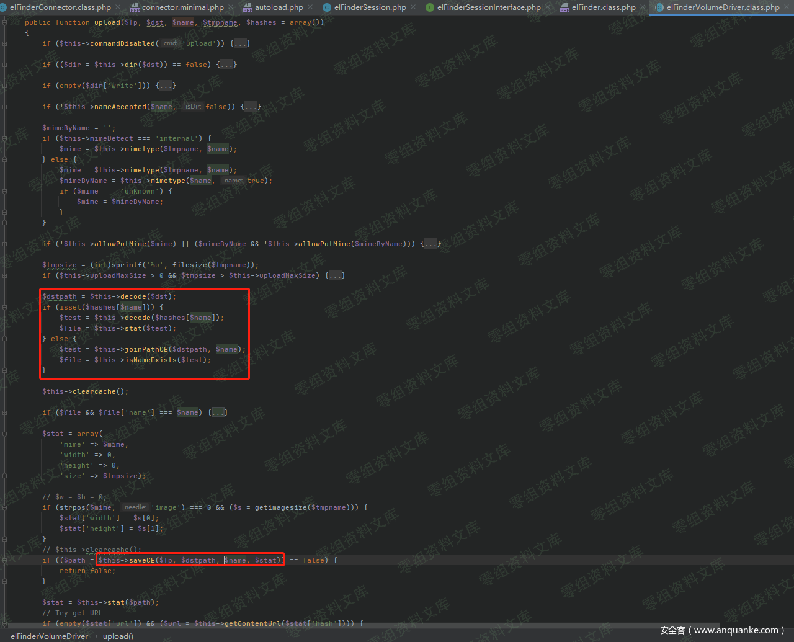

然后进行`mime`的判断，程序识别上传的php脚本的`mime`为`text/x-php`，跟进`allowPutMime()`函数，

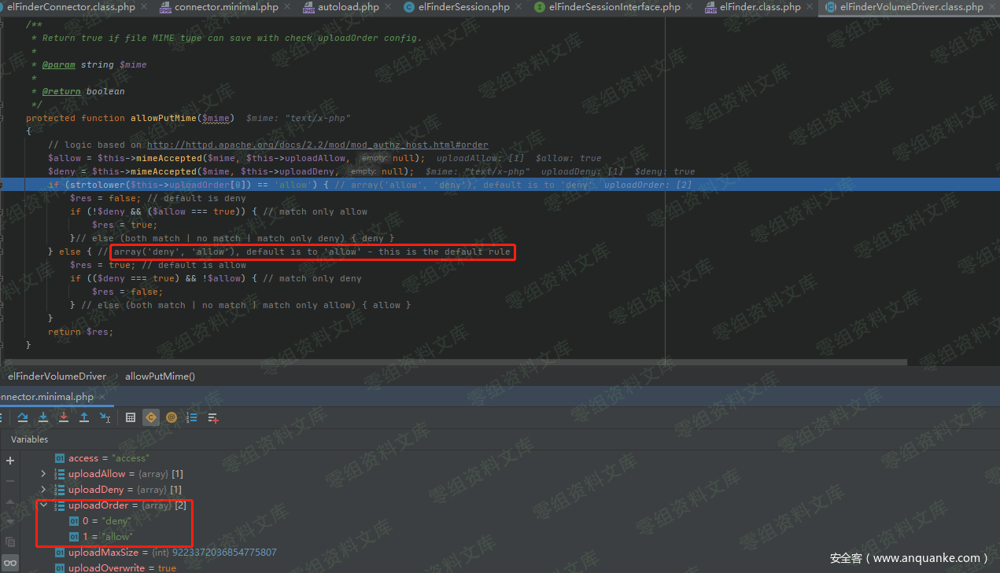

从程序自带的注释中可以看出如果`uploadOrder`数组为`array('deny','allow')`，则默认允许上传`$mime`类型的文件。然后获取文件的大小，若文件大小不合法报错结束程序，之后`decode()`处理`$dst`(`POST`**传入的**`target`**值**)返回结果赋给`$dstpath`，因为`$hash`为空数组，所以会调用`joinPathCE()`将`$dstpath`和`$name`(**上传文件的文件名**)拼接，然后检查文件是否存在。

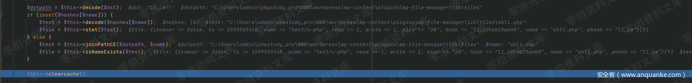

最后调用`$this->saveCE()`

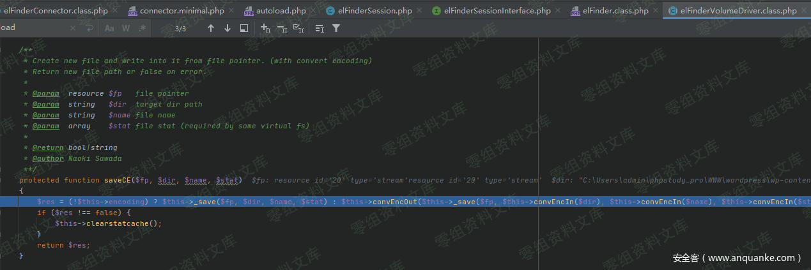

跟进`_save()`。

本地是利用Windows系统分析，`$path`为`C:\Users\admin\phpstudy_pro\WWW\wordpress\wp-content\plugins\wp-file-manager\lib\files\shell.php`;`$uri`为`C:\Windows\phpxxxx.tmp`，最后会调用`copy()`将上传的文件复制到`\wordpress\wp-content\plugins\wp-file-manager\lib\files\shell.php`，即完成了任意文件上传。

### 漏洞复现

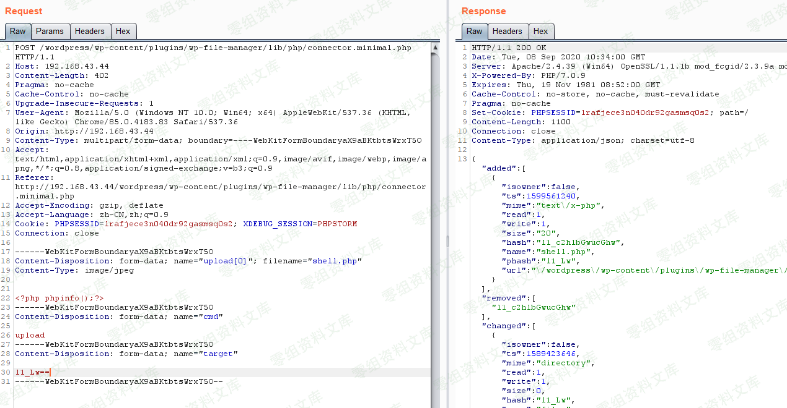

访问`https://www.0-sec.org/wordpress/wp-content/plugins/wp-file-manager/lib/files/shell.php`

