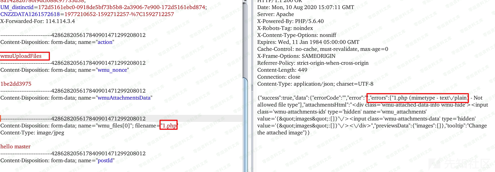
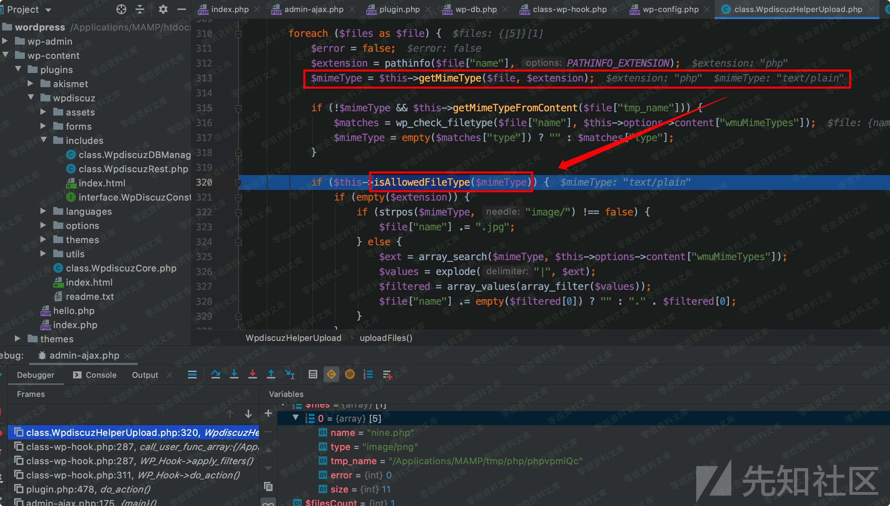
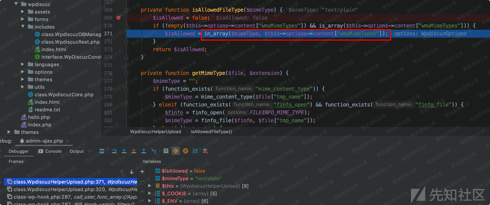
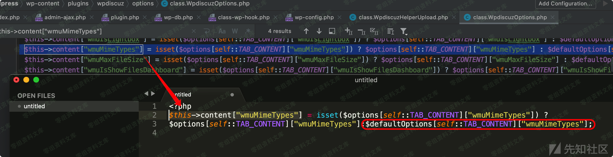
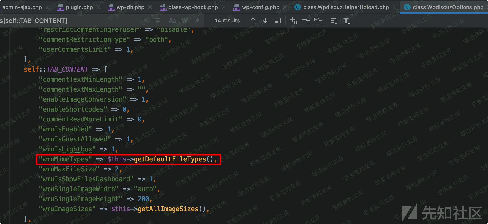
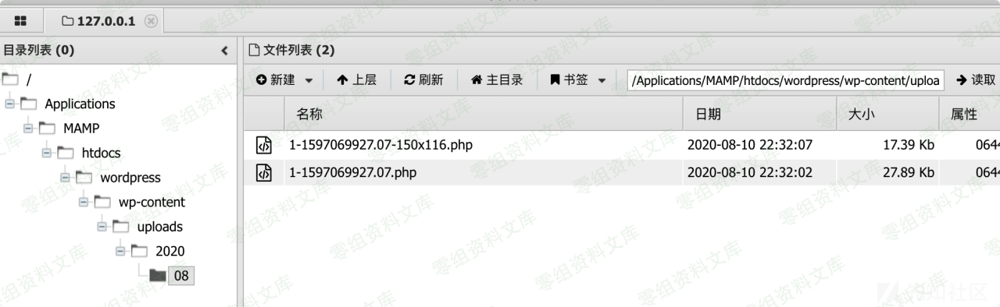

WordPress Plugin - WPdiscuz 7.0.4 任意文件上传漏洞
==================================================

一、漏洞简介
------------

二、漏洞影响
------------

WPdiscuz 7.0.0 - WPdiscuz 7.0.4

三、复现过程
------------

### 漏洞分析

-   1.环境搭建后，手动安装wpdiscuz插件后，看到文章下增加评论模块

-   2.phpstorm导入web目录，点击图片按钮，上传一个php文件测试一下，上传路径是`http://www.0-sec.org:8888/wordpress/wp-admin/admin-ajax.php`，默认是上传不了的。

-   3.从入口点分析，如图是wp\_filter的action过滤

-   4.跟进去，可以看到上传的功能点，再进去

-   5.可以看到如图位置，使用getMimeType方法根据文件内容获取文件类型，并不是通过文件后缀名判断，进一步根据\$mineType判断是否是允许的上传类型。

-   6.跟入查看isAllowedFileType方法，在判斷\$mineType是否在\$this -\>
    options -\> content\[\"wmuMimeTypes\"\]中存在。

-   7.如图，进入\$options中，可以content\[\"wmuMimeTypes\"\]使用三目运算判断，搜索上下文得知，结果就是\$defaultOptions\[self::TAB\_CONTENT\]\[\"wmuMimeTypes\"\]

-   8.进入\$defaultOptions中可以得到最终\$this -\> options -\>
    content\[\"wmuMimeTypes\"\]的值是几种常见的图片类型。

-   9.很明显此时文件类型已经通过getMimeType()方法修改为text/plain了，但是回到进入isAllowedFileType的代码，发现程序只在此处对上传文件进行了判断后，直接保存了文件。

### 漏洞复现

如此，程序只是根据文件内容判断文件类型，并未对文件后缀进行效验，构造一个图片马，或者手动在webshell前面加上图片头信息即可绕过。

-   1.把后门文件追加到图片后

-   2.上传并修改后缀名为php，可以看到返回路径

-   3.连接webshell

### poc

    import requests
    import re
    import sys

    class wpdiscuz():
        def __init__(self):
            self.s = requests.session()
            self.s.headrs = {
                "User-Agent":
                "Mozilla/5.0 (Windows NT 6.1) AppleWebKit/537.36 (KHTML, like Gecko) Chrome/80.0.3987.132 Safari/537.36 Edg/80.0.361.66"
            }
            self.nonce = ""
            self.state = False

        def check(self, url):
            res = self.s.get(url=url)

            pat1 = "wpdiscuz/themes/default/style\.css\?ver=(.*?)'"
            reSearch1 = re.search(pat1, res.text)
            if reSearch1 == None:
                print("%s 评论插件不存在任意文件漏洞" % url) 
                return
            mess = reSearch1.group(0)
            version = reSearch1.group(1)
            # 判断版本
            vers = version.split(".")
            if (len(vers) == 3):
                if int(vers[0]) == 7:
                    if int(vers[2]) <= 4:
                        print(url + " 存在任意文件上传漏洞 wpdiscuz版本为 %s" % version)
                        self.state = True

            if self.state == True:
                # nonce
                pat2 = '"wmuSecurity":"(.*?)"'
                reSearch2 = re.search(pat2, res.text)
                nonce = reSearch2.group(1)
                self.nonce = nonce
            else:
                print("%s 评论插件不存在任意文件漏洞" % url)    

        def exp(self, url, project, filepath):
            pass

    if __name__ == "__main__":
        wpdiscuz = wpdiscuz()
        url = sys.argv[1]
        print("检测漏洞结果:")
        wpdiscuz.check(url)

参考链接
--------

> https://xz.aliyun.com/t/8138\#toc-1
