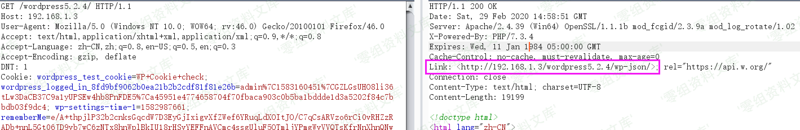
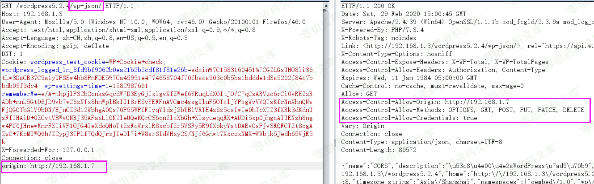
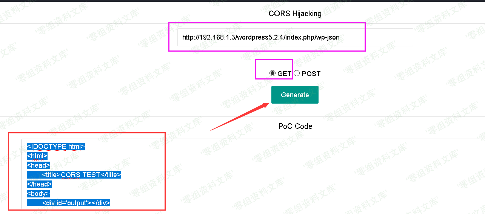

Wordpress 5.2.4 cors跨域劫持漏洞
================================

一、漏洞简介
------------

CORS是一个W3C标准，全称是"跨域资源共享"（Cross-origin resource
sharing）。通过该标准，可以允许浏览器向跨源服务器发出 XMLHttpRequest
请求，从而克服了AJAX只能同源使用的限制，进而读取跨域的资源。CORS允许Web服务器通知Web浏览器应该允许哪些其他来源从该Web服务器的回复中访问内容

漏洞产生原因：在Access-Control-Allow-Origin中反射请求的Origin值。该配置可导致任意攻击者网站可以直接跨域读取其资源内容。

二、漏洞影响
------------

Wordpress 5.2.4

三、复现过程
------------

1、影响版本wordpress5.2.4，首先访问首页，利用burp抓包

2、然后发送到reapeter，日常go一下，看到返回包内容，返回了/wp-json

3、我们将请求包中的url补上/wp-json，再次发包，发现出现了一堆json数据，我们将其复制到jsonbeautiful进行格式化，说明漏洞出现在：[http://www.0-sec.org/wp-json，](http://www.0-sec.org/wp-json，)

4、我们在请求包中，加入orgin头[http://192.168.1.7（实战中为你的vps），再次发送，](http://192.168.1.7（实战中为你的vps），再次发送，)
发现响应头内的

Access-Control-Allow-Origin:已经变成[http://192.168.1.7，并且且Access-Control-Allow-Credentials:的值为true。](http://192.168.1.7，并且且Access-Control-Allow-Credentials:的值为true。)

从而证明是存在cors漏洞的，我们可以进行cors跨域劫持

5、然后我们利用pocbox构造payload，输入漏洞链接(记住！！记住！！！加上[http://)，选择http请求方法即可](http://)，选择http请求方法即可)

6、然后将生成的html内容，放到你的vps下，命名为wp-cors.html

7、然后诱骗受害者点击，就会把json数据传到你的服务器，从而获取对方敏感信息，攻击成功

