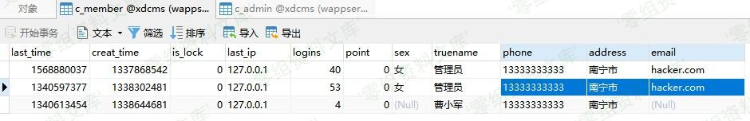

XDCMS 1.0 csrf漏洞
==================

一、漏洞简介
------------

二、漏洞影响
------------

XDCMS 1.0

三、复现过程
------------

> CSRF漏洞常存在于涉及权限控制的地方，像管理后台、会员中心、论坛帖子、资料修改、交易管理等。
>
> 通常可检查相应代码处是否存在检测token或referer，如果没有token/referer直接请求该页面进行判断

漏洞存在于用户资料修改页面，URL：`index.php?m=member&f=edit`，同SQL注入2漏洞点相同

直接修改Cookie中`member_userid`字段，成功将其他用户信息修改

