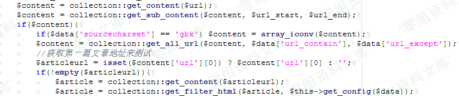
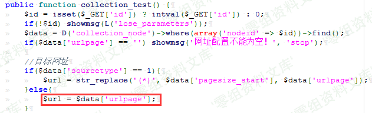
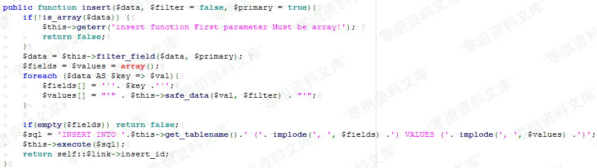
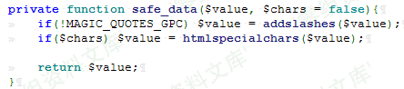
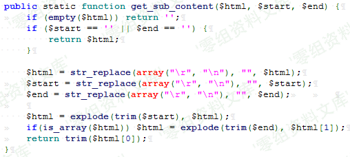
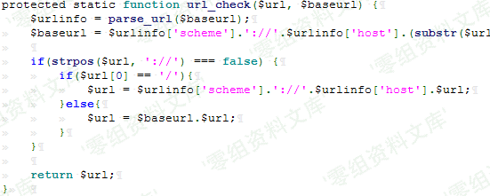
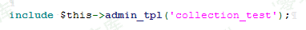

YzmCMS V5.3 后台ssrf
====================

一、漏洞简介
------------

二、漏洞影响
------------

YzmCMS V5.3

三、复现过程
------------

### 漏洞分析

漏洞位于
application\\collection\\controller\\collection\_content.class.php 中的
collection\_test
函数，此函数为获取一个网页中的URL，并获取此URL的值输出。类似于爬虫，爬取网页中URL对应的文章。以下为主要功能函数：　

首先查看 get\_content()函数：

可以看到传进来的URL不进过任何检测规则就带入
file\_get\_content()函数，那么倘若此 \$url 为 file://
伪协议的话，如此则产生任意文件读取漏洞。那么此时回头看
\$url的值是否可控。

可以看到，\$url 的值来自于 collection\_node 表中的 urlpage
字段的值。如果要 \$url 可控，那么就要找到一个数据库写入操作，并且urlpage
字段的值可控。再看

此函数则是将\$\_POST的数据写入到表中。看 insert 函数如何写。

可以看到在写入过程中经过过滤函数 safe\_data() ：

假设payload为：file://C:/Windows/System32/drivers/etc/hosts
可以看到此过滤函数对此payload并无任何影响，所以导致插入数据库中的urlpage字段的值可控，由此导致\$url的值可控。再往下查看
get\_sub\_content()函数：

可以看到此函数是将 \$html 中的 \$start 和 \$end 之间的值取出来，而
\$start 表示区间开始的html表示，\$end
表示区间结束的html标识。并且这两个标识不能为空。于是可以构造payload为：file://C:/Windows/System32/drivers/etc/hosts，如此进过上述函数则会取出payload并返回。再往下：

进入get\_all\_url()函数：

    public static function get_all_url($html, $url_contain='', $url_except='') {

            $html = str_replace(array("\r", "\n"), '', $html);
            $html = str_replace(array("</a>", "</A>"), "</a>\n", $html);
            preg_match_all('/<a ([^>]*)>([^\/a>].*)<\/a>/i', $html, $out);
            $data = array();
            foreach ($out[1] as $k=>$v) {
                if (preg_match('/href=[\'"]?([^\'" ]*)[\'"]?/i', $v, $match_out)) {
                    if ($url_contain) {
                        if (strpos($match_out[1], $url_contain) === false) {
                            continue;
                        } 
                    }

                    if ($url_except) {
                        if (strpos($match_out[1], $url_except) !== false) {
                            continue;
                        } 
                    }
                    $url2 = $match_out[1];
                    $url2 = self::url_check($url2, self::$url);

                    $title = strip_tags($out[2][$k]);

                    if(empty($url2) || empty($title)) continue;

                    $data['url'][$k] = $url2;
                    $data['title'][$k] = $title;

                } else {
                    continue;
                }
            }

发现其中有一个正则过滤：
preg\_match\_all(\'/\]*)\>([^\\/a\>^](#fn_%5C/a%3E).*)\<\\/a\>/i\',
\$html, \$out);
，此正则获取(value)括号中的值，并将其合并为一个数组。再往下看，又出现一个正则过滤：

preg\_match(\'/href=\[\\\'\"\]?([^\\\'\"^](#fn_%5C%27)
\*)\[\\\'\"\]?/i\', \$v, \$match\_out)
，此规则为href=\"(value)\"，并获取括号中value的值给\$match\_out，那么此时我们的payload需更改为：

    <test123><a href="file://C:/Windows/System32/drivers/etc/hosts">test</a></test123>

此时在往下看，有一个url\_check函数：

可以看到会检测最后取出payload的值中是否有 ://
，巧的是我们的payload正好符合，所以该检测函数并未对payload造成影响。再往下回到最初的函数中：

至此，\$articleurl 的值为我们最后的payload：
file://C:/Windows/System32/drivers/etc/hosts ，直至此时，\$article
的值为读取到的本地任意文件的内容，再往下看 get\_filter\_html()函数：

    $data``[``'content'``] = self::replace_item(self::get_sub_content(``$html``, ``$config``[``'content_rule'``][0], ``$config``[``'content_rule'``][1]), ``$config``[``'content_html_rule'``]); ``return` `$data``;

由于篇幅限制，只拿出影响读取内容的代码，其实这段代码对结果并无影响，有兴趣自己下来阅读。在往下看到：

admin\_tpl()函数为加载模板的函数，此模板位于：application\\collection\\view\\collection\_test.html

此处只截出影响此漏洞的代码。此处可以看到，将读取出的任意文件内容显示出来，到此则漏洞分析完毕。

### 漏洞复现

操作系统：windows 7

php版本：5.5.38 + Apache

mysql版本：5.5.53

首先登陆后台，进入 模块管理\-\--\>采集管理

添加节点

此处网站配置框中，可以在自己的vps服务器中搭建一个html网页，其内容为payload：

    <test123><a href="file://C:/Windows/System32/drivers/etc/hosts">123</a></test123>

获取网站中的区域开始html为，区域结束的HTML为。点击保存。

再次点击测试采集，则读取payload中的hosts文件。

复现成功。

参考链接
--------

> <https://www.cnblogs.com/Spec/p/11188198.html>
