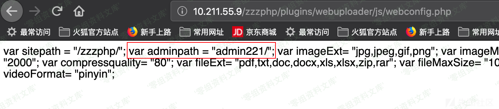

Zzzcms 1.75 后台地址泄露
========================

一、漏洞简介
------------

二、漏洞影响
------------

Zzzcms 1.75

三、复现过程
------------

存在一个比较奇葩的文件直接将一些属于不可访问的zzz\_config.php的内容直接给回显了，该信息泄露文件位于plugins\\webuploader\\js\\webconfig.php，可以直接获取到管理后台的管理路径名称，再也不用去爆破admin加3位数字了

参考链接
--------

> https://xz.aliyun.com/t/7414
